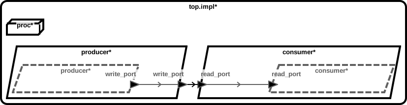
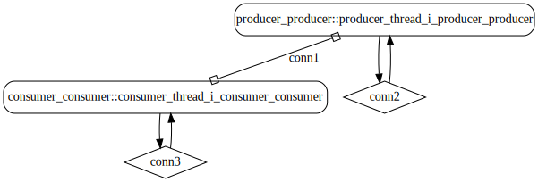
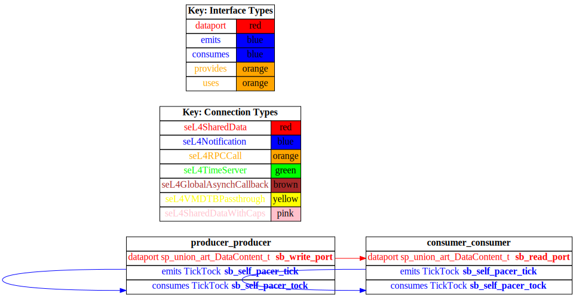

# test_data_port_periodic_domains

 Table of Contents
<!--table-of-contents_start-->
  * [AADL Architecture](#aadl-architecture)
  * [Linux](#linux)
    * [HAMR Configuration: Linux](#hamr-configuration-linux)
    * [Behavior Code: Linux](#behavior-code-linux)
    * [How to Build/Run: Linux](#how-to-buildrun-linux)
  * [SeL4](#sel4)
    * [HAMR Configuration: SeL4](#hamr-configuration-sel4)
    * [Behavior Code: SeL4](#behavior-code-sel4)
    * [How to Build/Run: SeL4](#how-to-buildrun-sel4)
    * [Example Output: SeL4](#example-output-sel4)
    * [CAmkES Architecture: SeL4](#camkes-architecture-sel4)
    * [HAMR CAmkES Architecture: SeL4](#hamr-camkes-architecture-sel4)
<!--table-of-contents_end-->

This example illustrates how to model and implement data port communications between
components. In this context, a data port communication is a shared memory construct
where the sending component has write-only permissions, to the designated block
of memory, and the receiving component has read-only permissions. The data in the
shared memory is not queued (i.e., has a queue size of one) and is overwritten
by consecutive write operations. The data transferred via the port communication 
has a designated data type (e.g., integer, real, boolean, array, struct).
Both write and read operations are non-blocking.

This example also illustrates the use of periodic component scheduling. For a
seL4 target, the implementation employs a static cyclic scheduler. Each
component is assigned a domain (or temporal partition) and typically a domain
is assigned a single component (domain zero is reserved for seL4 infrastructure
and must be invoked regularly to maintain operational flow). The schedule consists
of a series of ordered (non-overlapping) time slots of a specific length and domain.
Time slot lengths are expressed as a number of ticks (by default a tick is
2 milliseconds). The user defines the component schedule in the *domain_schedule.c*
file. 

For seL4 targets, the static cyclic scheduler maintains temporal isolation
between the components, assuming the domain schedule has been correctly engineered.
It is the responsibility of the system designer to define a schedule
in which the components execute to completion within their assigned slots.
A component execution that exceeds the length of a time slot will resume from
where it left off when its next assigned time slot is invoked. 
For Linux targets, the components follow the default round-robin periodic
scheduler employed by the Linux operating system.

Further details regarding modeling guidelines and HAMR integration can be found
in the [CASE-Tool-Assessment-Guide](https://github.com/loonwerks/CASE/tree/master/TA5/tool-assessment-4/doc/CASE-Tool-Assessment-Guide.pdf).

## AADL Architecture
<!--aadl-architecture_start-->

|System Properties|
|--|
|Domain Scheduling|
|Wire Protocol|

|producer Properties|
|--|
|Periodic: 1000 ms|
|Native|


|consumer Properties|
|--|
|Periodic: 1000 ms|
|Native|


<!--aadl-architecture_end-->


## Linux
<!--Linux_start--><!--Linux_end-->

### HAMR Configuration: Linux
<!--hamr-configuration-linux_start-->
refer to [aadl/bin/run-hamr-Linux.sh](aadl/bin/run-hamr-Linux.sh)
<!--hamr-configuration-linux_end-->


### Behavior Code: Linux
<!--behavior-code-linux_start-->
  * [producer](hamr/c/ext-c/producer_thread_i_producer_producer/producer_thread_i_producer_producer.c)

  * [consumer](hamr/c/ext-c/consumer_thread_i_consumer_consumer/consumer_thread_i_consumer_consumer.c)
<!--behavior-code-linux_end-->


### How to Build/Run: Linux
<!--how-to-buildrun-linux_start-->
```
./aadl/bin/run-hamr-Linux.sh
./hamr/c/bin/compile-linux.sh
./hamr/c/bin/run-linux.sh
./hamr/c/bin/stop.sh
```
<!--how-to-buildrun-linux_end-->


## SeL4
<!--SeL4_start--><!--SeL4_end-->

### HAMR Configuration: SeL4
<!--hamr-configuration-sel4_start-->
refer to [aadl/bin/run-hamr-SeL4.sh](aadl/bin/run-hamr-SeL4.sh)
<!--hamr-configuration-sel4_end-->


### Behavior Code: SeL4
<!--behavior-code-sel4_start-->
  * [producer](hamr/c/ext-c/producer_thread_i_producer_producer/producer_thread_i_producer_producer.c)

  * [consumer](hamr/c/ext-c/consumer_thread_i_consumer_consumer/consumer_thread_i_consumer_consumer.c)
<!--behavior-code-sel4_end-->


### How to Build/Run: SeL4
<!--how-to-buildrun-sel4_start-->
```
./aadl/bin/run-hamr-SeL4.sh
./hamr/camkes/bin/run-camkes.sh -s
```
<!--how-to-buildrun-sel4_end-->


### Example Output: SeL4
<!--example-output-sel4_start-->
Timeout = 18 seconds
```
Booting all finished, dropped to user space
Entering pre-init of consumer_thread_i_consumer_consumer
Art: RegisEntering pre-init of producer_thread_i_producer_producer
Art: Registeredtered component: top_impl_Instance_consumer_consumer (periodic: 1000)
Art: - Registered port: top_impl_Instance_consumer_consumer_read_port (d component: top_impl_Instance_producer_producer (periodic: 1000)
Art: - Registered port: top_impl_Instance_producer_producer_write_port (data out)
Leaving pre-init of producer_thread_i_producer_producer
ata in)
Leaving pre-init of consumer_thread_i_consumer_consumer
top_impl_Instance_consumer_consumer: Read 8 bits on read_port: [ 00 ]
top_impl_Instance_consumer_consumer: Read 8 bits on read_port: [ 01 ]
top_impl_Instance_consumer_consumer: Read 8 bits on read_port: [ 02 ]
top_impl_Instance_consumer_consumer: Read 8 bits on read_port: [ 03 ]
top_impl_Instance_consumer_consumer: Read 8 bits on read_port: [ 04 ]
top_impl_Instance_consumer_consumer: Read 8 bits on read_port: [ 05 ]
top_impl_Instance_consumer_consumer: Read 8 bits on read_port: [ 06 ]
top_impl_Instance_consumer_consumer: Read 8 bits on read_port: [ 07 ]
top_impl_Instance_consumer_consumer: Read 8 bits on read_port: [ 08 ]
top_impl_Instance_consumer_consumer: Read 8 bits on read_port: [ 09 ]
top_impl_Instance_consumer_consumer: Read 8 bits on read_port: [ 0A ]
top_impl_Instance_consumer_consumer: Read 8 bits on read_port: [ 0B ]
top_impl_Instance_consumer_consumer: Read 8 bits on read_port: [ 0C ]
top_impl_Instance_consumer_consumer: Read 8 bits on read_port: [ 0D ]
top_impl_Instance_consumer_consumer: Read 8 bits on read_port: [ 0E ]
QEMU: Terminated


```
<!--example-output-sel4_end-->


### CAmkES Architecture: SeL4
<!--camkes-architecture-sel4_start-->

<!--camkes-architecture-sel4_end-->


### HAMR CAmkES Architecture: SeL4
<!--hamr-camkes-architecture-sel4_start-->

<!--hamr-camkes-architecture-sel4_end-->

