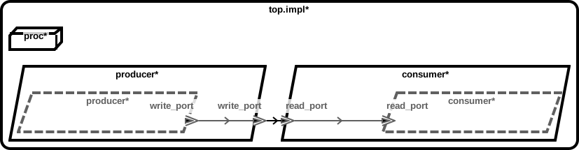
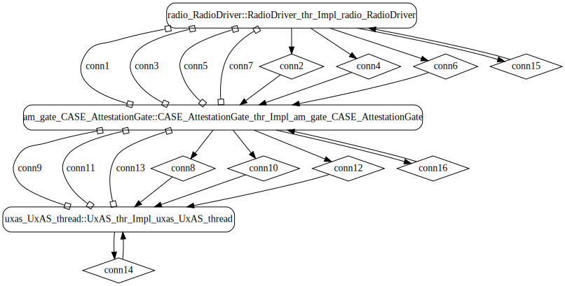
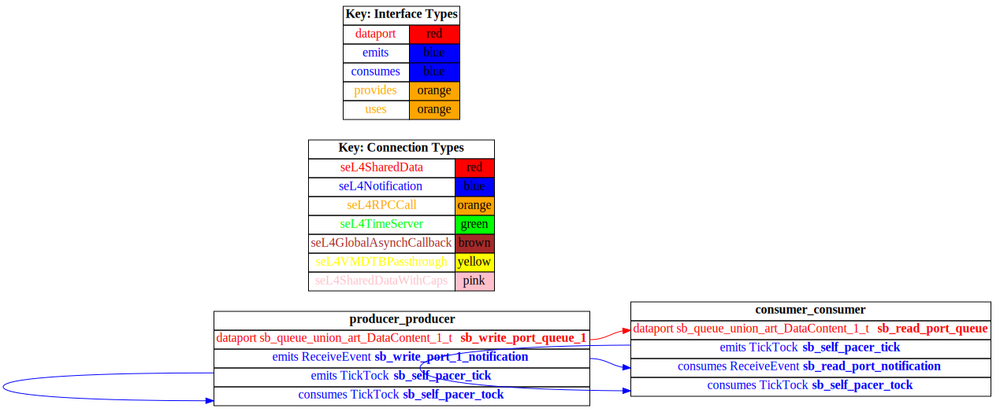

# test_event_data_port_periodic_domains

 Table of Contents
<!--table-of-contents_start-->
  * [AADL Architecture](#aadl-architecture)
  * [Linux](#linux)
    * [HAMR Configuration: Linux](#hamr-configuration-linux)
    * [Behavior Code: Linux](#behavior-code-linux)
    * [How to Build/Run: Linux](#how-to-buildrun-linux)
  * [SeL4](#sel4)
    * [HAMR Configuration: SeL4](#hamr-configuration-sel4)
    * [Behavior Code: SeL4](#behavior-code-sel4)
    * [How to Build/Run: SeL4](#how-to-buildrun-sel4)
    * [Example Output: SeL4](#example-output-sel4)
    * [CAmkES Architecture: SeL4](#camkes-architecture-sel4)
    * [HAMR CAmkES Architecture: SeL4](#hamr-camkes-architecture-sel4)
<!--table-of-contents_end-->


## AADL Architecture
<!--aadl-architecture_start-->

|System Properties|
|--|
|Domain Scheduling|
|Wire Protocol|

|producer Properties|
|--|
|Periodic: 1000 ms|
|Native|


|consumer Properties|
|--|
|Sporadic|
|Native|


<!--aadl-architecture_end-->


## Linux
<!--Linux_start--><!--Linux_end-->

### HAMR Configuration: Linux
<!--hamr-configuration-linux_start-->
refer to [aadl/bin/run-hamr-Linux.sh](aadl/bin/run-hamr-Linux.sh)
<!--hamr-configuration-linux_end-->


### Behavior Code: Linux
<!--behavior-code-linux_start-->
  * [producer](hamr/c/ext-c/producer_t_i_producer_producer/producer_t_i_producer_producer.c)

  * [consumer](hamr/c/ext-c/consumer_t_i_consumer_consumer/consumer_t_i_consumer_consumer.c)
<!--behavior-code-linux_end-->


### How to Build/Run: Linux
<!--how-to-buildrun-linux_start-->
```
./aadl/bin/run-hamr-Linux.sh
./hamr/c/bin/compile-linux.sh
./hamr/c/bin/run-linux.sh
./hamr/c/bin/stop.sh
```
<!--how-to-buildrun-linux_end-->


## SeL4
<!--SeL4_start--><!--SeL4_end-->

### HAMR Configuration: SeL4
<!--hamr-configuration-sel4_start-->
refer to [aadl/bin/run-hamr-SeL4.sh](aadl/bin/run-hamr-SeL4.sh)
<!--hamr-configuration-sel4_end-->


### Behavior Code: SeL4
<!--behavior-code-sel4_start-->
  * [producer](hamr/c/ext-c/producer_t_i_producer_producer/producer_t_i_producer_producer.c)

  * [consumer](hamr/c/ext-c/consumer_t_i_consumer_consumer/consumer_t_i_consumer_consumer.c)
<!--behavior-code-sel4_end-->


### How to Build/Run: SeL4
<!--how-to-buildrun-sel4_start-->
```
./aadl/bin/run-hamr-SeL4.sh
./hamr/camkes/bin/run-camkes.sh -s
```
<!--how-to-buildrun-sel4_end-->


### Example Output: SeL4
<!--example-output-sel4_start-->
Timeout = 18 seconds
```
Booting all finished, dropped to user space
Entering pre-init of consumer_t_i_consumer_consumer
Entering pre-init of producer_t_i_producer_producer
Art: Registered componeArt: Registered component: top_impl_Instance_consumer_consumer (sporadic: 1)
Art: - Registered port: top_impl_Instance_consumer_consumer_read_port (event in)
Leaving pre-init of consumer_t_i_consumer_consumer
nt: top_impl_Instance_producer_producer (periodic: 1000)
Art: - Registered port: top_impl_Instance_producer_producer_write_port (event out)
Leaving pre-init of producer_t_i_producer_producer
top_impl_Instance_consumer_consumer: Received on read_port: 00 
top_impl_Instance_consumer_consumer: Received on read_port: 01 
top_impl_Instance_consumer_consumer: Received on read_port: 02 
top_impl_Instance_consumer_consumer: Received on read_port: 03 
top_impl_Instance_consumer_consumer: Received on read_port: 04 

```
<!--example-output-sel4_end-->


### CAmkES Architecture: SeL4
<!--camkes-architecture-sel4_start-->

<!--camkes-architecture-sel4_end-->


### HAMR CAmkES Architecture: SeL4
<!--hamr-camkes-architecture-sel4_start-->

<!--hamr-camkes-architecture-sel4_end-->

