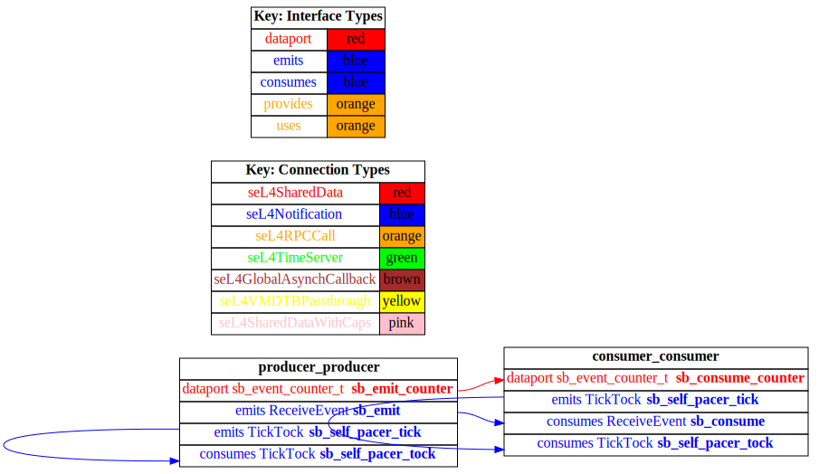

# test_event_port_periodic_domains

 Table of Contents
  * [AADL Architecture](#aadl-architecture)
  * [Linux](#linux)
    * [HAMR Configuration](#hamr-configuration)
    * [How to Build/Run](#how-to-buildrun)
  * [SeL4](#sel4)
    * [HAMR Configuration](#hamr-configuration)
    * [How to Build/Run](#how-to-buildrun)
    * [Example Output: Timeout = 18 seconds](#example-output-timeout--18-seconds)
    * [CAmkES Architecture](#camkes-architecture)
    * [HAMR CAmkES Architecture](#hamr-camkes-architecture)

## AADL Architecture


|producer|
|--|
|Periodic: 1000 ms|
|Native|


|consumer|
|--|
|Sporadic|
|Native|


## Linux
### HAMR Configuration
refer to [aadl/bin/run-hamr-Linux.sh](aadl/bin/run-hamr-Linux.sh)

### How to Build/Run
```
./aadl/bin/run-hamr-Linux.sh
./hamr/c/bin/compile-linux.sh
./hamr/c/bin/run-linux.sh
./hamr/c/bin/stop.sh
```
## SeL4
### HAMR Configuration
refer to [aadl/bin/run-hamr-SeL4.sh](aadl/bin/run-hamr-SeL4.sh)

### How to Build/Run
```
./aadl/bin/run-hamr-SeL4.sh
./hamr/camkes/bin/run-camkes.sh -s
```

### Example Output: Timeout = 18 seconds
```
Booting all finished, dropped to user space
Entering pre-init of consumer_t_i_consumer_consumer
Art: Registered component: top_impl_InstanceEntering pre-init of producer_t_i_producer_producer
Art: Registered component: top_impl_Instance_producer_p_consumer_consumer (sporadic: 1)
Art: - Registered port: top_impl_Instance_consumer_consumer_consume (event in)
Leaving pre-init of consumer_t_i_consumer_consumer
roducer (periodic: 1000)
Art: - Registered port: top_impl_Instance_producer_producer_emit (event out)
Leaving pre-init of producer_t_i_producer_producer
top_impl_Instance_consumer_consumer: Received 1 events on consume
top_impl_Instance_consumer_consumer: Received 2 events on consume
top_impl_Instance_consumer_consumer: Received 3 events on consume
top_impl_Instance_consumer_consumer: Received 4 events on consume
top_impl_Instance_consumer_consumer: Received 5 events on consume
```

### CAmkES Architecture


### HAMR CAmkES Architecture
