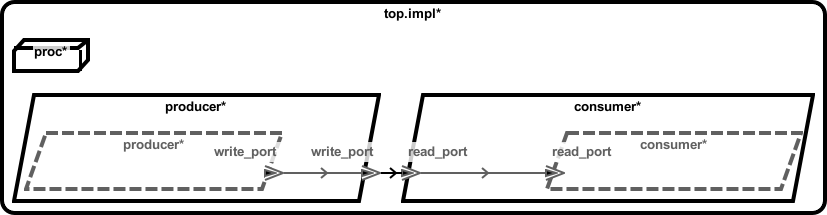
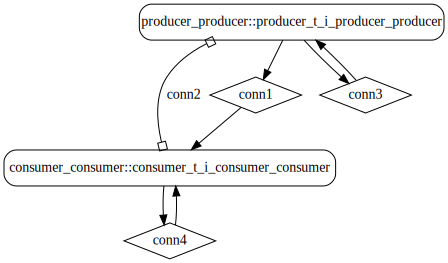
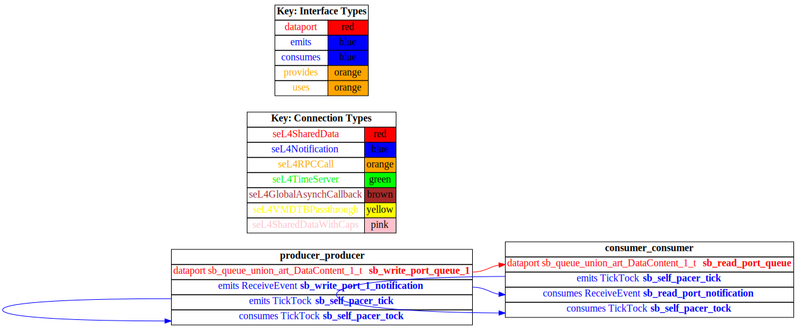

# tutorial

 Table of Contents
<!--table-of-contents_start-->
* [AADL Architecture](#aadl-architecture)
* [Linux](#linux)
  * [HAMR Configuration: Linux](#hamr-configuration-linux)
  * [Behavior Code: Linux](#behavior-code-linux)
  * [How to Build/Run: Linux](#how-to-buildrun-linux)
* [SeL4](#sel4)
  * [HAMR Configuration: SeL4](#hamr-configuration-sel4)
  * [Behavior Code: SeL4](#behavior-code-sel4)
  * [How to Build/Run: SeL4](#how-to-buildrun-sel4)
  * [Example Output: SeL4](#example-output-sel4)
  * [CAmkES Architecture: SeL4](#camkes-architecture-sel4)
  * [HAMR CAmkES Architecture: SeL4](#hamr-camkes-architecture-sel4)
* [Background](#background)
  * [Threading](#threading)
  * [Port-based Communication](#port-based-communication)
    * [AADL Semantics](#aadl-semantics)
    * [Underlying Representation in seL4](#underlying-representation-in-sel4)
* [Structure of Generated Code](#structure-of-generated-code)
  * [Compile and Execute Scripts](#compile-and-execute-scripts)
  * [Overview of Auto-generated Application Code Templates and Port-Communication APIs](#overview-of-auto-generated-application-code-templates-and-port-communication-apis)
<!--table-of-contents_end-->

This example supports the tutorial video **TODO: Insert Link** provided for this tool assessment.  The example is a minor adaptation of the [Event Data Port](../test_event_data_port_periodic_domains) example provided in the Basic Examples folder.

This ReadMe file provides a text-based walkthrough of the example to complement the tutorial video (the walk-through is presented after the artifact overview below).


## AADL Architecture
<!--aadl-architecture_start-->

|System: [top_impl_Instance](aadl/test_event_data_port_periodic_domains.aadl#L77) Properties|
|--|
|Domain Scheduling|
|Wire Protocol|

|[producer](aadl/test_event_data_port_periodic_domains.aadl#L7) Properties|
|--|
|Native|
|Periodic: 1000 ms|
|Domain: 2|


|[consumer](aadl/test_event_data_port_periodic_domains.aadl#L35) Properties|
|--|
|Native|
|Periodic: 1000 ms|
|Domain: 3|


**Schedule:** [domain_schedule.c](aadl/domain_schedule.c)
<!--aadl-architecture_end-->


## Linux
<!--Linux_start--><!--Linux_end-->

### HAMR Configuration: Linux
<!--hamr-configuration-linux_start-->
refer to [aadl/bin/run-hamr-Linux.sh](aadl/bin/run-hamr-Linux.sh)
<details>
<summary>Click for an example showing how HAMR's plugin dialog box relates to the CLI options</summary>
<!-- due to security issues, you may need to have the parent folder (ie. '../') open in your
     editor (e.g. vscode) in order to see the following image -->


The CLI options ``verbose`` and ``run-transpiler`` are set via ``Verbose output`` and ``Run Transpiler``
options respectively that are located in __Preferences >> OSATE >> Sireum HAMR >> Code Generation__.
The last two CLI options are set by the HAMR plugin.
</details>
<!--hamr-configuration-linux_end-->


### Behavior Code: Linux
<!--behavior-code-linux_start-->
  * [producer](hamr/c/ext-c/producer_t_i_producer_producer/producer_t_i_producer_producer.c)

  * [consumer](hamr/c/ext-c/consumer_t_i_consumer_consumer/consumer_t_i_consumer_consumer.c)
<!--behavior-code-linux_end-->


### How to Build/Run: Linux
<!--how-to-buildrun-linux_start-->
```
./aadl/bin/run-hamr-Linux.sh
./hamr/c/bin/compile-linux.sh
./hamr/c/bin/run-linux.sh
./hamr/c/bin/stop.sh
```
<!--how-to-buildrun-linux_end-->


## SeL4
<!--SeL4_start--><!--SeL4_end-->

### HAMR Configuration: SeL4
<!--hamr-configuration-sel4_start-->
refer to [aadl/bin/run-hamr-SeL4.sh](aadl/bin/run-hamr-SeL4.sh)
<details>
<summary>Click for an example showing how HAMR's plugin dialog box relates to the CLI options</summary>
<!-- due to security issues, you may need to have the parent folder (ie. '../') open in your
     editor (e.g. vscode) in order to see the following image -->


The CLI options ``verbose`` and ``run-transpiler`` are set via ``Verbose output`` and ``Run Transpiler``
options respectively that are located in __Preferences >> OSATE >> Sireum HAMR >> Code Generation__.
The last two CLI options are set by the HAMR plugin.
</details>
<!--hamr-configuration-sel4_end-->


### Behavior Code: SeL4
<!--behavior-code-sel4_start-->
  * [producer](hamr/c/ext-c/producer_t_i_producer_producer/producer_t_i_producer_producer.c)

  * [consumer](hamr/c/ext-c/consumer_t_i_consumer_consumer/consumer_t_i_consumer_consumer.c)
<!--behavior-code-sel4_end-->


### How to Build/Run: SeL4
<!--how-to-buildrun-sel4_start-->
```
./aadl/bin/run-hamr-SeL4.sh
./hamr/camkes/bin/run-camkes.sh -s
```
<!--how-to-buildrun-sel4_end-->


### Example Output: SeL4
<!--example-output-sel4_start-->
Timeout = 18 seconds
```
Booting all finished, dropped to user space
Entering pre-init of consumer_t_i_consumer_consumer
Entering pre-init of producer_t_i_producer_producer
Art: Registered component: top_impl_Instance_consumer_consumer (periodic: 1000)
Art: - Registered port: top_impl_Instance_consumer_consumer_read_port (event in)
Leaving pre-init of consumer_t_i_consumer_consumer
Art: Registered component: top_impl_Instance_producer_producer (periodic: 1000)
Art: - Registered port: top_impl_Instance_producer_producer_write_port (event out)
Leaving pre-init of producer_t_i_producer_producer
Sent 0
[ 00 00 00 00 ]

Received 0
top_impl_Instance_consumer_consumer: Received 32 bits on port read_port: [ 00 00 00 00 ]

Sent 1
[ 00 00 00 01 ]

Received 1
top_impl_Instance_consumer_consumer: Received 32 bits on port read_port: [ 00 00 00 01 ]

Sent 2
[ 00 00 00 02 ]

Received 2
top_impl_Instance_consumer_consumer: Received 32 bits on port read_port: [ 00 00 00 02 ]

Sent 3
[ 00 00 00 03 ]

Received 3
top_impl_Instance_consumer_consumer: Received 32 bits on port read_port: [ 00 00 00 03 ]

Sent 4
[ 00 00 00 04 ]

Received 4
top_impl_Instance_consumer_consumer: Received 32 bits on port read_port: [ 00 00 00 04 ]

Sent 5
[ 00 00 00 05 ]

Received 5
top_impl_Instance_consumer_consumer: Received 32 bits on port read_port: [ 00 00 00 05 ]

Sent 6
[ 00 00 00 06 ]

Received 6
top_impl_Instance_consumer_consumer: Received 32 bits on port read_port: [ 00 00 00 06 ]

Sent 7
[ 00 00 00 07 ]


```
<!--example-output-sel4_end-->


### CAmkES Architecture: SeL4
<!--camkes-architecture-sel4_start-->

<!--camkes-architecture-sel4_end-->


### HAMR CAmkES Architecture: SeL4
<!--hamr-camkes-architecture-sel4_start-->

<!--hamr-camkes-architecture-sel4_end-->


## Tutorial: Background

This example illustrates the AADL threading and port communication patterns that are most commonly used in the Collins Phase II and Phase III models:

* AADL periodic thread components -- time-triggered threads, executed according to a static schedule
* AADL event data port communication -- one-way, buffered, asynchronous communication between threads (with port buffers of size 1).

### Threading 

The static scheduling of periodic components used in this and other examples provided in this Tool Assessment closely aligns with the ARINC 653 tasking approach used in existing Collins systems supported by the CASE TA6 team. For a build of a HAMR-generated system for seL4, the implementation employs a static cyclic scheduler. Each
component is assigned a domain (or temporal partition) in the AADL model, and typically a domain is assigned a single component (domain zero is reserved for seL4 infrastructure
and must be invoked regularly to maintain operational flow). The user-written schedule consists of a series of ordered (non-overlapping) time slots of a specific length and domain. Time slot lengths are expressed as a number of ticks (by default a tick is 2 milliseconds). The user defines the component schedule in the *domain_schedule.c* file. 

For seL4 targets, the static cyclic scheduler maintains temporal isolation
between the components, assuming the domain schedule has been correctly engineered.
It is the responsibility of the system designer to define a schedule, and the usual goal is to define a schedule in which the components *execute to completion within their assigned slots*.  A component execution that exceeds the length of a time slot will resume from where it left off when its next assigned time slot is invoked. However, utilizing this behavior is not recommended since it will often lead to incoming messages being lost.  The threading paradigm emphasized by the AADL standard supports a *Receive-Input/Compute/Send-Output* structure, and once a thread begins the *Compute* actions, new input cannot be processed until the task has finished the *Compute* and *Send-Output* phases and is dispatched again.  With this paradigm, run-to-complete compute actions are emphasized.   For Linux targets, the components follow the 
same default *Receive-Input/Compute/Send-Output* structure, but scheduling is supported by a round-robin periodic scheduler executed by the Linux operating system.  Note: upcoming releases of HAMR will support a simplistic static scheduling approach for Linux to align with the seL4 approach -- Linux cannot enforce temporal separation as achieved by the seL4 domain scheduler, so the Linux static scheduling will be primarily a prototyping aid used before transitioning to seL4 deployments.

For more motivation and information about the AADL threading approach, including the *Receive-Input/Compute/Send-Output* emphasis, see the chapter on [AADL Concepts](http://hamr.sireum.org/hamr-doc/ch04-hamr-aadl-fundamental-concepts.html) in the HAMR documentation.


### Port-based Communication

#### AADL Semantics

AADL provides several types of port-based communication that correspond to common communication patterns used in real-time embedded system.  This tool assessment focuses on models which use AADL's *event data* ports with input and output buffers of *size 1*.   AADL event data ports provide *one-way asynchronous communication* as opposed to e.g., a *remote procedure call (RPC)* or *request/response* communication pattern which embody two-phase (message from caller to receive, response from receiver to caller),  synchronous (caller blocks until receiving a response from the receiver) communication.   Two-phased, blocking communication is often more difficult to reason about in real-time embedded systems, since it is more difficult to estimate the required time for blocking, computing result, and getting a result back and many levels of timing dependence can be introduced.   Moreover, two-phased communication inherently represents a bi-directional flow of information.  Focusing on one-way, asynchronous communication enables tighter control and easier reasoning about information flow and also makes reasoning about timing and schedulability easier.

Using AADL event data ports with buffers of size one (as opposed to unbuffered AADL data ports) allows application code to more easily distinguish between situations in which new data has arrived (there is data in the queue) versus situations where no new data has arrived since the thread was last dispatched (the queue is empty).

HAMR currently supports fan-out for event data ports (a single component port can be connected to multiple consuming component ports) but not fan-in (having multiple output ports connected to a single input port is not allowed).

With an input queue size of 1, if a sending component is dispatched twice before a receiving component is dispatch, the queue of the receiving component may overflow.
HAMR supports an AADL overflow policy in which the oldest message is overwritten and there is no error signaled.

AADL output buffers are always of size 1, and so a thread can put at most one message on a specific output event data port during each dispatch.  However, if it has multiple output event data ports, it may put a value on each of the output ports.

Due to the design of AADL tasking and communication, when a component is dispatched at the beginning of its period, all available input port values are dequeued and (from the point of view of the application code) the values of the input ports are "frozen" while the user's Compute entry point time-triggered function executes to completion.   This means that the user code does not have to worry about locking the input port queues or dealing with any race conditions on the port values once the thread is dispatched.   Similarly, all values that the application code puts on output ports are held until the time-triggered method completes, and then are released to the communication infrastructure.   This enables an AADL Compute entry point to be viewed as a function from Inport Port Values and component local state to Output Port Values and updated component local state.   System execution then becomes an interleaving of these functions (atomic, if each compute entry point runs to completion) where the interleaving order is controlled by the provided static schedule.  This highly structured real-time tasking is what enables various forms of AADL model-level verification (e.g., using AGREE specifications) and analysis on the CASE program.

#### Underlying Representation in seL4

In HAMR code generation for seL4, the underlying representation of the *AADL event data port* communication
channel between the sending and receiving port is a shared memory construct
for which the sending component has write-only permissions and the receiving component 
has read-only permissions. These representation aspects are all hidden from the application developer -- the developer
just uses the port APIs described in the following sections.  The representation hiding in the APIs facilitates
the reuse of code across seL4 and Linux.  It what allows us in the provided examples to have a single application code 
for each component that can be deployed on both seL4 and Linux.   The data transferred via the port communication APIs
has a designated data type (e.g., integer, real, boolean, array, struct).

Behind the scenes, in the seL4 deployment, the data in the
shared memory is queued, and each write operation is accompanied with an event signal
that is forwarded to the receiving component, indicating that a new communication has
been sent. If a write operation is invoked when the queue is full, then the oldest data entry
is overwritten. 
Both write and read operations are non-blocking.

## Tutorial: Structure of Generated Code

Consult the tutorial video for the steps needed to generate code from AADL models for seL4 and Linux.  HAMR examples use the following convention for directory structure.  The diagram below expands the folders most relevant for programming HAMR applications on seL4 and Linux platforms.

```
aadl/                            // aadl models
hamr/                            // target directories for HAMR code generation
├── c/                           // C artifacts
    ├── bin/                     // Build and Execution scripts
    ├── etc/ 
    ├── etc_seL4/adapters 
    └── c-ext/                   // platform-independent C application code
        ├── <component C1 application code folder>/
        |    ├── <component C1>.c   // thread entry points
        |    ├── <component C1>.h
        |    ├── <component C1>_api.c 
        |    └── <component C1>_api.h  // api's for port communication & logging
        ├── ...
        ├── <component Cn application code folder>/
        | 
        ├── ext.c
        └── ext.h 
├── camkes/                      // seL4 artifacts
    ├── kernel/ 
    |    └── domain_schedule.c   // static schedule specification
    └── ...
└── slang/
```


The developer codes the system by carrying out the following general activities:

* filling in the templates for the thread entry points in each `<component Cx>.c` files.  The most important is the *compute entry point* represented by the `time-triggered` function (example code below will illustrate this).
* utilizing the port communication api's in the `<component Cx>_api.h` files to `get` values from input ports and `put` values on output ports.
* specifying the static schedule for seL4 in `camkes/kernel/domain_schedule.c`.

### Compile and Execute Scripts

The developer compiles and executes the system using the platform-specific scripts in the `c/bin` folder. `stop.sh` is used to gracefully halt the system.

```
compile-cygwin.sh
compile-linux.sh
compile-macOS.sh
run-cygwin.sh
run-linux.sh
run-macOS.sh
stop.sh
```

### Overview of Auto-generated Application Code Templates and Port-Communication APIs

#### Auto-generated Application Code Templates for Threads

For each AADL thread component instance, HAMR will generate a skeleton file indicated by the `<component Cn>.c` files in the code organization diagram above.
To show the state of the code as it is initially generated (in contrast to the completed code), 
we have added a special folder hierarchy for the tutorial example named [hamr-initial](hamr-initial)

In the `<component Cn>.c` C files holding the thread component application code, e.g., [hamr-initial/c/ext-c/producer_t_i_producer_producer/producer_t_i_producer_producer.c](hamr-initial/c/ext-c/producer_t_i_producer_producer/producer_t_i_producer_producer.c), 
name mangling is used, based on the position of the thread instance within the AADL-specified architecture, to guarantee that the name `<component Cn>.c` of the component instance file is unique across the entire system.  For example, for the `producer_t_i_producer_producer.c` file, the generated name is derived from the following three segments in the system instance architecture traversal.

* `producer_t_i` is derived from the name of the AADL thread component implementation `thread implementation producer_t.i` (with an underscore `_` replacing the `.`)
* the first `producer` of `producer_producer` is derived from the name of the process instance `producer` in the system implementation `top.impl`
* the second `producer` of `producer_producer` is derived from the name of the thread instance `producer` in the process implementation `

The relevant [thread implementation](aadl/test_event_data_port_periodic_domains.aadl#L16) `producer_t.i` is shown below
```
thread producer_t
  ...
end producer_t;

thread implementation producer_t.i  -- thread implementation name
end producer_t.i;
```

The relevant [process instance](aadl/test_event_data_port_periodic_domains.aadl#L80) (first `producer` in `producer_producer`) is shown below
```
process implementation producer_p.i
		subcomponents
			producer: thread producer_t.i;   // process instance name
		connections
			c1: port producer.write_port -> write_port;
end producer_p.i;
```

The relevant [thread instance](aadl/test_event_data_port_periodic_domains.aadl#L29) (second `producer` in `producer_producer`) is shown below
```
system implementation top.impl
		subcomponents
			proc: processor proc.impl;
			producer: process producer_p.i;   // thread instance name
			consumer: process consumer_p.i;
```


The listing below illustrates the auto-generated skeleton file for the producer thread.  See
[hamr_initial/c/ext-c/producer_t_i_producer_producer/producer_t_i_producer_producer.c](hamr-initial/c/ext-c/producer_t_i_producer_producer/producer_t_i_producer_producer.c), 
for the actual file.  In the listing below, for pedagogical purpose, we have added comments explaining the content.

Notice that the file includes the comment `// This file will not be overwritten so is safe to edit`.  All applicational files that the developer codes (typically the `<component Cn>.c` files) will contain this comment (generated by HAMR).  If the developer runs HAMR code generation is again, e.g., due to some changes in the model, such files will not be overwritten, but all other auto-generated files will be (these files will typically have a corresponding comment indicating that the user should NOT edit the files).  If for some reason the port names of a component are changed after initial code generation and HAMR is re-run, the port access methods in the API files will have their names updated (because the files are auto-generated), but the usage of the APIs in the application code files will not be updated.  When using a C IDE, syntax errors marked in the files should indicate the need for the developer to manual change the API functional calls in the application code file to align with the new port names.

The listing illustrates that the skeleton file has three methods representing the standard AADL entry points:
* the Initialize entry point method, (note that `initialise` (with an `s`) is used to name the Initialize Entry Point to avoid conflicts with the reserved word `initialize` in some of the other HAMR-supported languages, similarly for `finalise`), 
* the Finalize entry point method, and
* the Compute entry point method (named `time_triggered` for periodic components).

Of these, the Compute entry point is most important as it contains the application logic that will be run on each period of the thread.

The Initialize entry point method should be used to initialize any component local variables and put any initial values on out ports.   Following the AADL standard, values of input ports are not initialized here.   Event data ports and event ports don't need to be initialized such they are created with the underlying queue representation being empty.
*in data ports* need to be initialized, but they are not initialized here.  Instead, according to the AADL standard, any component that has an *out data port* must provide an initial output value for the port in the sending component's Initialize entry point, and that value will be propagated at the end of the system initialization phase to the connected component in data port to provide its initial value.  Most of these issues are irrelevant for the current tool assessment since the assessment emphasizes *event data* ports.

The Finalize entry point should be used to tear down any data structures, or close any open services, etc.  In most of the examples, the deliverables the Finalize entrypoints are not used.

The listing below also includes a special comment block indicating the placement of declarations for component local state variables.   Such variables hold their values between activations/dispatches of the entry points.   These might be used to hold data such as the most recent sensor value read, some history of actions or data computed, data received on a port during a previous dispatch (e.g., a new set of waypoints, or setpoints for a control module, etc).   This comment is not included in the actual auto-generated skeleton but is used in this tutorial listing to highlight the concept.

```c
// File: producer_t_i_producer_producer.c (auto-generated template)

#include <producer_t_i_producer_producer_api.h>
#include <producer_t_i_producer_producer.h>
#include <ext.h>

// This file will not be overwritten so is safe to edit

//----------------------------------------------
// L o c a l    S t a t e    D e c l a r a t i o n s
//
// Declare any component local variables to be 
// used in component application logic here.
//----------------------------------------------

 // declare component local variables (e.g., variables whose values persist between dispatches of the thread)
 
//----------------------------------------------
// I n i t i a l i z e    E n t r y  p o i n t
//
//  Called once by AADL run-time scheduling infrastructure during
//  the initialization phase of the system.
//
//   Use this entry point to fully initialize component local state
//   and send any initial values out output ports.
//   Typically initial values are only sent out for data ports,
//   whereas output for event data ports and event ports is left
//   for the Compute Entry Point.
//----------------------------------------------

Unit base_test_event_data_port_periodic_domains_producer_t_i_producer_producer_initialise_(STACK_FRAME_ONLY) {
  // The purpose of this stack frame content is explained following the code listing.   
  DeclNewStackFrame(caller, "producer_t_i_producer_producer.c", "", "base_test_event_data_port_periodic_domains_producer_t_i_producer_producer_initialise_", 0);

  // The developer codes the Initialize Entry Point by filling in this method.  
  // HAMR auto-generates example uses of the port APIs and logging APIs.  These
  // can be removed when coding the actual application logic.
  
  uint8_t t0[numBytes_S32]; // declare a functional local variable to hold message payload
  byte_array_default(SF t0, numBits_S32, numBytes_S32);  // use helper macro to initial byte array to default value
  // use put_*** API to put the contents of the payload variable on the output port.  The port value will not actually
  // be propagated until the method completes.
  api_put_write_port__base_test_event_data_port_periodic_domains_producer_t_i_producer_producer(SF numBits_S32, t0);

  // example uses of the logging APIs
  api_logInfo__base_test_event_data_port_periodic_domains_producer_t_i_producer_producer(SF string("Example logInfo"));

  api_logDebug__base_test_event_data_port_periodic_domains_producer_t_i_producer_producer(SF string("Example logDebug"));

  api_logError__base_test_event_data_port_periodic_domains_producer_t_i_producer_producer(SF string("Example logError"));
}

//----------------------------------------------
// F i n a l i z e   E n t r y  p o i n t
//
//  Called once by AADL run-time scheduling infrastructure during
//  the finalization (shutdown) phase of the system.
//----------------------------------------------

Unit base_test_event_data_port_periodic_domains_producer_t_i_producer_producer_finalise_(STACK_FRAME_ONLY) {
  // The purpose of this stack frame content is explained following the code listing. 
  DeclNewStackFrame(caller, "producer_t_i_producer_producer.c", "", "base_test_event_data_port_periodic_domains_producer_t_i_producer_producer_finalise_", 0);

  // The developer codes the Finalize Entry Point by filling in this method.  
  // It can be left empty if there is nothing to clean up.
}

//----------------------------------------------
// C o m p u t e     E n t r y  p o i n t
//
//  The "main" function of the thread.
//  Called by AADL run-time scheduling infrastructure 
//  at the beginning of each period of the thread.
//  Or for seL4, more precisely, at the point(s) in time indicated
//  by the user-provided static domain schedule
//----------------------------------------------

Unit base_test_event_data_port_periodic_domains_producer_t_i_producer_producer_timeTriggered_(STACK_FRAME_ONLY) {
  // The purpose of this stack frame content is explained following the code listing. 
  DeclNewStackFrame(caller, "producer_t_i_producer_producer.c", "", "base_test_event_data_port_periodic_domains_producer_t_i_producer_producer_timeTriggered_", 0);

  // The developer codes the Compute Entry Point by filling in this method.  
  // The typical pattern for periodic components / time-triggered method is:
  //
  //   (1) check/read input ports into function local variables using get_*** APIs
  //     (behind the scenes, the infrastructure "freezes" the input ports to make sure that they 
  //      are not modified during the execution of the entry point.  This avoids the need
  //      for locking and prevents race conditions between communication actions and threading logic).
  //   (2) perform application logic
  //   (3) set values for output ports using the set_*** APIs. (this can be interleaved with step (2) above).
  //      Output values are not immediately sent.  After the time-triggered function completes, the
  //      set output port values will be propagated to consumer components.
  //   
}
```

Recall the HAMR code generation architecture supports multiple languages and multiple platforms, and this is facilitated by having several stages in the code generation architecture.  One of those stages uses the Kansas State University Slang language (high assurance subset of Scala) to code AADL run-time infrastructure and the set the structure of the application code for all platforms.  In CASE workflows, the Slang is then translated behind the scenes to C by a stage called the "transpiler".
Some of the artifacts and style of coding in the generated C files are the result of factoring the translation through Slang.
In particular, a notion of stack frames is introduced into the code to aid traceability back to the Slang code (this would be needed in any eventual certification of the framework).

The symbols ``STACK_FRAME``, ``STACK_FRAME_ONLY``, ``SF``, ``SF_ONLY``, ``DeclNewStackFrame``, and ``caller``
are C macros introduced by the transpiler.  By default these are disabled meaning they do not add 
any additional code.  

These stack frame artifacts can typically be ignored in CASE work flows, since the development focus is on C and not Slang. 
For this tool assessment, we recommend leaving in the auto-generated `DeclNewStackFrame(.)` but then making no further use
of that info.   Other C functions can be added and called as usual with passing stack frame information.

There are a few situations where the stack trace information can be helpful in debugging CASE code.
Here are a few remarks concern how the stack trace information works.
When the stack trace macros are enabled, they add code that allows C error stack traces to refer to 
Slang resource information rather than to the C code those resources get transpiled into.
For example, the error trace below shows the trace started from a method in the Slang file ``consumer_thread_i_consumer_consumer_App.scala`` and ends in the time_triggered method located in the
C file ``consumer_thread_i_consumer_consumer.c``

```
base_test_data_port_periodic_domains_consumer_thread_i_consumer_consumer_timeTriggered_(consumer_thread_i_consumer_consumer.c)
base_test_data_port_periodic_domains_consumer_thread_i_consumer_consumer_timeTriggered(consumer_thread_i_consumer_consumer_api.c)
base.test_data_port_periodic_domains.consumer_thread_i_consumer_consumer_Bridge.EntryPoints.compute(consumer_thread_i_consumer_consumer_Bridge.scala:90)
base.consumer_thread_i_consumer_consumer_App.compute(consumer_thread_i_consumer_consumer_App.scala:40)
base.consumer_thread_i_consumer_consumer_App.main(consumer_thread_i_consumer_consumer_App.scala:74)
base.consumer_thread_i_consumer_consumer_App.<App>(consumer_thread_i_consumer_consumer_App.scala)
```

To enable the macros for Linux, run the compile script with the CMake option ``WITH_LOC`` enabled.  For example,

```
WITH_LOC=ON ./hamr/c/bin/compile-linux.sh
```
and similarly for CAmkES, 
```
WITH_LOC=ON ./hamr/camkes/bin/run-camkes.sh -s
``` 

When enabled the macros expand as follows:

|||
|--:|--|
|DeclNewStackFrame|Adds a local variable called ``sf`` that holds a ``StackFrame``.  A StackFrame stores information about the current method, e.g. the method name, the name of the file it belongs in, and a pointer to the method that called it |
|STACK_FRAME|Adds the parameter ``StackFrame caller`` followed by a comma|
|STACK_FRAME_ONLY|Adds the parameter ``StackFrame Caller``|
|caller|Adds the symbol ``caller`` (i.e. the parameter added by ``STACK_FRAME``/``STACK_FRAME_ONLY``)|
|SF|Adds the symbol ``sf`` (i.e. the variable introduced by ``DeclNewStackFrame``) followed by a comma|
|SF_ONLY|Adds the symbol ``sf``|

#### Auto-generated APIs for Port Communication

HAMR will generate APIs that application can call for *getting* values from input ports (`api_get_***` functions) and *putting* values on output ports (`api_put_***` functions).  These APIs are platform-indepdent -- behind the scenes, HAMR will generate an appropriate realization for either seL4 or Linux.   

The listing below shows the port and logging APIs generated for the producer.  In this case, the producer only has one port, so the only port API generated is for the producer's [write_port](aadl/test_event_data_port_periodic_domains.aadl#L9).

```c
// File: producer_t_i_producer_producer_api.h

#ifndef PRODUCER_T_I_PRODUCER_PRODUCER_API_H
#define PRODUCER_T_I_PRODUCER_PRODUCER_API_H

#include <all.h>

// This file was auto-generated.  Do not edit

// API to put a value on producer "write_port" output event data port.
// The use of the HAMR::Bit_Codec_Raw_Connections => true; in the system implementation
// causes the type on the payload to be a byte array (bypassing/ignoring the AADL type declared on the port).
// With this property in place, the developer must manage their own coding/encoding.
void api_put_write_port__base_test_event_data_port_periodic_domains_producer_t_i_producer_producer(
  STACK_FRAME
  size_t numBits,
  uint8_t *byteArray);

// logging APIs
void api_logInfo__base_test_event_data_port_periodic_domains_producer_t_i_producer_producer(
  STACK_FRAME
  String str);

void api_logDebug__base_test_event_data_port_periodic_domains_producer_t_i_producer_producer(
  STACK_FRAME
  String str);

void api_logError__base_test_event_data_port_periodic_domains_producer_t_i_producer_producer(
  STACK_FRAME
  String str);

#endif
```

As noted earlier, HAMR will support port type declarations using the AADL data model, but due to a transition in the implementation of data types that is not yet completed, this tool assessment uses another HAMR-supported approach:  the ability to generate "raw" byte arrays as the types for port-based communication, which is useful for when the application logic needs custom representations and encodings/decodings for data.   The capability is selected by including the [Byte_Codec_Raw_Connections](aadl/test_event_data_port_periodic_domains.aadl#L87) property in the top-level system implementation (excerpt shown below).  This causes the [declared port data types such as Base_Types::Integer_32](aadl/test_event_data_port_periodic_domains.aadl#L9)) to be ignored in the code generation; types for raw byte arrays are used for each port data type instead.


```
thread producer_t
	features
      // the type Base_Types::Integer_32 is ignored by HAMR code generation
      // when the Bit_Codec_Raw_Connections property (in the top-level system implementation)
      // is set to true.
		write_port: out event data port Base_Types::Integer_32;
  ...
end producer_t;

...

system implementation top.impl
		...
		properties
			Actual_Processor_Binding => (reference (proc)) applies to producer, consumer;
			HAMR::Platform => (Linux, seL4);
			HAMR::Bit_Codec_Raw_Connections => true;   // indicates that byte arrays should be used for all port data types
      ...
end top.impl;
```
To determine how internal space (e.g., for the seL4 shared memory cells) to be allocated for each connection, HAMR uses the following strategy.
For AADL Base Types such as `Base_Types::Integer_32`, HAMR will utilize the `Data_Size` property in the declared in the base type used
(note that the base types are defined in the `Base_Types.aadl` file contained in the `Plug-In Contributions` folder of every OSATE AADL Project).

```
-- (excerpt from Base_Types.aadl)
data Integer_32 extends Integer
  properties
    Data_Model::Number_Representation => Signed;
    -- dictates the amount of space to be used in the HAMR-generated representation AADL connection when the 
    -- Bit_Codec_Raw_Connections capability is used.
    Data_Size => 4 Bytes;   
  end Integer_32;
```  

To aid the developer `#define`s are generated in [hamr/c/etc-c/ext.h](hamr/c/etc-c/ext.h#L9) that define constants for the sizes for byte arrays for data types used in the AADL model.

```
// bit-codec size for S32
#define numBits_S32 32
#define numBytes_S32 ((numBits_S32 - 1) / 8 + 1)
```

For developer-defined types, such as those declared in [aadl/CASE_Types.aadl](aadl/CASE_Types.aadl#L16), 
the property `HAMR::Bit_Codec_Max_Size` must be used to indicate to HAMR how much space to allocate to realize the connection
for ports that use that type.

```
data Coordinate
end Coordinate;

data implementation Coordinate.i
	subcomponents
		altitude: data Base_Types::Integer_32;
		latitude: data Base_Types::Integer_32;
		longitude: data Base_Types::Integer_32;
	properties
      -- dictates the amount of space to be used in the HAMR-generated representation AADL connection when the 
      -- Bit_Codec_Raw_Connections capability is used.
		HAMR::Bit_Codec_Max_Size => 96 bits;
end Coordinate.i;
```
For an illustration of using a general-purpose encoding / decoding framework to work with HAMR's raw byte arrays, 
and more discussion of the HAMR byte array concept, see
the [producer-filter-consumer](../../bit-codec/producer-filter-consumer) example.


The listing below shows the consumer APIs.  In this case, the only port API generated is for the producer's [read_port](aadl/test_event_data_port_periodic_domains.aadl#L37)

```c
// File: consumer_t_i_consumer_consumer_api.h

#ifndef CONSUMER_T_I_CONSUMER_CONSUMER_API_H
#define CONSUMER_T_I_CONSUMER_CONSUMER_API_H

#include <all.h>

// This file was auto-generated.  Do not edit

// API to get a value from the consumer "read_port" input event data port.
// The use of the HAMR::Bit_Codec_Raw_Connections => true; in the system implementation
// causes the type on the payload to be a byte array (bypassing/ignoring the AADL type declared on the port).
// With this property in place, the developer must manage their own coding/encoding.
//
// The bool return value of "true" indicates that there is a value in the port, where as
// "false" indicate that no message has arrived on the port since the last thread dispatch.
bool api_get_read_port__base_test_event_data_port_periodic_domains_consumer_t_i_consumer_consumer(
  STACK_FRAME
  size_t *numBits,
  uint8_t *byteArray);

// logging APIs
void api_logInfo__base_test_event_data_port_periodic_domains_consumer_t_i_consumer_consumer(
  STACK_FRAME
  String str);

void api_logDebug__base_test_event_data_port_periodic_domains_consumer_t_i_consumer_consumer(
  STACK_FRAME
  String str);

void api_logError__base_test_event_data_port_periodic_domains_consumer_t_i_consumer_consumer(
  STACK_FRAME
  String str);

#endif
```

### Tutorial: Coding the Application Logic

The developer adds application code to the files for thread entry points above such as `producer_t_i_producer_producer.c` to 
implement each thread component's functionality.  The completed code can be found in the [hamr/c/ext-c](hamr/c/ext-c) folder.

Below is a listing of the completed code for the [producer](hamr/c/ext-c/producer_t_i_producer_producer/producer_t_i_producer_producer.c) (we have put additional comments in the listing below for pedagogical purposes).

```c
// File: producer_t_i_producer_producer.c (completed application code)
#include <producer_t_i_producer_producer_api.h>
#include <producer_t_i_producer_producer.h>
#include <ext.h>

// This file will not be overwritten so is safe to edit

//----------------------------------------------
// L o c a l    S t a t e    D e c l a r a t i o n s
//
// Declare any component local variables to be 
// used in component application logic here.
//----------------------------------------------

// component local variable to keep a count of number of messages that have been sent 
// "write_port" out event data port 

int32_t sent;

//----------------------------------------------
// I n i t i a l i z e    E n t r y  p o i n t
//
//  Called once by AADL run-time scheduling infrastructure during
//  the initialization phase of the system.
//
//   Use this entry point to fully initialize component local state
//   and send any initial values out output ports.
//   Typically initial values are only sent out for data ports,
//   whereas output for event data ports and event ports is left
//   for the Compute Entry Point.
//----------------------------------------------

Unit base_test_event_data_port_periodic_domains_producer_t_i_producer_producer_initialise_(STACK_FRAME_ONLY) {
  // see discussion about stack frame traceability information following listing
  DeclNewStackFrame(caller, "producer_t_i_producer_producer.c", "", "base_test_event_data_port_periodic_domains_producer_t_i_producer_producer_initialise_", 0);

  // initialize component local state
  sent = 0;

  // send initial values out output port (sending initial values on data ports is required)
  //  ...since we have no out data ports, and we choose to not send an initial value out the out event data port,
  //     there is nothing to code here.
}

//----------------------------------------------
// F i n a l i z e   E n t r y  p o i n t
//
//  Called once by AADL run-time scheduling infrastructure during
//  the finalization (shutdown) phase of the system.
//----------------------------------------------

Unit base_test_event_data_port_periodic_domains_producer_t_i_producer_producer_finalise_(STACK_FRAME_ONLY) {
  DeclNewStackFrame(caller, "producer_t_i_producer_producer.c", "", "base_test_event_data_port_periodic_domains_producer_t_i_producer_producer_finalise_", 0);

  // Here, we simply keep the default auto-generated function as is and don't add any code,
  // because there is nothing to "finalize"/tear down
}

//----------------------------------------------
// C o m p u t e     E n t r y  p o i n t
//
//  The "main" function of the thread.
//  Called by AADL run-time scheduling infrastructure 
//  at the beginning of each period of the thread.
//  Or for seL4, more precisely, at the point(s) in time indicated
//  by the user-provided static domain schedule
//----------------------------------------------


Unit base_test_event_data_port_periodic_domains_producer_t_i_producer_producer_timeTriggered_(STACK_FRAME_ONLY) {
  DeclNewStackFrame(caller, "producer_t_i_producer_producer.c", "", "base_test_event_data_port_periodic_domains_producer_t_i_producer_producer_timeTriggered_", 0);

// The developer codes the Compute Entry Point by filling in this method.  
  // The typical pattern for periodic components / time-triggered method is:
  //
  //   (1) check/read input ports into function local variables using get_*** APIs
  //     (behind the scenes, the infrastructure "freezes" the input ports to make sure that they 
  //      are not modified during the execution of the entry point.  This avoids the need
  //      for locking and prevents race conditions between communication actions and threading logic).
  //   (2) perform application logic
  //   (3) set values for output ports using the set_*** APIs. (this can be interleaved with step (2) above).
  //      Output values are not immediately sent.  After the time-triggered function completes, the
  //      set output port values will be propagated to consumer components.
  //   

  // For (1), there are no input ports, so there is nothing to read.
  // For (2), we simply format a four byte payload to send
  uint8_t t0[numBytes_S32];     // use the auto-generated constant in hamr/c/ext-c/ext.h to declare the size of the byte array
  t0[0] = (sent >> 24) & 0xFF;
  t0[1] = (sent >> 16) & 0xFF;
  t0[2] = (sent >> 8) & 0xFF;
  t0[3] = sent & 0xFF;

  // print some debugging info
  printf("Sent %i\n", sent);
  hex_dump(t0, 4);
  printf("\n");

  // increment component local variable
  // The value of this variable persists between dispatches of the compute entry point (time-triggered function)
  sent++;

  // For (3), we set the value of the output port, providing both the length of the byte array in bits and the message payload
  // Use the auto-generated constant in hamr/c/ext-c/ext.h to declare the size of the byte array.
  api_put_write_port__base_test_event_data_port_periodic_domains_producer_t_i_producer_producer(SF numBits_S32, t0);

  // When the method completes, the value put on the output ports will be flushed to the communication infrastructure.
}
```

Below is a listing of the completed code for the [consumer](hamr/c/ext-c/consumer_t_i_consumer_consumer/consumer_t_i_consumer_consumer.c) (we have put additional comments in the listing below for pedagogical purposes).

```c
// File: consumer_t_i_consumer_consumer.c (completed application code)
#include <consumer_t_i_consumer_consumer_api.h>
#include <consumer_t_i_consumer_consumer.h>
#include <ext.h>

// This file will not be overwritten so is safe to edit

//----------------------------------------------
// L o c a l    S t a t e    D e c l a r a t i o n s
//
// Declare any component local variables to be 
// used in component application logic here.
//----------------------------------------------

// there are no component local variables for this thread

//----------------------------------------------
// I n i t i a l i z e    E n t r y  p o i n t
//
//  Called once by AADL run-time scheduling infrastructure during
//  the initialization phase of the system.
//
//   Use this entry point to fully initialize component local state
//   and send any initial values out output ports.
//   Typically initial values are only sent out for data ports,
//   whereas output for event data ports and event ports is left
//   for the Compute Entry Point.
//----------------------------------------------

Unit base_test_event_data_port_periodic_domains_consumer_t_i_consumer_consumer_initialise_(STACK_FRAME_ONLY) {
  DeclNewStackFrame(caller, "consumer_t_i_consumer_consumer.c", "", "base_test_event_data_port_periodic_domains_consumer_t_i_consumer_consumer_initialise_", 0);

  // there is nothing to initialize for this thread
}

//----------------------------------------------
// F i n a l i z e   E n t r y  p o i n t
//
//  Called once by AADL run-time scheduling infrastructure during
//  the finalization (shutdown) phase of the system.
//----------------------------------------------

Unit base_test_event_data_port_periodic_domains_consumer_t_i_consumer_consumer_finalise_(STACK_FRAME_ONLY) {
  DeclNewStackFrame(caller, "consumer_t_i_consumer_consumer.c", "", "base_test_event_data_port_periodic_domains_consumer_t_i_consumer_consumer_finalise_", 0);
  // Here, we simply keep the default auto-generated function as is and don't add any code,
  // because there is nothing to "finalize"/tear down
}

//----------------------------------------------
// C o m p u t e     E n t r y  p o i n t
//
//  The "main" function of the thread.
//  Called by AADL run-time scheduling infrastructure 
//  at the beginning of each period of the thread.
//  Or for seL4, more precisely, at the point(s) in time indicated
//  by the user-provided static domain schedule
//----------------------------------------------

Unit base_test_event_data_port_periodic_domains_consumer_t_i_consumer_consumer_timeTriggered_(STACK_FRAME_ONLY) {
  DeclNewStackFrame(caller, "consumer_t_i_consumer_consumer.c", "", "base_test_event_data_port_periodic_domains_consumer_t_i_consumer_consumer_timeTriggered_", 0);

  // The developer codes the Compute Entry Point by filling in this method.  
  // The typical pattern for periodic components / time-triggered method is:
  //
  //   (1) check/read input ports into function local variables using get_*** APIs
  //     (behind the scenes, the infrastructure "freezes" the input ports to make sure that they 
  //      are not modified during the execution of the entry point.  This avoids the need
  //      for locking and prevents race conditions between communication actions and threading logic).
  //   (2) perform application logic
  //   (3) set values for output ports using the set_*** APIs. (this can be interleaved with step (2) above).
  //      Output values are not immediately sent.  After the time-triggered function completes, the
  //      set output port values will be propagated to consumer components.
  //   

  // At the start of the method, any input ports such as "read_port" will have their
  // values dequeued (if any have arrived) and made available to the developer code
  // via associated api_get_*** functions.  This means that there is no content or race conditions
  // associated with reading the input ports.

  // For (1), we get the value from the "read_port" in event data port
  //    Declare a variable to hold the payload; use the auto-generated size constant from hamr/c/ext-c/ext.h
  uint8_t t0[numBytes_S32];  
  //    Declare a variable to hold the size of the received data
  size_t t0_numBits; 

  // check if "read_port" has a value.
  // If it does, the payload will be read into t0, and the associated size into t0_numBits
  if(api_get_read_port__base_test_event_data_port_periodic_domains_consumer_t_i_consumer_consumer(SF &t0_numBits, t0)) {
    // sanity check
    sfAssert(SF (Z) t0_numBits == numBits_S32, "numBits received does not match expected");

    // "decode" the byte array in to an int32
    int32_t value = t0[0] << 24 | t0[1] << 16 | t0[2] << 8 | t0[3];
    printf("Received %i\n", value);

    // Format output spring 
    DeclNewString(read_port_str);
    String__append(SF (String) &read_port_str, string("Received "));
    Z_string_(SF (String) &read_port_str, t0_numBits);
    String__append(SF (String) &read_port_str, string(" bits on port read_port: [ "));
    byte_array_string(SF (String) &read_port_str, t0, numBytes_S32);
    String__append(SF (String) &read_port_str, string("]\n"));

    // use auto-generated logging function
    api_logInfo__base_test_event_data_port_periodic_domains_consumer_t_i_consumer_consumer(SF (String) &read_port_str);
  }
}
```


```c
// Copyright 2020 Adventium Labs

// This is a kernel data structure.

#include <config.h>
#include <object/structures.h>
#include <model/statedata.h>

// An arbitrary hand generated schedule. The length is in seL4 ticks
// (2 ms default). This schedule should be generated from the AADL model
// using execution time and data flow latency specifications.
//
// Pacer runs at highest rate
//
// This schedule is single-rate, 1Hz, run each thread at 200ms ticks for simplicity.
// Fill space in with domain 0.
//
//         +
// 3 dest  |        -              -              -              -      
// 2 src   |     -              -              -              -         
// 1 pacer |  -              -              -              -            
// 0 dom0  |-- -- -- -------- -- -- -------- -- -- -------- -- -- ------
//         |______________|______________________________________________\time
//           seconds      1              2              3              4 /
//
// Major frame is 1 seconds, since destination has 1 second period
//
const dschedule_t ksDomSchedule[] = { // (1 tick == 2ms)
    { .domain = 0, .length = 100 }, // all other seL4 threads, init, 200ms
    { .domain = 2, .length =   5 }, // source       10ms
    { .domain = 0, .length =  95 }, // domain0     190ms
    { .domain = 3, .length =   5 }, // destination  10ms
    { .domain = 0, .length = 295 }, // domain0     590ms
                                    // +
                                    // -----------------
                                    //            1000ms 
};

const word_t ksDomScheduleLength = sizeof(ksDomSchedule) / sizeof(dschedule_t);
```

