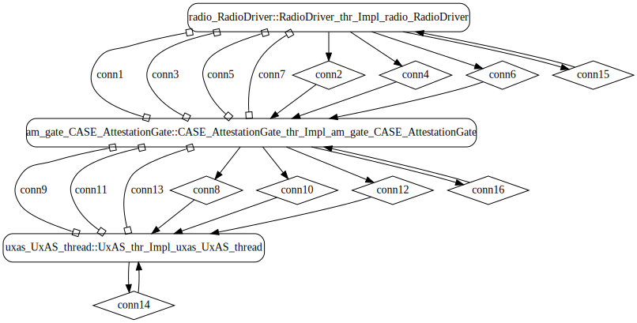

# producer-filter-consumer

 Table of Contents
<!--table-of-contents_start-->
* [AADL Architecture](#aadl-architecture)
* [Bit-Codec Spec](#bit-codec-spec)
* [Modify the AADL Model to Use Wire Protocol](#modify-the-aadl-model-to-use-wire-protocol)
* [Linux](#linux)
  * [HAMR Configuration: Linux](#hamr-configuration-linux)
  * [Behavior Code: Linux](#behavior-code-linux)
  * [How to Build/Run: Linux](#how-to-buildrun-linux)
* [SeL4](#sel4)
  * [HAMR Configuration: SeL4](#hamr-configuration-sel4)
  * [Behavior Code: SeL4](#behavior-code-sel4)
  * [How to Build/Run: SeL4](#how-to-buildrun-sel4)
  * [Example Output: SeL4](#example-output-sel4)
  * [CAmkES Architecture: SeL4](#camkes-architecture-sel4)
  * [HAMR CAmkES Architecture: SeL4](#hamr-camkes-architecture-sel4)
<!--table-of-contents_end-->


## AADL Architecture
<!--aadl-architecture_start-->

|System: [PFC_Sys_Impl_Instance](aadl/PFC.aadl#L29) Properties|
|--|
|Domain Scheduling|
|Wire Protocol|

|[producer](aadl/PFC.aadl#L115) Properties|
|--|
|Native|
|Periodic: 1000 ms|
|Domain: 2|


|[filter](aadl/PFC.aadl#L127) Properties|
|--|
|Native|
|Periodic: 1000 ms|
|Domain: 3|


|[consumer](aadl/PFC.aadl#L140) Properties|
|--|
|Native|
|Periodic: 1000 ms|
|Domain: 4|


**Schedule:** [domain_schedule.c](aadl/domain_schedule.c)
<!--aadl-architecture_end-->

## Bit-Codec Spec


[aadl/data/Mission.sc](aadl/data/Mission.sc)

Bit-Codec is not currently integrated with HAMR Codegen so the developers needs to create the bit-codec spec by hand and then call the bit-codec generator (e.g. [aadl/bin/bcgen.sh](aadl/bin/bcgen.sh)).  This will generate structured data types, encoders and decoders  (e.g. [hamr/slang/src/main/data/pfc/PFC/MissionBitCodec.scala](hamr/slang/src/main/data/pfc/PFC/MissionBitCodec.scala))

The transpiler only includes Slang artifacts that are reachable from its apps option (e.g. [here](hamr/slang/bin/transpile.sh#L24)) so the developer also needs to expliclity call the decoders/encoders/etc so that they are available at the C level (e.g. [hamr/slang/src/main/component/pfc/TranspilerToucher.scala](hamr/slang/src/main/component/pfc/TranspilerToucher.scala))

An example workflow:
```
./aadl/bin/run-hamr-Linux.sh
./aadl/bin/bcgen.sh
```

Developer 'touches' bit-codec artifacts and then runs the transpiler like below.  Note that the transpiler only needs to be rerun when/if Slang artifacts are modified.

```
./hamr/slang/bin/transpile.sh
```

All these steps will be automated once HAMR integrates bit-codec generation as part of codegen.

## Modify the AADL Model to Use Wire Protocol

The following modifications must be made since bit-codec is not currently integrated as part of HAMR Codegen

  - Attach ``HAMR::Bit_Codec_Raw_Connections => true;`` to the top-level system [PFC.aadl](aadl/PFC.aadl#L46)
  - Use the ``HAMR::Bit_Codec_Max_Size`` property to specify the encoded size of each data component that is used by an event data or data port.  For example, see [Mission](aadl/PFC.aadl#L22) that is used by [producer_t.to_filter](aadl/PFC.aadl#L117)

    - This property only needs to be attached to the top level data component (e.g. array subtypes and record field types do not need to be modified if they are not directly used by a port)

    - HAMR will use the ``Memory_Properties::Data_Size`` annotation if present for types defined in [Base_Types](https://github.com/osate/osate2/blob/master/core/org.osate.contribution.sei/resources/packages/Base_Types.aadl).  The following unbounded types are not currently supported: ``Bases_Types::Boolean``, ``Base_Types::Character``, ``Base_Types::String``, ``Base_Types::Integer``, ``Base_Types::Float``

  \* _Note: HAMR does not currently process the ``HAMR::Bit_Codec_Spec`` property annotation as seen [here](aadl/PFC.aadl#L21)_

## Linux
<!--Linux_start--><!--Linux_end-->

### HAMR Configuration: Linux
<!--hamr-configuration-linux_start-->
refer to [aadl/bin/run-hamr-Linux.sh](aadl/bin/run-hamr-Linux.sh)
<details>
<summary>Click for an example showing how HAMR's plugin dialog box relates to the CLI options</summary>
<!-- due to security issues, you may need to have the parent folder (ie. '../') open in your
     editor (e.g. vscode) in order to see the following image -->


The CLI options ``verbose`` and ``run-transpiler`` are set via ``Verbose output`` and ``Run Transpiler``
options respectively that are located in __Preferences >> OSATE >> Sireum HAMR >> Code Generation__.
The last two CLI options are set by the HAMR plugin.
</details>
<!--hamr-configuration-linux_end-->


### Behavior Code: Linux
<!--behavior-code-linux_start-->
  * [producer](hamr/c/ext-c/producer_t_producer_producer/producer_t_producer_producer.c)

  * [filter](hamr/c/ext-c/filter_t_filter_filter/filter_t_filter_filter.c)

  * [consumer](hamr/c/ext-c/consumer_t_consumer_consumer/consumer_t_consumer_consumer.c)
<!--behavior-code-linux_end-->


### How to Build/Run: Linux
<!--how-to-buildrun-linux_start-->
```
./aadl/bin/run-hamr-Linux.sh
./hamr/c/bin/compile-linux.sh
./hamr/c/bin/run-linux.sh
./hamr/c/bin/stop.sh
```
<!--how-to-buildrun-linux_end-->


## SeL4
<!--SeL4_start--><!--SeL4_end-->

### HAMR Configuration: SeL4
<!--hamr-configuration-sel4_start-->
refer to [aadl/bin/run-hamr-SeL4.sh](aadl/bin/run-hamr-SeL4.sh)
<details>
<summary>Click for an example showing how HAMR's plugin dialog box relates to the CLI options</summary>
<!-- due to security issues, you may need to have the parent folder (ie. '../') open in your
     editor (e.g. vscode) in order to see the following image -->


The CLI options ``verbose`` and ``run-transpiler`` are set via ``Verbose output`` and ``Run Transpiler``
options respectively that are located in __Preferences >> OSATE >> Sireum HAMR >> Code Generation__.
The last two CLI options are set by the HAMR plugin.
</details>
<!--hamr-configuration-sel4_end-->


### Behavior Code: SeL4
<!--behavior-code-sel4_start-->
  * [producer](hamr/c/ext-c/producer_t_producer_producer/producer_t_producer_producer.c)

  * [filter](hamr/c/ext-c/filter_t_filter_filter/filter_t_filter_filter.c)

  * [consumer](hamr/c/ext-c/consumer_t_consumer_consumer/consumer_t_consumer_consumer.c)
<!--behavior-code-sel4_end-->


### How to Build/Run: SeL4
<!--how-to-buildrun-sel4_start-->
```
./aadl/bin/run-hamr-SeL4.sh
./hamr/camkes/bin/run-camkes.sh -s
```
<!--how-to-buildrun-sel4_end-->


### Example Output: SeL4
<!--example-output-sel4_start-->
Timeout = 18 seconds
```
Booting all finished, dropped to user space
Entering pre-init of producer_t_producer_producer
Entering pre-init of filter_t_filter_filter
Art: Registered cEntering pre-init of consumer_t_consumer_consumer
Art: Registered comArt: Registered component: PFC_Sys_Impl_Instance_producer_producer (periodic: 1000)
Art: - Registered port: PFC_Sys_Impl_Instance_producer_producer_to_filter (event out)
Leaving pre-init of proomponent: PFC_Sys_Impl_Instance_filter_filter (periodic: 1000)
Art: - Registered port: PFC_Sys_Impl_Instance_filter_filter_from_producer (event in)
Art: - Registered port: PFC_Sys_Impl_Instance_filter_filter_to_consumer (event out)
Leaving pre-init of filter_t_filter_filter
ponent: PFC_Sys_Impl_Instance_consumer_consumer (periodic: 1000)
Art: - Registered port: PFC_Sys_Impl_Instance_consumer_consumer_from_filter (event in)
Leaving pre-init of consumer_t_consumer_consumer
ducer_t_producer_producer
PFC_Sys_Impl_Instance_filter_filter:     Approved Mission([Coordinate(1, 1, 1), Coordinate(2, 2, 2), Coordinate(3, 3, 3)])
PFC_Sys_Impl_Instance_consumer_consumer: Received Mission([Coordinate(1, 1, 1), Coordinate(2, 2, 2), Coordinate(3, 3, 3)])
PFC_Sys_Impl_Instance_filter_filter:     Rejected Mission([Coordinate(4, 4, 4), Coordinate(5, 5, 5), Coordinate(6, 6, 6)])
PFC_Sys_Impl_Instance_filter_filter:     Approved Mission([Coordinate(7, 7, 7), Coordinate(8, 8, 8), Coordinate(9, 9, 9)])
PFC_Sys_Impl_Instance_consumer_consumer: Received Mission([Coordinate(7, 7, 7), Coordinate(8, 8, 8), Coordinate(9, 9, 9)])
PFC_Sys_Impl_Instance_filter_filter:     Approved Mission([Coordinate(1, 1, 1), Coordinate(2, 2, 2), Coordinate(3, 3, 3)])
PFC_Sys_Impl_Instance_consumer_consumer: Received Mission([Coordinate(1, 1, 1), Coordinate(2, 2, 2), Coordinate(3, 3, 3)])
PFC_Sys_Impl_Instance_filter_filter:     Rejected Mission([Coordinate(4, 4, 4), Coordinate(5, 5, 5), Coordinate(6, 6, 6)])
PFC_Sys_Impl_Instance_filter_filter:     Approved Mission([Coordinate(7, 7, 7), Coordinate(8, 8, 8), Coordinate(9, 9, 9)])
PFC_Sys_Impl_Instance_consumer_consumer: Received Mission([Coordinate(7, 7, 7), Coordinate(8, 8, 8), Coordinate(9, 9, 9)])
PFC_Sys_Impl_Instance_filter_filter:     Approved Mission([Coordinate(1, 1, 1), Coordinate(2, 2, 2), Coordinate(3, 3, 3)])
PFC_Sys_Impl_Instance_consumer_consumer: Received Mission([Coordinate(1, 1, 1), Coordinate(2, 2, 2), Coordinate(3, 3, 3)])

```
<!--example-output-sel4_end-->


### CAmkES Architecture: SeL4
<!--camkes-architecture-sel4_start-->

<!--camkes-architecture-sel4_end-->


### HAMR CAmkES Architecture: SeL4
<!--hamr-camkes-architecture-sel4_start-->

<!--hamr-camkes-architecture-sel4_end-->

