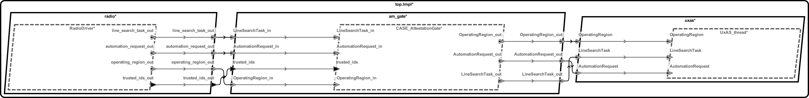
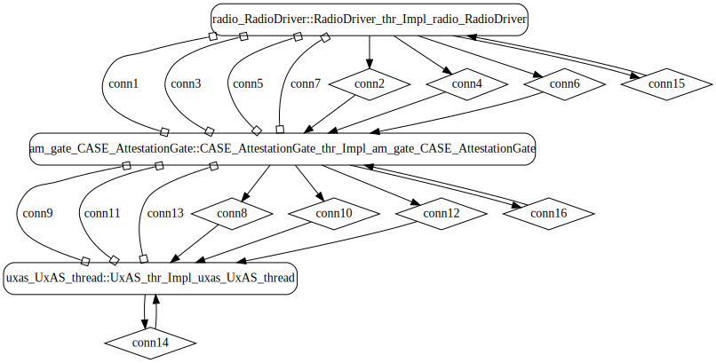
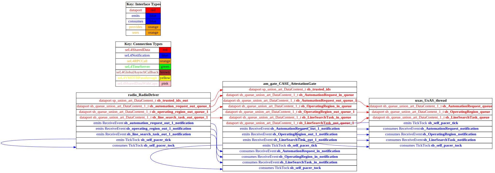

# attestation-gate

 Table of Contents
<!--table-of-contents_start-->
* [AADL Architecture](#aadl-architecture)
* [Modify the AADL Model for CakeML Integration](#modify-the-aadl-model-for-cakeml-integration)
  * [Wire Protocol](#wire-protocol)
  * [Specify Monitor/Filter components](#specify-monitorfilter-components)
* [Linux](#linux)
  * [HAMR Configuration: Linux](#hamr-configuration-linux)
  * [Behavior Code: Linux](#behavior-code-linux)
  * [How to Build/Run: Linux](#how-to-buildrun-linux)
* [SeL4](#sel4)
  * [HAMR Configuration: SeL4](#hamr-configuration-sel4)
  * [Behavior Code: SeL4](#behavior-code-sel4)
  * [How to Build/Run: SeL4](#how-to-buildrun-sel4)
  * [Example Output: SeL4](#example-output-sel4)
  * [CAmkES Architecture: SeL4](#camkes-architecture-sel4)
  * [HAMR CAmkES Architecture: SeL4](#hamr-camkes-architecture-sel4)
<!--table-of-contents_end-->


## AADL Architecture
<!--aadl-architecture_start-->

|System: [top_Impl_Instance](aadl/SysContext.aadl#L89) Properties|
|--|
|Domain Scheduling|
|Wire Protocol|

|[RadioDriver](aadl/RadioDriver.aadl#L12) Properties|
|--|
|Native|
|Periodic: 500 ms|
|Domain: 2|


|[CASE_AttestationGate](aadl/CASE_AttesationGate.aadl#L13) Properties|
|--|
|CakeML|
|Periodic: 500 ms|
|Domain: 5|


|[UxAS_thread](aadl/SysContext.aadl#L24) Properties|
|--|
|Native|
|Periodic: 1000 ms|
|Domain: 9|


**Schedule:** [domain_schedule.c](aadl/kernel/domain_schedule.c)
<!--aadl-architecture_end-->

## Modify the AADL Model for CakeML Integration

### Wire Protocol
Only the wire protocol (ie. byte arrays) is supported for CakeML integration.

  - Attach ``HAMR::Bit_Codec_Raw_Connections => true;`` to the top-level system [SysContext.aadl](aadl/SysContext.aadl#L112)
  - Use the ``HAMR::Bit_Codec_Max_Size`` property to specify the encoded size of each data component that is used by an event data or data port.  For example, see [AirVehicleState.i](aadl/CMASI.aadl#L363) that is used by [UARTDriver_thr.AirVehicleState](aadl/SysContext.aadl#L59)

    - This property only needs to be attached to the top level data component (e.g. array subtypes and record field types do not need to be modified if they are not directly used by a port)

    - HAMR will use the ``Memory_Properties::Data_Size`` annotation if present for types defined in [Base_Types](https://github.com/osate/osate2/blob/master/core/org.osate.contribution.sei/resources/packages/Base_Types.aadl).  The following unbounded types are not currently supported: ``Bases_Types::Boolean``, ``Base_Types::Character``, ``Base_Types::String``, ``Base_Types::Integer``, ``Base_Types::Float``

### Specify Monitor/Filter components
Attach ``CASE_Properties::Component_Type => CakeML`` to the filters or monitors - e.g. [CASE_AttesationGate.aadl](aadl/CASE_AttesationGate.aadl#L25)

Attach ``Source_Text`` to the filters or monitors indicating where the CakeML assemblies are - e.g. 
[CASE_AttesationGate.aadl](aadl/CASE_AttesationGate.aadl#L24).  For this example the assembly can be created by running the script 
[compile-cakeml.cmd](aadl/cakeml/compile-cakeml.cmd)

```
./aadl/cakeml/compile-cakeml.cmd
```

## Linux
<!--Linux_start--><!--Linux_end-->

CakeML integeration is not currently supported for the Linux platform.  However, the behavior of the CakeML components can be mocked up and then the actual CakeML behavior code can be swapped in when deploying to seL4.

### HAMR Configuration: Linux
<!--hamr-configuration-linux_start-->
The following are the options that were used in HAMR's FMIDE dialog box (_&lt;example-dir&gt;_ is the directory that contains this readme file)

Option Name|Value |
|--|--|
Platform|Linux|
Output Directory|_&lt;example-dir&gt;_/hamr/slang|
Base Package Name|attestation-gate|
|Exclude Slang Component Implementations|True/Checked|
|Bit Width|32|
|Max Sequence Size|1|
|Max String Size|256|
|C Output Directory|_&lt;example-dir&gt;_/hamr/c|

You can have HAMR's FMIDE plugin generate verbose output and run the transpiler by setting the ``Verbose output`` and ``Run Transpiler``
options that are located in __Preferences >> OSATE >> Sireum HAMR >> Code Generation__.


<details>

<summary>Click for instructions on how to run HAMR Codegen via the command line</summary>

The script [aadl/bin/run-hamr-Linux.sh](aadl/bin/run-hamr-Linux.sh) uses an experimental OSATE/FMIDE plugin we've developed that
allows you to run HAMR's OSATE/FMIDE plugin via the command line.  It has primarily been used/tested
when installed in OSATE (not FMIDE) and under Linux so may not work as expected in FMIDE or
under a different operating system. The script contains instructions on how to install the plugin.

```
./aadl/bin/run-hamr-Linux.sh
```

</details>
<!--hamr-configuration-linux_end-->


### Behavior Code: Linux
<!--behavior-code-linux_start-->
  * [RadioDriver](hamr/c/ext-c/RadioDriver_thr_Impl_radio_RadioDriver/RadioDriver_thr_Impl_radio_RadioDriver.c)

  * [CASE_AttestationGate](hamr/c/ext-c/CASE_AttestationGate_thr_Impl_am_gate_CASE_AttestationGate/CASE_AttestationGate_thr_Impl_am_gate_CASE_AttestationGate.c)

  * [UxAS_thread](hamr/c/ext-c/UxAS_thr_Impl_uxas_UxAS_thread/UxAS_thr_Impl_uxas_UxAS_thread.c)
<!--behavior-code-linux_end-->


### How to Build/Run: Linux
<!--how-to-buildrun-linux_start-->
If you didn't configure HAMR's FMIDE plugin to run the transpiler automatically then first run
```
./hamr/slang/bin/transpile.sh
```
then 
```
./hamr/c/bin/compile-linux.sh
./hamr/c/bin/run-linux.sh
./hamr/c/bin/stop.sh
```
<!--how-to-buildrun-linux_end-->


## SeL4
<!--SeL4_start--><!--SeL4_end-->

### HAMR Configuration: SeL4
<!--hamr-configuration-sel4_start-->
The following are the options that were used in HAMR's FMIDE dialog box (_&lt;example-dir&gt;_ is the directory that contains this readme file)

Option Name|Value |
|--|--|
Platform|SeL4|
Output Directory|_&lt;example-dir&gt;_/hamr/slang|
Base Package Name|attestation-gate|
|Exclude Slang Component Implementations|True/Checked|
|Bit Width|32|
|Max Sequence Size|1|
|Max String Size|256|
|C Output Directory|_&lt;example-dir&gt;_/hamr/c|
|seL4/CAmkES Output Directory|_&lt;example-dir&gt;_/hamr/camkes

You can have HAMR's FMIDE plugin generate verbose output and run the transpiler by setting the ``Verbose output`` and ``Run Transpiler``
options that are located in __Preferences >> OSATE >> Sireum HAMR >> Code Generation__.


<details>

<summary>Click for instructions on how to run HAMR Codegen via the command line</summary>

The script [aadl/bin/run-hamr-SeL4.sh](aadl/bin/run-hamr-SeL4.sh) uses an experimental OSATE/FMIDE plugin we've developed that
allows you to run HAMR's OSATE/FMIDE plugin via the command line.  It has primarily been used/tested
when installed in OSATE (not FMIDE) and under Linux so may not work as expected in FMIDE or
under a different operating system. The script contains instructions on how to install the plugin.

```
./aadl/bin/run-hamr-SeL4.sh
```

</details>
<!--hamr-configuration-sel4_end-->


### Behavior Code: SeL4
<!--behavior-code-sel4_start-->
  * [RadioDriver](hamr/c/ext-c/RadioDriver_thr_Impl_radio_RadioDriver/RadioDriver_thr_Impl_radio_RadioDriver.c)

  * [CASE_AttestationGate](hamr/c/ext-c/CASE_AttestationGate_thr_Impl_am_gate_CASE_AttestationGate/CASE_AttestationGate_thr_Impl_am_gate_CASE_AttestationGate.c)

  * [UxAS_thread](hamr/c/ext-c/UxAS_thr_Impl_uxas_UxAS_thread/UxAS_thr_Impl_uxas_UxAS_thread.c)
<!--behavior-code-sel4_end-->

\* _If ``CAKEML_ASSEMBLIES_PRESENT=ON`` is passed to ``run-camkes.sh`` (see below) then the behavior code for the attestation gate will come from the CakeML file 
[CASE_AttestationGate_thr_Impl.cml](aadl/cakeml/CASE_AttestationGate_thr_Impl/CASE_AttestationGate_thr_Impl.cml)_

### How to Build/Run: SeL4

Generate the CakeML assembly by running this script [compile-cakeml.cmd](aadl/cakeml/compile-cakeml.cmd)

```
./aadl/cakeml/compile-cakeml.cmd
```

then, run HAMR Codegen.  This, in addition to the normal code generation process, will copy the generated CakeML assemblies into the CAmkES project. 

<!--how-to-buildrun-sel4_start-->
If you didn't configure HAMR's FMIDE plugin to run the transpiler automatically then run
```
./hamr/slang/bin/transpile-sel4.sh
```
then

```
./hamr/camkes/bin/run-camkes.sh -o "-DCAKEML_ASSEMBLIES_PRESENT=ON" -s
```
<!--how-to-buildrun-sel4_end-->

Passing ``CAKEML_ASSEMBLIES_PRESENT=ON`` will remove the run method generated by HAMR 
[here](hamr/camkes/components/CASE_AttestationGate_thr_Impl_am_gate_CASE_AttestationGate/src/sb_CASE_AttestationGate_thr_Impl.c#L295) 
so that the run method provided\* by the CakeML assembly will be used instead. 

\* _Note that the [script](aadl/cakeml/compile-cakeml.cmd#L65) changes the name of the ``main`` method to ``run`` in the generated CakeML assembly_

### Example Output: SeL4
<!--example-output-sel4_start-->
Timeout = 18 seconds
```
Booting all finished, dropped to user space
Entering pre-init of RadioDriver_thr_Impl_radio_RadioDriver
Art: Registered component: top_Impl_Instance_radio_RadioDriver (periodic: 500)
Art: - Registered port: top_Impl_Instance_radio_RadioDrivEntering pre-init of CASE_AttestationGate_thr_Impl_am_gate_CASE_AttestationGate
Art: Registered component: top_Impl_Instance_am_gate_CASE_AttestationGate (periodic: 500)
Art: - Registered port: top_Impl_Instance_am_gate_CASE_AttestationGate_trusEntering pre-init of UxAS_thr_Impl_uxas_UxAS_thread
Art: Registered component: top_Impl_Instance_uxas_UxAS_thread (periodic: 1000)
Art: - Registered port: top_Impl_Instance_uxas_UxAS_thread_AutomationRequest (event in)
Art: - Registered port: top_Impl_Instance_uxas_UxAS_thread_OperatingRegion (eer_trusted_ids_out (data out)
Art: - Registered port: top_Impl_Instance_radio_RadioDriver_automation_request_out (event out)
Art: - Registered port: top_Impl_Instance_radio_RadioDriver_operating_region_out (event out)
Art: - Registered port: top_Impl_Instance_radio_RadioDriver_line_search_task_out (event out)
Leaving pre-init of RadioDriver_thr_Impl_radio_RadioDriver
ted_ids (data in)
Art: - Registered port: top_Impl_Instance_am_gate_CASE_AttestationGate_AutomationRequest_in (event in)
Art: - Registered port: top_Impl_Instance_am_gate_CASE_AttestationGate_AutomationRequest_out (event out)
Art: - Registered port: top_Impl_Instance_am_gate_CASE_AttestationGate_OperatingRegion_in (event in)
Art: - Registered port: top_Impl_Instance_am_gate_CASE_AttestationGate_OperatingRegion_out (event out)
Art: - Registered port: top_Impl_Instance_am_gate_CASE_AttestationGate_LineSearchTask_in (event in)
Art: - Registered port: top_Impl_Instance_am_gate_CASE_AttestationGate_LineSearchTask_out (event out)
Leaving pre-init of CASE_AttestationGate_thr_Impl_am_gate_CASE_AttestationGate
vent in)
Art: - Registered port: top_Impl_Instance_uxas_UxAS_thread_LineSearchTask (event in)
Leaving pre-init of UxAS_thr_Impl_uxas_UxAS_thread
top_Impl_Instance_am_gate_CASE_AttestationGate: 
	tidArray = (555, 666, 777)
	opregionID = 
	lstID = 
	autorqtID = 400
top_Impl_Instance_am_gate_CASE_AttestationGate: 
	tidArray = (500, 400, 600)
	opregionID = 
	lstID = 400
	autorqtID = 
top_Impl_Instance_uxas_UxAS_thread: 
	Line Search Task (8192 bytes)
top_Impl_Instance_am_gate_CASE_AttestationGate: 
	tidArray = (555, 666, 777)
	opregionID = 
	lstID = 
	autorqtID = 400
top_Impl_Instance_am_gate_CASE_AttestationGate: 
	tidArray = (500, 400, 600)
	opregionID = 
	lstID = 400
	autorqtID = 
top_Impl_Instance_uxas_UxAS_thread: 
	Line Search Task (8192 bytes)
top_Impl_Instance_am_gate_CASE_AttestationGate: 
	tidArray = (500, 400, 600)
	opregionID = 400
	lstID = 
	autorqtID = 
top_Impl_Instance_uxas_UxAS_thread: 
	Operating Region (256 bytes)
top_Impl_Instance_am_gate_CASE_AttestationGate: 
	tidArray = (555, 666, 777)
	opregionID = 
	lstID = 400
	autorqtID = 
top_Impl_Instance_am_gate_CASE_AttestationGate: 
	tidArray = (555, 666, 777)
	opregionID = 
	lstID = 
	autorqtID = 400

```
<!--example-output-sel4_end-->


### CAmkES Architecture: SeL4
<!--camkes-architecture-sel4_start-->

<!--camkes-architecture-sel4_end-->


### HAMR CAmkES Architecture: SeL4
<!--hamr-camkes-architecture-sel4_start-->

<!--hamr-camkes-architecture-sel4_end-->

