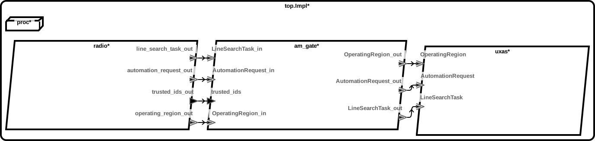
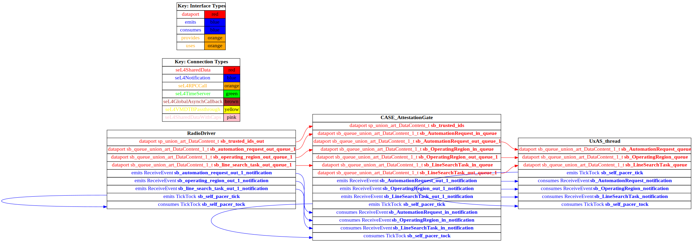

# attestation-gate

 Table of Contents
  * [Diagrams](#diagrams)
    * [AADL Arch](#aadl-arch)
    * [SeL4](#sel4)
      * [SeL4 CAmkES Arch](#sel4-camkes-arch)
      * [SeL4 CAmkES HAMR Arch](#sel4-camkes-hamr-arch)
  * [Example Output](#example-output)
    * [SeL4 Expected Output: Timeout = 20 seconds](#sel4-expected-output-timeout--20-seconds)

## Diagrams
### AADL Arch


### SeL4
#### SeL4 CAmkES Arch


#### SeL4 CAmkES HAMR Arch


## Example Output
*NOTE:* actual output may differ due to issues related to thread interleaving
### SeL4 Expected Output: Timeout = 20 seconds

  |HAMR Codegen Configuration| |
  |--|--|
  | refer to [bin/run-hamr-SeL4.sh](bin/run-hamr-SeL4.sh) |


  **How To Run**
  ```
  ./bin/run-hamr-SeL4.sh

  ./cakeml/compile-cakeml.cmd

  ./CAmkES_seL4_2021/src/c/CAmkES_seL4/bin/run-camkes.sh -o "-DCAKEML_ASSEMBLIES_PRESENT=ON" -s
  ```

  ```
  Booting all finished, dropped to user space
  Entering pre-init of RadioDriver_thr_Impl_radio_RadioDriver
  Art: Registered component: top_Impl_Instance_radio_RadioDriver (periodic: 500)
  Art: - Registered port: top_Impl_Instance_radio_RadioDriver_trusted_ids_out (data out)
  Art: - Registered port: top_Impl_Instance_radio_RadioDriver_automation_request_out (event out)
  Art: - Registered port: tEntering pre-init of CASE_AttestationGate_thr_Impl_am_gate_CASE_AttestationGate
  Art: Registered component: top_Impl_Instance_am_gate_CASE_AttestationGate (periodic: 500)
  Art: - Registered port: top_Impl_Instance_am_gate_CASE_AttestationGate_trusted_ids (data in)
  Art: - Registered port: top_Impl_Instance_am_gate_CASE_AttestationGate_AutomationRequest_in (event in)
  Entering pre-init of UxAS_thr_Impl_uxas_UxAS_thread
  Art: Registered component: top_Impl_Instance_uxas_UxAS_thread (periodic: 1000)
  Art: - Registered port: top_Impl_Instance_uxas_UxAS_thread_AutomationRequest (event in)
  Art: - Registered port: top_Impl_Instance_uxas_UxAS_thread_OperatingRegion (event in)
  Art: - Registered port: top_Impl_Instance_uxas_UxAS_thread_LineSearchTop_Impl_Instance_radio_RadioDriver_operating_region_out (event out)
  Art: - Registered port: top_Impl_Instance_radio_RadioDriver_line_search_task_out (event out)
  Leaving pre-init of RadioDriver_thr_Impl_radio_RadioDriver
  Art: - Registered port: top_Impl_Instance_am_gate_CASE_AttestationGate_AutomationRequest_out (event out)
  Art: - Registered port: top_Impl_Instance_am_gate_CASE_AttestationGate_OperatingRegion_in (event in)
  Art: - Registered port: top_Impl_Instance_am_gate_CASE_AttestationGate_OperatingRegion_out (event out)
  Art: - Registered port: top_Impl_Instance_am_gate_CASE_AttestationGate_LineSearchTask_in (event in)
  Art: - Registered port: top_Impl_Instance_am_gate_CASE_AttestationGate_LineSearchTask_out (event out)
  Leaving pre-init of CASE_AttestationGate_thr_Impl_am_gate_CASE_AttestationGate
  ask (event in)
  Leaving pre-init of UxAS_thr_Impl_uxas_UxAS_thread
  top_Impl_Instance_am_gate_CASE_AttestationGate: 
  	tidArray = (555, 666, 777)
  	opregionID = 
  	lstID = 
  	autorqtID = 400
  top_Impl_Instance_am_gate_CASE_AttestationGate: 
  	tidArray = (500, 400, 600)
  	opregionID = 
  	lstID = 400
  	autorqtID = 
  top_Impl_Instance_uxas_UxAS_thread: 
  	Line Search Task (8192 bytes)
  top_Impl_Instance_am_gate_CASE_AttestationGate: 
  	tidArray = (555, 666, 777)
  	opregionID = 
  	lstID = 
  	autorqtID = 400
  top_Impl_Instance_am_gate_CASE_AttestationGate: 
  	tidArray = (500, 400, 600)
  	opregionID = 
  	lstID = 400
  	autorqtID = 
  top_Impl_Instance_uxas_UxAS_thread: 
  	Line Search Task (8192 bytes)
  top_Impl_Instance_am_gate_CASE_AttestationGate: 
  	tidArray = (500, 400, 600)
  	opregionID = 400
  	lstID = 
  	autorqtID = 
  top_Impl_Instance_uxas_UxAS_thread: 
  	Operating Region (256 bytes)
  top_Impl_Instance_am_gate_CASE_AttestationGate: 
  	tidArray = (555, 666, 777)
  	opregionID = 
  	lstID = 400
  	autorqtID = 
  top_Impl_Instance_am_gate_CASE_AttestationGate: 
  	tidArray = (555, 666, 777)
  	opregionID = 
  	lstID = 
  	autorqtID = 400
  top_Impl_Instance_am_gate_CASE_AttestationGate: 
  	tidArray = (555, 666, 777)
  	opregionID = 400
  	lstID = 
  	autorqtID = 
  top_Impl_Instance_am_gate_CASE_AttestationGate: 
  	tidArray = (500, 400, 600)
  	opregionID = 
  	lstID = 400
  	autorqtID = 
  top_Impl_Instance_uxas_UxAS_thread: 
  	Line Search Task (8192 bytes)
  top_Impl_Instance_am_gate_CASE_AttestationGate: 
  	tidArray = (555, 666, 777)
  	opregionID = 
  	lstID = 400
  	autorqtID = 

  ```