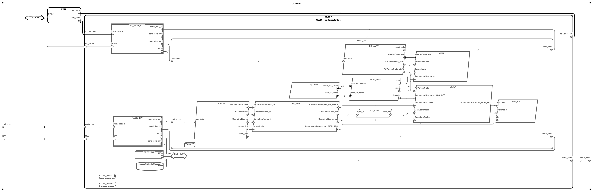
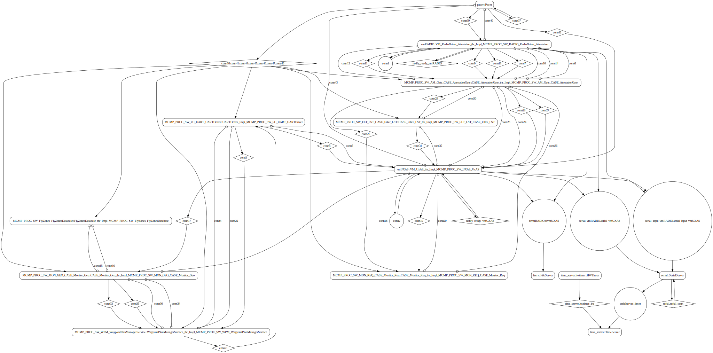
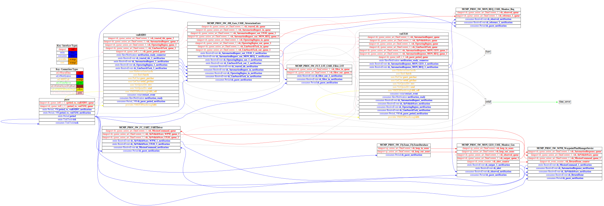

# phase2

 Table of Contents
<!--ts-->
* [AADL Architecture](#aadl-architecture)
* [Installing the Tools](#installing-the-tools)
  * [Install CakeML](#install-cakeml)
* [Modify the AADL Model for CakeML Integration](#modify-the-aadl-model-for-cakeml-integration)
  * [Wire Protocol](#wire-protocol)
  * [Specify Monitor/Filter components](#specify-monitorfilter-components)
* [LMCP Integration](#lmcp-integration)
* [Linux](#linux)
  * [HAMR Configuration: Linux](#hamr-configuration-linux)
  * [Behavior Code: Linux](#behavior-code-linux)
  * [How to Build/Run: Linux](#how-to-buildrun-linux)
* [SeL4](#sel4)
  * [HAMR Configuration: SeL4](#hamr-configuration-sel4)
  * [Behavior Code: SeL4](#behavior-code-sel4)
  * [How to Build/Run: SeL4](#how-to-buildrun-sel4)
    * [Generate the CakeML assemblies](#generate-the-cakeml-assemblies)
    * [Install CAmkES + ARM VM](#install-camkes--arm-vm)
    * [Build the Image and Simulate via QEMU](#build-the-image-and-simulate-via-qemu)
  * [Example Output: SeL4](#example-output-sel4)
  * [CAmkES Architecture: SeL4](#camkes-architecture-sel4)
  * [HAMR CAmkES Architecture: SeL4](#hamr-camkes-architecture-sel4)
<!--te-->


## AADL Architecture
<!--aadl-architecture_start-->

|System Properties|
|--|
|Domain Scheduling|
|Wire Protocol|

|RadioDriver_Attestation Properties|
|--|
|Virtual Machine|
|Periodic: 500 ms|
|Domain: 2|


|CASE_AttestationGate Properties|
|--|
|CakeML|
|Periodic: 500 ms|
|Domain: 3|


|FlyZonesDatabase Properties|
|--|
|Native|
|Periodic: 500 ms|
|Domain: 4|


|CASE_Filter_LST Properties|
|--|
|CakeML|
|Periodic: 500 ms|
|Domain: 5|


|UxAS Properties|
|--|
|Virtual Machine|
|Periodic: 500 ms|
|Domain: 6|


|CASE_Monitor_Geo Properties|
|--|
|CakeML|
|Periodic: 500 ms|
|Domain: 7|


|WaypointPlanManagerService Properties|
|--|
|Native|
|Periodic: 500 ms|
|Domain: 8|


|UARTDriver Properties|
|--|
|Native|
|Periodic: 500 ms|
|Domain: 9|


|CASE_Monitor_Req Properties|
|--|
|Native|
|Periodic: 500 ms|
|Domain: 10|

<!--aadl-architecture_end-->


## Installing the Tools

The following assumes a case-env is used (see [https://github.com/loonwerks/CASE/tree/master/TA5/case-env](https://github.com/loonwerks/CASE/tree/master/TA5/case-env))

### Install CakeML

Run ``$HOME/CASE/seL4-CAmkES-L4v-dockerfiles/scripts/cakeml.sh``.  Note that installing HOL takes a long time and is optional <-- *Junaid/Eric feedback*

Once installed, make sure the 64bit version is available from the command line.  E.g. in a directory available in my path I have the symlink ``cake -> /usr/local/bin/cake-x64-64/cake``

**NOTE**: Cake seg faulted the first time I tried to run it from the command line.  Restarting the vagrant VM seemed to fix the issue.

## Modify the AADL Model for CakeML Integration

### Wire Protocol
Only the wire protocol (ie. byte arrays) is supported for CakeML integration.

  - Attach ``HAMR::Bit_Codec_Raw_Connections => true;`` to the top-level system [UAV.aadl](aadl/UAV/UAV.aadl#L46)
  - Use the ``HAMR::Bit_Codec_Max_Size`` property to specify the encoded size of each data component that is used by an event data or data port.  For example, see 
  [AddressAttributedMessage.i](aadl/UxAS/Message%20Definitions/CMASI.aadl#L52)
  that is used by
  [UARTDriver_thrRadioDriver_Attestation_thr.AutomationRequest](aadl/UAV/SW.aadl#L26)

    - This property only needs to be attached to the top level data component (e.g. array subtypes and record field types do not need to be modified if they are not directly used by a port)

    - HAMR will use the ``Memory_Properties::Data_Size`` annotation if present for types defined in [Base_Types](https://github.com/osate/osate2/blob/master/core/org.osate.contribution.sei/resources/packages/Base_Types.aadl).  The following unbounded types are not currently supported: ``Bases_Types::Boolean``, ``Base_Types::Character``, ``Base_Types::String``, ``Base_Types::Integer``, ``Base_Types::Float``

### Specify Monitor/Filter components
Attach ``CASE_Properties::Component_Type => CakeML`` to the filters or monitors - e.g. [CASE_AttestationGate_thr](aadl/UAV/SW.aadl#L82)

Attach ``Source_Text`` to the filters or monitors indicating where the CakeML assemblies are - e.g. 
[CASE_AttestationGate_thr](aadl/UAV/SW.aadl#L83).  For this example the assembly can be created by running the script 
[compile-cakeml.cmd](aadl/cakeml/compile-cakeml.cmd)

## LMCP Integration

The data structures that realize the AADL types attached to the event data ports were
constructed using the Lightweight Message Construction Protocol ([LMCP](https://github.com/afrl-rq/LmcpGen#introduction)).  LMCP, similar to 
Bit-Codec, provides a framework for defining structured data and generates serializer/deserializers
that enable the data to be transmitted and received regardless of the operating system, platform, or programming language used.

The [location](aadl/c_libraries/CMASI) of the LMCP library was passed to HAMR (e.g. [here](aadl/bin/run-hamr-SeL4.sh#L34)) 
and is therefore available to native components (e.g. 
[Geofence Monitor](hamr/c/ext-c/CASE_Monitor_Req_thr_Impl_MCMP_PROC_SW_MON_REQ_CASE_Monitor_Req/CASE_Monitor_Req_thr_Impl_MCMP_PROC_SW_MON_REQ_CASE_Monitor_Req.c#L29))
as well as for VM components
(e.g. [UXAS](hamr/camkes/components/VM/apps/vmUXAS/vmUXAS.c#L512))

## Linux
CakeML integeration is not currently supported for the Linux platform. However, the behavior of the CakeML components can be mocked up and then the actual CakeML behavior code can be swapped in when deploying to seL4.


<!--Linux_start--><!--Linux_end-->

### HAMR Configuration: Linux
<!--hamr-configuration-linux_start-->
refer to [aadl/bin/run-hamr-Linux.sh](aadl/bin/run-hamr-Linux.sh)
<!--hamr-configuration-linux_end-->


### Behavior Code: Linux
<!--behavior-code-linux_start-->
  * [UARTDriver](hamr/c/ext-c/UARTDriver_Impl_MCMP_PROC_SW_FC_UART_UARTDriver/UARTDriver_Impl_MCMP_PROC_SW_FC_UART_UARTDriver.c)

  * [RadioDriver_Attestation](hamr/c/ext-c/RadioDriver_Attestation_thr_Impl_MCMP_PROC_SW_RADIO_RadioDriver_Attestation/RadioDriver_Attestation_thr_Impl_MCMP_PROC_SW_RADIO_RadioDriver_Attestation.c)

  * [FlyZonesDatabase](hamr/c/ext-c/FlyZonesDatabase_thr_Impl_MCMP_PROC_SW_FlyZones_FlyZonesDatabase/FlyZonesDatabase_thr_Impl_MCMP_PROC_SW_FlyZones_FlyZonesDatabase.c)

  * [UxAS](hamr/c/ext-c/UxAS_thr_Impl_MCMP_PROC_SW_UXAS_UxAS/UxAS_thr_Impl_MCMP_PROC_SW_UXAS_UxAS.c)

  * [WaypointPlanManagerService](hamr/c/ext-c/WaypointPlanManagerService_thr_Impl_MCMP_PROC_SW_WPM_WaypointPlanManagerService/WaypointPlanManagerService_thr_Impl_MCMP_PROC_SW_WPM_WaypointPlanManagerService.c)

  * [CASE_AttestationGate](hamr/c/ext-c/CASE_AttestationGate_thr_Impl_MCMP_PROC_SW_AM_Gate_CASE_AttestationGate/CASE_AttestationGate_thr_Impl_MCMP_PROC_SW_AM_Gate_CASE_AttestationGate.c)

  * [CASE_Filter_LST](hamr/c/ext-c/CASE_Filter_LST_thr_Impl_MCMP_PROC_SW_FLT_LST_CASE_Filter_LST/CASE_Filter_LST_thr_Impl_MCMP_PROC_SW_FLT_LST_CASE_Filter_LST.c)

  * [CASE_Monitor_Req](hamr/c/ext-c/CASE_Monitor_Req_thr_Impl_MCMP_PROC_SW_MON_REQ_CASE_Monitor_Req/CASE_Monitor_Req_thr_Impl_MCMP_PROC_SW_MON_REQ_CASE_Monitor_Req.c)

  * [CASE_Monitor_Geo](hamr/c/ext-c/CASE_Monitor_Geo_thr_Impl_MCMP_PROC_SW_MON_GEO_CASE_Monitor_Geo/CASE_Monitor_Geo_thr_Impl_MCMP_PROC_SW_MON_GEO_CASE_Monitor_Geo.c)
<!--behavior-code-linux_end-->


### How to Build/Run: Linux
<!--how-to-buildrun-linux_start-->
```
./aadl/bin/run-hamr-Linux.sh
./hamr/c/bin/compile-linux.sh
./hamr/c/bin/run-linux.sh
./hamr/c/bin/stop.sh
```
<!--how-to-buildrun-linux_end-->


## SeL4
<!--SeL4_start--><!--SeL4_end-->

### HAMR Configuration: SeL4
<!--hamr-configuration-sel4_start-->
refer to [aadl/bin/run-hamr-SeL4.sh](aadl/bin/run-hamr-SeL4.sh)
<!--hamr-configuration-sel4_end-->


### Behavior Code: SeL4

<!--behavior-code-sel4_start-->
  * [UARTDriver](hamr/c/ext-c/UARTDriver_Impl_MCMP_PROC_SW_FC_UART_UARTDriver/UARTDriver_Impl_MCMP_PROC_SW_FC_UART_UARTDriver.c)

  * [RadioDriver_Attestation (includes VM glue code)](hamr/camkes/components/VM/apps/vmRADIO/vmRADIO.c)

  * [FlyZonesDatabase](hamr/c/ext-c/FlyZonesDatabase_thr_Impl_MCMP_PROC_SW_FlyZones_FlyZonesDatabase/FlyZonesDatabase_thr_Impl_MCMP_PROC_SW_FlyZones_FlyZonesDatabase.c)

  * [UxAS (includes VM glue code)](hamr/camkes/components/VM/apps/vmUXAS/vmUXAS.c)

  * [WaypointPlanManagerService](hamr/c/ext-c/WaypointPlanManagerService_thr_Impl_MCMP_PROC_SW_WPM_WaypointPlanManagerService/WaypointPlanManagerService_thr_Impl_MCMP_PROC_SW_WPM_WaypointPlanManagerService.c)

  * [CASE_AttestationGate](hamr/c/ext-c/CASE_AttestationGate_thr_Impl_MCMP_PROC_SW_AM_Gate_CASE_AttestationGate/CASE_AttestationGate_thr_Impl_MCMP_PROC_SW_AM_Gate_CASE_AttestationGate.c)

  * [CASE_Filter_LST](hamr/c/ext-c/CASE_Filter_LST_thr_Impl_MCMP_PROC_SW_FLT_LST_CASE_Filter_LST/CASE_Filter_LST_thr_Impl_MCMP_PROC_SW_FLT_LST_CASE_Filter_LST.c)

  * [CASE_Monitor_Req](hamr/c/ext-c/CASE_Monitor_Req_thr_Impl_MCMP_PROC_SW_MON_REQ_CASE_Monitor_Req/CASE_Monitor_Req_thr_Impl_MCMP_PROC_SW_MON_REQ_CASE_Monitor_Req.c)

  * [CASE_Monitor_Geo](hamr/c/ext-c/CASE_Monitor_Geo_thr_Impl_MCMP_PROC_SW_MON_GEO_CASE_Monitor_Geo/CASE_Monitor_Geo_thr_Impl_MCMP_PROC_SW_MON_GEO_CASE_Monitor_Geo.c)
<!--behavior-code-sel4_end-->

\* _If CAKEML_ASSEMBLIES_PRESENT=ON is passed to run-camkes.sh (see below) then the behavior code for the CakeML components will come from the following CakeML files_

  * [attestation_gate.cml](aadl/cakeml/attestation_gate/attestation_gate.cml)
  * [geofence_monitor.cml](aadl/cakeml/geofence_monitor/geofence_monitor.cml)
  * [line_search_task_filter.cml](aadl/cakeml/line_search_task_filter/line_search_task_filter.cml)

### How to Build/Run: SeL4

**NOTE: the following potentially needs a lot of rework depending on the status of the CakeML plugin, CASE tool transforms etc.**

#### Generate the CakeML assemblies

The AADL model was hand-modified so that the CakeML components point to the
location of their CakeML assemblies (e.g 
[AttestationGate](aadl/UAV/SW.aadl#L83)).
For this example the 
assemblies are created by running this Slash script 
[compile-cakeml.cmd](aadl/cakeml/compile-cakeml.cmd).
In the 
future the CASE tranforms + the SPLAT plugin will automate these steps.

Therefore the first build step is to run the Slash script to generate the
CakeML assemblies

```
./aadl/cakeml/compile-cakeml.cmd --stripped --target=arm8
```

Note that two of the CakeML components (
[filter](aadl/UAV/SW.aadl#L141) and 
[monitor](aadl/UAV/SW.aadl#L416)
) crash somewhere in the Contigs
when run, so the Slash script 'strips' them via the ``--stripped`` option,
which causes those CakeML components to act as simple pass throughs 
(i.e. they're CakeML, but don't do anything interesting).

The ``target=arm8`` may be the culprit for why the above are crashing.
**TODO: add discussion regarding issues with the ``Double`` library
if necessary**

Another oddity is that the attestation gate's
[interface](aadl/UAV/SW.aadl#L74-80)
indicates it
should be stripping the 'address attributed' part of messages before
forwarding them onto, for example, the CakeML filter 
[here](aadl/UAV/SW.aadl#137).  That
issue also impacts non-CakeML downstream components like the UXAS as the
messages flowing in are larger (ie. contain more bits) than expected.  

**TODO: add more explanation if necessary**

#### Install CAmkES + ARM VM

**TODO explain this step**

```
./hamr/camkes/bin/setup-camkes-arm-vm.sh
```

#### Build the Image and Simulate via QEMU

Now, run HAMR codegen

```
./aadl/bin/run-hamr-SeL4.sh
```

**TODO: explain why the [CASE](aadl/CASE) directory needs to be deleted if running HAMR via FMIDE.  For now see this 
[comment](aadl/CASE/README.md)**

After running ``run-hamr-SeL4.sh`` you must run the command below
in order to patch the code HAMR generates so that it is compatible with
the legacy CakeML code that was produced for the phase 2 deliverable.
**TODO: add more explanation if needed**


```
git apply-patch 0001-ffi-data-port-hack.patch
```

Now build the image and simulate it via QEMU

```
./hamr/camkes/bin/run-camkes.sh -o "-DCAKEML_ASSEMBLIES_PRESENT=ON -DUSE_PRECONFIGURED_ROOTFS=ON" -s
```

**TODO add instructions on how to start up the separate VM's unde QEMU -- for now, just look at the output below**

### Example Output: SeL4
<!--example-output-sel4_start-->
```
Booting all finished, dropped to user space
<<seL4(CPU 0) [decodeUntypedInvocation/212 T0xff807fc1c400 "rootserver" @4006f0]: Untyped Retype: Insufficient memory (1 * 2097152 bytes needed, 0 bytes available).>>
<<seL4(CPU 0) [decodeUntypedInvocation/212 T0xff807fc1c400 "rootserver" @4006f0]: Untyped Retype: Insufficient memory (1 * 2097152 bytes needed, 0 bytes available).>>
<<seL4(CPU 0) [maskVMRights/187 T0xff807fc1c400 "rootserver" @4006f0]: Attempted to make unsupported write only mapping>>
Entering pre-init of FlyZonesDatabase_thr_Impl_MCMP_PROC_SW_FlyZones_FlyZonesDatabase
Art: Registered component: UAV_Impl_Instance_MCMP_PROC_SW_FlyZones_FlyZonesDatabase (periodic: 500)
Art: - Registered port: UAV_Impl_Instance_MCMP_PROC_SW_FlyZones_FlyZonesDatabase_keep_in_zones (data out)
Art: - Registered port: UAV_Impl_Instance_MCMP_PROC_SW_FlyZones_FlyZonesDatabase_keep_out_zones (data out)
Leaving pre-init of FlyZonesDatabase_thr_Impl_MCMP_PROC_SW_FlyZones_FlyZonesDatabase
Entering pre-init of CASE_Filter_LST_thr_Impl_MCMP_PROC_SW_FLT_LST_CASE_Filter_LST
Art: Registered component: UAV_Impl_Instance_MCMP_PROC_SW_FLT_LST_CASE_Filter_LST (periodic: 500)
Art: - Registered port: UAV_Impl_Instance_MCMP_PROC_SW_FLT_LST_CASE_Filter_LST_filter_in (event in)
Art: - Registered port: UAV_Impl_Instance_MCMP_PROC_SW_FLT_LST_CASE_Filter_LST_filter_out (event out)
Leaving pre-init of CASE_Filter_LST_thr_Impl_MCMP_PROC_SW_FLT_LST_CASE_Filter_LST
Entering pre-init of CASE_Monitor_Geo_thr_Impl_MCMP_PROC_SW_MON_GEO_CASE_Monitor_Geo
Art: Registered component: UAV_Impl_Instance_MCMP_PROC_SW_MON_GEO_CASE_Monitor_Geo (periodic: 500)
Art: - Registered port: UAV_Impl_Instance_MCMP_PROC_SW_MON_GEO_CASE_Monitor_Geo_keep_in_zones (data in)
Art: - Registered port: UAV_Impl_Instance_MCMP_PROC_SW_MON_GEO_CASE_Monitor_Geo_keep_out_zones (data in)
Art: - Registered port: UAV_Impl_Instance_MCMP_PROC_SW_MON_GEO_CASE_Monitor_Geo_observed (event in)
Art: - Registered port: UAV_Impl_Instance_MCMP_PROC_SW_MON_GEO_CASE_Monitor_Geo_output (event out)
Art: - Registered port: UAV_Impl_Instance_MCMP_PROC_SW_MON_GEO_CASE_Monitor_Geo_alert (event out)
Leaving pre-init of CASE_Monitor_Geo_thr_Impl_MCMP_PROC_SW_MON_GEO_CASE_Monitor_Geo
Entering pre-init of WaypointPlanManagerService_thr_Impl_MCMP_PROC_SW_WPM_WaypointPlanManagerService
Entering pre-init of UARTDriver_Impl_MCMP_PROC_SW_FC_UART_UARTDriver
Art: Registered component: UAV_Impl_Instance_MCMP_PROC_SW_FC_UART_UARTDriver (periodic: 500)
Art: - Registered port: UAV_Impl_Instance_MCMP_PROC_SW_FC_UART_UARTDriver_recv_data (event in)
Art: - Registered port: UAV_Impl_Instance_MCMP_PROC_SW_FC_UART_UARTDriver_MissionCommand (event in)
Art: - Registered port: UAV_Impl_Instance_MCMP_PROC_SW_FC_UART_UARTDriver_send_data (event out)
Art: - Registered port: UAV_Impl_Instance_MCMP_PROC_SW_FC_UART_UARTDriver_AirVehicleState_WPM (event out)
Art: - Registered port: UAV_Impl_Instance_MCMP_PROC_SW_FC_UART_UARTDriver_AirVehicleState_UXAS (event out)
Entering pre-init of CASE_Monitor_Req_thr_Impl_MCMP_PROC_SW_MON_REQ_CASE_Monitor_Req
Art: Registered component: UAV_Impl_Instance_MCMP_PROC_SW_MON_REQ_CASE_Monitor_Req (periodic: 500)
Art: - Registered port: UAV_Impl_Instance_MCMP_PROC_SW_MON_REQ_CASE_Monitor_Req_observed (event in)
Art: - Registered port: UAV_Impl_Instance_MCMP_PROC_SW_MON_REQ_CASE_Monitor_Req_reference_1 (event in)
Leaving pre-init of CASE_Monitor_Req_thr_Impl_MCMP_PROC_SW_MON_REQ_CASE_Monitor_Req
Entering pre-init of CASE_AttestationGate_thr_Impl_MCMP_PROC_SW_AM_Gate_CASE_AttestationGate
Art: Registered component: UAV_Impl_Instance_MCMP_PROC_SW_AM_Gate_CASE_AttestationGate (periodic: 500)
Art: - Registered port: UAV_Impl_Instance_MCMP_PROC_SW_AM_Gate_CASE_AttestationGate_trusted_ids (event in)
Art: - Registered port: UAV_Impl_Instance_MCMP_PROC_SW_AM_Gate_CASE_AttestationGate_AutomationRequest_in (event in)
Art: - Registered port: UAV_Impl_Instance_MCMP_PROC_SW_AM_Gate_CASE_AttestationGate_AutomationRequest_out_UXAS (event out)
Art: - Registered port: UAV_Impl_Instance_MCMP_PROC_SW_AM_Gate_CASE_AttestationGate_AutomationRequest_out_MON_REQ (event out)
Art: - Registered port: UAV_Impl_Instance_MCMP_PROC_SW_AM_Gate_CASE_AttestationGate_OperatingRegion_in (event in)
Art: - Registered port: UAV_Impl_Instance_MCMP_PROC_SW_AM_Gate_CASE_AttestationGate_OperatingRegi_utspace_split_alloc@split.c:272 Failed to find any untyped capable of creating an object at address 0x8040000
Loading Linux: 'linux' dtb: ''
install_linux_devices@main.c:657 module name: map_frame_hack
install_linux_devices@main.c:657 module name: init_ram
Art: Registered component: UAV_Impl_Instance_MCMP_PROC_SW_WPM_WaypointPlanManagerService (periodic: 500)
Art: - Registered port: UAV_Impl_Instance_MCMP_PROC_SW_WPM_WaypointPlanManagerService_AutomationResponse (event in)
Art: - Registered port: UAV_Impl_Instance_MCMP_PROC_SW_WPM_WaypointPlanManagerService_AirVehicleState (event in)
Art: - Registered port: UAV_Impl_Instance_MCMP_PROC_SW_WPM_WaypointPlanManagerService_MissionCommand (event out)
Art: - Registered port: UAV_Impl_Instance_MCMP_PROC_SW_WPM_WaypointPlanManagerService_ReturnHome (event in)
Leaving pre-init of WaypointPlanManagerService_thr_Impl_MCMP_PROC_SW_WPM_WaypointPlanManagerService
Leaving pre-init of UARTDriver_Impl_MCMP_PROC_SW_FC_UART_UARTDriver
_utspace_split_alloc@split.c:272 Failed to find any untyped capable of creating an object at address 0x8040000
Loading Linux: 'linux' dtb: ''
install_linux_devices@main.c:657 module name: map_frame_hack
install_linux_devices@main.c:657 module name: init_ram
on_out (event out)
Art: - Registered port: UAV_Impl_Instance_MCMP_PROC_SW_AM_Gate_CASE_AttestationGate_LineSearchTask_in (event in)
Art: - Registered port: UAV_Impl_Instance_MCMP_PROC_SW_AM_Gate_CASE_AttestationGate_LineSearchTask_out (event out)
Leaving pre-init of CASE_AttestationGate_thr_Impl_MCMP_PROC_SW_AM_Gate_CASE_AttestationGate
install_linux_devices@main.c:657 module name: virtio_con
install_linux_devices@main.c:657 module name: cross_vm_connections
install_linux_devices@main.c:657 module name: virtio_con
install_linux_devices@main.c:657 module name: cross_vm_connections
libsel4muslcsys: Error attempting syscall 215
libsel4muslcsys: Error attempting syscall 215
libsel4muslcsys: Error attempting syscall 215
clean_up@fdtgen.c:370 Non-existing node None specified to be kept
consume_connection_event@cross_vm_connection.c:247 Failed to inject connection irq
_utspace_split_alloc@split.c:272 Failed to find any untyped capable of creating an object at address 0x8020000
[   13.490215] Unable to detect cache hierarchy for CPU 0
[   13.507618] e1000: Intel(R) PRO/1000 Network Driver - version 7.3.21-k8-NAPI
[   13.522675] e1000: Copyright (c) 1999-2006 Intel Corporation.
[   13.536417] e1000e: Intel(R) consume_connection_event@cross_vm_connection.c:247 Failed to inject connection irq
PRO/1000 Network Driver - 3.2.6-k
[   14.167203] e1000e: Copyright(c) 1999 - 2015 Intel Corporation.
[   14.187089] mousedev: PS/2 mouse device common for all mice
[   14.208110] ledtrig-cpu: registered to indicate activity on CPUs
[   14.222571] dmi-sysfs: dmi entry is absent.
[   14.235312] ipip: IPv4 and MPLS over IPv4 tunneling driver
[   14.258057] NET: Registered protocol family 10
consume_connection_event@cross_vm_connection.c:247 Failed to inject connection irq
[   15.094392] mip6: Mobile IPv6
[   15.110571] NET: Registered protocol family 17
[   15.123038] mpls_gso: MPLS GSO support
[   15.133853] Registered cp15_barrier emulation handler
[   15.146184] Registered setend emulation handler
[   15.163470] registered taskstats version 1
[   15.174288] zswap: loaded using pool lzo/zbud
consume_connection_event@cross_vm_connection.c:247 Failed to inject connection irq
[   16.036699] ima: No TPM chip found, activating TPM-bypass!
[   16.047524] ima: Allocated hash algorithm: sha256
[   16.074911] hctosys: unable to open rtc device (rtc0)
[   16.086571] PM: Hibernation image not present or could not be loaded.
[   16.099985] initcall clk_disable_unused blacklisted
[   13.898284] Unable to detect cache hierarchy for CPU 0
[   13.915712] e1000: Intel(R) PRO/1000 Network Driver - version 7.3.21-k8-NAPI
[   13.933406] e1000: Copyright (c) 1999-2006 Intel Corporation.
[   14.991968] e1000e: Intel(R) PRO/1000 Network Driver - 3.2.6-k
[   15.005107] e1000e: Copyright(c) 1999 - 2015 Intel Corporation.
[   15.026358] mousedev: PS/2 mouse device common for all mice
[   15.049692] ledtrig-cpu: registered to indicate activity on CPUs
[   15.064335] dmi-sysfs: dmi entry is absent.
[   15.078279] ipip: IPv4 and MPLS over IPv4 tunneling driver
[   15.096631] NET: Registered protocol family 10
[   16.144747] mip6: Mobile IPv6
[   16.173890] NET: Registered protocol family 17
[   16.184232] mpls_gso: MPLS GSO support
[   16.193474] Registered cp15_barrier emulation handler
[   16.204777] Registered setend emulation handler
[   16.222793] registered taskstats version 1
[   16.233741] zswap: loaded using pool lzo/zbud
[   17.272016] ima: No TPM chip found, activating TPM-bypass!
[   17.282474] ima: Allocated hash algorithm: sha256
[   17.308676] hctosys: unable to open rtc device (rtc0)
[   17.321350] PM: Hibernation image not present or could not be loaded.
[   17.335881] initcall clk_disable_unused blacklisted
[   20.729690] Freeing unused kernel memory: 3776K
[   21.984609] Freeing unused kernel memory: 3776K
Starting syslogd: OK
Starting klogd: OK
Starting syslogd: OK
Starting klogd: Running sysctl: OK
Running sysctl: OK
Initializing random number generator... [   41.748266] random: dd: uninitialized urandom read (512 bytes read)
done.
Starting network: OK
Initializing random number generator... [   43.959136] random: dd: uninitialized urandom read (512 bytes read)
OK
done.
[   48.447129] connection: loading out-of-tree module taints kernel.
[   48.489919] Event Bar (dev-0) initalised
[   48.512930] 2 Dataports (dev-0) initalised
[   48.525444] Event Bar (dev-1)Starting network:  initalised
[   49.805964] 2 Dataports (dev-1) initalised
[   49.815808] Event Bar (dev-2) initalised
[   49.831236] 2 Dataports (dev-2) initalised
[   49.851368] Event Bar (dev-3) initalised
[   49.864498] 2 Dataports (dev-3) initalised
[   49.876349] Event Bar (dev-4) initalised
[   49.893538] 2 Dataports (dev-4) initalised

Welcome to Buildroot
buildroot login: OK
[   51.326527] connection: loading out-of-tree module taints kernel.
[   51.372969] Event Bar (dev-0) initalised
[   51.394413] 2 Dataports (dev-0) initalised
[   51.405703] Event Bar (dev-1) initalised
[   51.428005] 2 Dataports (dev-1) initalised
[   52.255684] Event Bar (dev-2) initalised
[   52.271247] 2 Dataports (dev-2) initalised
[   52.282360] Event Bar (dev-3) initalised
[   52.301475] 2 Dataports (dev-3) initalised
[   52.321077] Event Bar (dev-4) initalised
[   52.334116] 2 Dataports (dev-4) initalised
[   53.468091] Event Bar (dev-5) initalised
[   53.483062] 2 Dataports (dev-5) initalised
[   53.493903] Event Bar (dev-6) initalised
[   53.514403] 2 Dataports (dev-6) initalised

Welcome to Buildroot
buildroot login: root
# ls /dev/ui*
/dev/uio0  /dev/uio1  /dev/uio2  /dev/uio3  /dev/uio4  /dev/uio5  /dev/uio6
# vmUXAS 
VM App vmUXAS started
Setting up incoming event data port /dev/uio0 with size 262144
Successfully setup incoming event data port /dev/uio0
Setting up incoming event data port /dev/uio1 with size 262144
Successfully setup incoming event data port /dev/uio1
Setting up incoming event data port /dev/uio2 with size 262144
Successfully setup incoming event data port /dev/uio2
Setting up incoming event data port /dev/uio3 with size 262144
Successfully setup incoming event data port /dev/uio3
Setting up outgoing event data port /dev/uio4 262144
Successfully setup /dev/uio4
Setting up outgoing event data port /dev/uio5 262144
Successfully setup /dev/uio5
Setting up incoming event data port /dev/uio6 with size 4096
Successfully setup incoming event data port /dev/uio6
Hello from vmUXAS's run method
Testing LMCP for a pre-baked AutomationResponse
	Valid AutomationResponse

Switching input to 1
root
# vmRADIO 
VM App vmRADIO started
Setting up outgoing event data port /dev/uio0 262144
Successfully setup /dev/uio0
Setting up outgoing event data port /dev/uio1 262144
Successfully setup /dev/uio1
Setting up outgoing event data port /dev/uio2 262144
Successfully setup /dev/uio2
Setting up outgoing event data port /dev/uio3 262144
Successfully setup /dev/uio3
Setting up incoming event data port /dev/uio4 with size 4096
Successfully setup incoming event data port /dev/uio4
Hello from vmRADIO's run method
Testing out LMCP for a pre-baked LineSearchTask
Valid LineSearchTask
vmRADIO: Sent bad trusted ids
UAV_Impl_Instance_MCMP_PROC_SW_AM_Gate_CASE_AttestationGate: 
	** Blocked OperatingRegion **
	  Valid IDS: tidArray = (555, 666, 777)
	  Received OperatingRegion ID = 400
UAV_Impl_Instance_MCMP_PROC_SW_FLT_LST_CASE_Filter_LST: STRIPPED Ver: Just passing on the LineSearchTask
UAV_Impl_Instance_MCMP_PROC_SW_MON_REQ_CASE_Monitor_Req: Received AutomationRequest from attestation gate
vmUXAS: Received expected messages from AM_Gate/FLT_ST so sent prebaked AutomationResponse
UAV_Impl_Instance_MCMP_PROC_SW_MON_GEO_CASE_Monitor_Geo: STRIPPED Ver: just passing on the AutomationResponse to WPM
UAV_Impl_Instance_MCMP_PROC_SW_WPM_WaypointPlanManagerService: Received Automation Response from monitor
UAV_Impl_Instance_MCMP_PROC_SW_FC_UART_UARTDriver: Mission Received!
 ||                          ||
 ||                          ||
 ||                          ||
 ||           ____           ||
 ||         .''''''.         ||
 ||        /   __   \        ||
 ||\__..-':   /\/\   :'-..__/||
 ||=__ =|='  |-()-|  '=|= __=||
 ||/  ''-.:   \/\/   :.-''  \||
 ||        \   ""   /        ||
 ||         `.____.'         ||
 ||                          ||
 ||                          ||
 ||                          ||
UAV_Impl_Instance_MCMP_PROC_SW_MON_REQ_CASE_Monitor_Req: Received AutomationResponse from uxas
	Valid AutomationResponse and length property is satisfied
UAV_Impl_Instance_MCMP_PROC_SW_FLT_LST_CASE_Filter_LST: STRIPPED Ver: Just passing on the LineSearchTask
vmRADIO: Sent bad trusted ids
UAV_Impl_Instance_MCMP_PROC_SW_AM_Gate_CASE_AttestationGate: 
	** Blocked AutomationRequest **
	  Valid IDS: tidArray = (555, 666, 777)
	  Received AutomationRequest ID = 400
UAV_Impl_Instance_MCMP_PROC_SW_FLT_LST_CASE_Filter_LST: STRIPPED Ver: Just passing on the LineSearchTask
vmUXAS: Received expected messages from AM_Gate/FLT_ST so sent prebaked AutomationResponse
UAV_Impl_Instance_MCMP_PROC_SW_MON_GEO_CASE_Monitor_Geo: STRIPPED Ver: just passing on the AutomationResponse to WPM
UAV_Impl_Instance_MCMP_PROC_SW_WPM_WaypointPlanManagerService: Received Automation Response from monitor
UAV_Impl_Instance_MCMP_PROC_SW_FC_UART_UARTDriver: Mission Received!
           ||                          ||
           ||                          ||
           ||                          ||
           ||           ____           ||
           ||         .''''''.         ||
           ||        /   __   \        ||
           ||\__..-':   /\/\   :'-..__/||
           ||=__ =|='  |-()-|  '=|= __=||
           ||/  ''-.:   \/\/   :.-''  \||
           ||        \   ""   /        ||
           ||         `.____.'         ||
           ||                          ||
           ||                          ||
           ||                          ||
UAV_Impl_Instance_MCMP_PROC_SW_MON_REQ_CASE_Monitor_Req: Received AutomationRequest from attestation gate
UAV_Impl_Instance_MCMP_PROC_SW_MON_REQ_CASE_Monitor_Req: Received AutomationResponse from uxas
	Valid AutomationResponse and length property is satisfied
vmRADIO: Sent bad trusted ids
UAV_Impl_Instance_MCMP_PROC_SW_AM_Gate_CASE_AttestationGate: 
	** Blocked LineSearchTask **
	  Valid IDS: tidArray = (555, 666, 777)
	  Received LineSearchTask ID = 400
UAV_Impl_Instance_MCMP_PROC_SW_MON_REQ_CASE_Monitor_Req: Received AutomationRequest from attestation gate
UAV_Impl_Instance_MCMP_PROC_SW_FLT_LST_CASE_Filter_LST: STRIPPED Ver: Just passing on the LineSearchTask
vmUXAS: Received expected messages from AM_Gate/FLT_ST so sent prebaked AutomationResponse
UAV_Impl_Instance_MCMP_PROC_SW_MON_GEO_CASE_Monitor_Geo: STRIPPED Ver: just passing on the AutomationResponse to WPM
UAV_Impl_Instance_MCMP_PROC_SW_WPM_WaypointPlanManagerService: Received Automation Response from monitor
UAV_Impl_Instance_MCMP_PROC_SW_FC_UART_UARTDriver: Mission Received!
                     ||                          ||
                     ||                          ||
                     ||                          ||
                     ||           ____           ||
                     ||         .''''''.         ||
                     ||        /   __   \        ||
                     ||\__..-':   /\/\   :'-..__/||
                     ||=__ =|='  |-()-|  '=|= __=||
                     ||/  ''-.:   \/\/   :.-''  \||
                     ||        \   ""   /        ||
                     ||         `.____.'         ||
                     ||                          ||
                     ||                          ||
                     ||                          ||
UAV_Impl_Instance_MCMP_PROC_SW_MON_REQ_CASE_Monitor_Req: Received AutomationResponse from uxas
	Valid AutomationResponse and length property is satisfied
UAV_Impl_Instance_MCMP_PROC_SW_MON_REQ_CASE_Monitor_Req: Received AutomationRequest from attestation gate
vmRADIO: Sent bad trusted ids
UAV_Impl_Instance_MCMP_PROC_SW_AM_Gate_CASE_AttestationGate: 
	** Blocked OperatingRegion **
	  Valid IDS: tidArray = (555, 666, 777)
	  Received OperatingRegion ID = 400
UAV_Impl_Instance_MCMP_PROC_SW_FLT_LST_CASE_Filter_LST: STRIPPED Ver: Just passing on the LineSearchTask
UAV_Impl_Instance_MCMP_PROC_SW_MON_REQ_CASE_Monitor_Req: Received AutomationRequest from attestation gate
vmUXAS: Received expected messages from AM_Gate/FLT_ST so sent prebaked AutomationResponse
UAV_Impl_Instance_MCMP_PROC_SW_MON_GEO_CASE_Monitor_Geo: STRIPPED Ver: just passing on the AutomationResponse to WPM
UAV_Impl_Instance_MCMP_PROC_SW_WPM_WaypointPlanManagerService: Received Automation Response from monitor
UAV_Impl_Instance_MCMP_PROC_SW_FC_UART_UARTDriver: Mission Received!
                               ||                          ||
                               ||                          ||
                               ||                          ||
                               ||           ____           ||
                               ||         .''''''.         ||
                               ||        /   __   \        ||
                               ||\__..-':   /\/\   :'-..__/||
                               ||=__ =|='  |-()-|  '=|= __=||
                               ||/  ''-.:   \/\/   :.-''  \||
                               ||        \   ""   /        ||
                               ||         `.____.'         ||
                               ||                          ||
                               ||                          ||
                               ||                          ||
UAV_Impl_Instance_MCMP_PROC_SW_MON_REQ_CASE_Monitor_Req: Received AutomationResponse from uxas
	Valid AutomationResponse and length property is satisfied
UAV_Impl_Instance_MCMP_PROC_SW_FLT_LST_CASE_Filter_LST: STRIPPED Ver: Just passing on the LineSearchTask
vmRADIO: Sent bad trusted ids
UAV_Impl_Instance_MCMP_PROC_SW_AM_Gate_CASE_AttestationGate: 
	** Blocked AutomationRequest **
	  Valid IDS: tidArray = (555, 666, 777)
	  Received AutomationRequest ID = 400
UAV_Impl_Instance_MCMP_PROC_SW_FLT_LST_CASE_Filter_LST: STRIPPED Ver: Just passing on the LineSearchTask
vmUXAS: Received expected messages from AM_Gate/FLT_ST so sent prebaked AutomationResponse
UAV_Impl_Instance_MCMP_PROC_SW_MON_GEO_CASE_Monitor_Geo: STRIPPED Ver: just passing on the AutomationResponse to WPM
UAV_Impl_Instance_MCMP_PROC_SW_WPM_WaypointPlanManagerService: Received Automation Response from monitor
UAV_Impl_Instance_MCMP_PROC_SW_FC_UART_UARTDriver: Mission Received!
                                         ||                          ||
                                         ||                          ||
                                         ||                          ||
                                         ||           ____           ||
                                         ||         .''''''.         ||
                                         ||        /   __   \        ||
                                         ||\__..-':   /\/\   :'-..__/||
                                         ||=__ =|='  |-()-|  '=|= __=||
                                         ||/  ''-.:   \/\/   :.-''  \||
                                         ||        \   ""   /        ||
                                         ||         `.____.'         ||
                                         ||                          ||
                                         ||                          ||
                                         ||                          ||
UAV_Impl_Instance_MCMP_PROC_SW_MON_REQ_CASE_Monitor_Req: Received AutomationRequest from attestation gate
UAV_Impl_Instance_MCMP_PROC_SW_MON_REQ_CASE_Monitor_Req: Received AutomationResponse from uxas
	Valid AutomationResponse and length property is satisfied
vmRADIO: Sent bad trusted ids
UAV_Impl_Instance_MCMP_PROC_SW_AM_Gate_CASE_AttestationGate: 
	** Blocked LineSearchTask **
	  Valid IDS: tidArray = (555, 666, 777)
	  Received LineSearchTask ID = 400
UAV_Impl_Instance_MCMP_PROC_SW_MON_REQ_CASE_Monitor_Req: Received AutomationRequest from attestation gate
QEMU: Terminated
NEED TO MANUALLY UPDATE EXPECTED OUTPUT
```
<!--example-output-sel4_end-->


### CAmkES Architecture: SeL4
<!--camkes-architecture-sel4_start-->

<!--camkes-architecture-sel4_end-->


### HAMR CAmkES Architecture: SeL4
<!--hamr-camkes-architecture-sel4_start-->

<!--hamr-camkes-architecture-sel4_end-->

