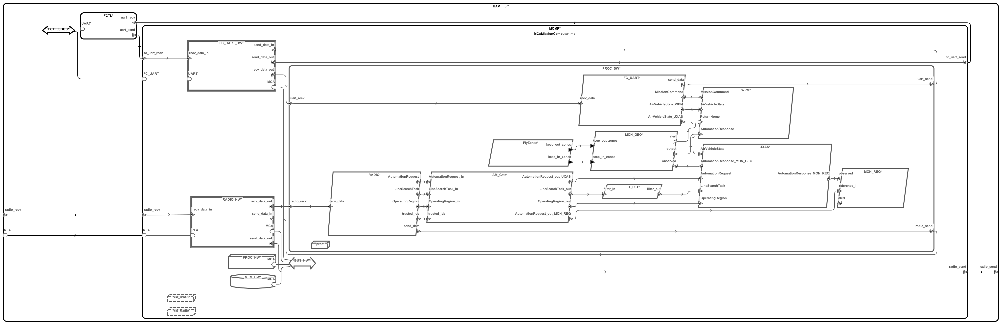

# HAMR codegen on Phase2 Step6 Model

<!--ts-->
   * [HAMR codegen on Phase2 Step6 Model](#hamr-codegen-on-phase2-step6-model)
      * [AADL Arch](#aadl-arch)
      * [Installing the Tools](#installing-the-tools)
         * [Update Sireum](#update-sireum)
         * [Install/Update osireum](#installupdate-osireum)
         * [Install CakeML](#install-cakeml)
      * [Generating Code](#generating-code)
         * [Generate Linux Code with Stubbed-out Serial Server](#generate-linux-code-with-stubbed-out-serial-server)
         * [Generate CAmkES with VMs + CakeML Integeration - Simulate via QEMU ARM](#generate-camkes-with-vms--cakeml-integeration---simulate-via-qemu-arm)
            * [Example QEMU Simulation](#example-qemu-simulation)

<!-- Added by: vagrant, at: Sun 07 Mar 2021 08:13:23 PM UTC -->

<!--te-->

The CakeML code in the ``vm`` directory had to be modified to prevent the apps from crashing under a 64-bit QEMU ARM simulation when they attempted to use the unary negate Double operator ``~`` (see 
[geofence_monitor_client.cml](vm/aadl/cakeml/geofence_monitor/geofence_monitor_client.cml#L865) and 
[line_search_task_filter_client.cml](vm/aadl/cakeml/line_search_task_filter/line_search_task_filter_client.cml#L865)
).  

**NOTE** there is still a crashing issue with the geofence monitor that appeared when it started receiving messages (perhaps due to 
[Int.~(xx)](vm/aadl/cakeml/geofence_monitor/geofence_monitor_client.cml#L440)?
).  Instead a 'stripped' version is used -- see notes [here](#generate-camkes-with-vms--cakeml-integeration---simulate-via-qemu-arm)

**NOTE** ``Double.~(xx)`` CakeML calls do appear to work under a 64-bit QEMU pc99/x86 simulation

## AADL Arch
  

The AADL model here [aadl](vm/aadl) is based on 
[Phase-2-UAV-Experimental-Platform-June](https://github.com/loonwerks/case-ta6-experimental-platform-models/tree/master/Phase-2-UAV-Experimental-Platform-June)

Modifications
- Commented out the MONITOR annotation for [MON_REQ](vm/aadl/UAV/SW.aadl#L306).  This component
  appears to be ResponseMonitor in step6 which is 
  [native](https://github.com/loonwerks/case-ta6-platform-assessment-camkes-apps/blob/master/apps/case-uav-step6/components/ResponseMonitor/src/response_monitor.c)

- added missing Stack_Size annotations to prevent apps crashing in QEMU before they were replaced
  with CakeML code or VMs 
  (e.g. [here](vm/aadl/UAV/SW.aadl#L143))

- Added [HAMR::Bit_Codec_Raw_Connections](vm/aadl/UAV/UAV.aadl#L43) annotation instructing HAMR to
  use the wire-protocol for message passing (i.e. byte-arrays)

- changed the trusted_id data ports for
  [RadioDriver_Attestation_thr](vm/aadl/UAV/SW.aadl#L24) and 
  [CASE_AttestationGate_thr](vm/aadl/UAV/SW.aadl#L73) to event data ports.  The issue is that only the sender can initialize a data port.  The sender, being a VM, will take a long time to spool up so the receiver, AM_GATE, will try to read from an uninitialized sampling port, which will appear to contain data.  

  Adding a time/period-based life-cycle-mananger (LCM) that would halt components from entering their run phase would be error prone as the start-up times of a VM is highly variable.  Ideally the components would report their state back to the LCM.


## Installing the Tools

The following assumes a case-env is used (see [https://github.com/loonwerks/CASE/tree/master/TA5/case-env](https://github.com/loonwerks/CASE/tree/master/TA5/case-env))

### Update Sireum

Update Sireum if older than 2021.03.08 -- run ``$SIREUM_HOME/bin/sireum`` to see the build date

```
cd $SIREUM_HOME
git pull --recurse-submodules
bin/build.cmd
```

Alternatively, run ``bin/build.cmd setup`` if you also want to update Sireum IVE

### Install/Update osireum

``osireum`` lets you run Sireum's command line iterface, but via an OSATE cli.  This allows allows an in-memory version of AIR to be passed directly to HAMR codegen rather than the previous method of first running phantom and serializing AIR to a file, and then running codegen on the serialized version.

This step may take several minutes the first time it's run as it will download OSATE 2.9.1 from SEI's servers (or wherever) which are slow.
There is an option to instead use a local copy of OSATE (refer to ``$SIREUM_HOME/bin/sireum hamr phantom -h``).

```
$SIREUM_HOME/bin/sireum hamr phantom -u
```

The phantom ``-u`` update option will suggest setting up an alias for osate-sireum called ``osireum`` like below.
It's suggested you place this in your ``$HOME/.bashrc`` so that it's available in the next steps

```
alias osireum='/home/vagrant/.sireum/phantom/osate-2.9.1-vfinal/osate -nosplash -console -consoleLog -data @user.home/.sireum -application org.sireum.aadl.osate.cli'
```

### Install CakeML

Run ``$HOME/CASE/seL4-CAmkES-L4v-dockerfiles/scripts/cakeml.sh``.  Note that installing HOL takes a long time and is optional <-- *Junaid/Eric feedback*

Once installed, make sure the 64bit version is available from the command line.  E.g. in a directory available in my path I have the symlink ``cake -> /usr/local/bin/cake-x64-64/cake``

## Generating Code

The model has the following configuration based on observations of 
[case-uav-step6](https://github.com/loonwerks/case-ta6-platform-assessment-camkes-apps/tree/master/apps/case-uav-step6) source code

Native Components
- MON_REQ ([ResponseMonitor](https://github.com/loonwerks/case-ta6-platform-assessment-camkes-apps/tree/master/apps/case-uav-step6/components/ResponseMonitor)? in step6)
- WPM ([WaypointManager](https://github.com/loonwerks/case-ta6-platform-assessment-camkes-apps/tree/master/apps/case-uav-step6/components/WaypointManager) in step6)
- FC_UART ([AutopilotSerialServer](https://github.com/loonwerks/case-ta6-platform-assessment-camkes-apps/tree/master/apps/case-uav-step6/components/AutopilotSerialServer) in step6)

CakeML Components
- AM_GATE ([AttestationGate](https://github.com/loonwerks/case-ta6-platform-assessment-camkes-apps/tree/master/apps/case-uav-step6/components/AttestationGate) in step6)
- MON_GEO ([GeofenceMonitor](https://github.com/loonwerks/case-ta6-platform-assessment-camkes-apps/tree/master/apps/case-uav-step6/components/GeofenceMonitor) in step6)
- FLT_LST ([LineSearchTaskFilter](https://github.com/loonwerks/case-ta6-platform-assessment-camkes-apps/tree/master/apps/case-uav-step6/components/LineSearchTaskFilter) in step6)

VM Components
- Radio ([vmRadio](https://github.com/loonwerks/case-ta6-platform-assessment-camkes-apps/tree/master/apps/case-uav-step6/vmRadio) in step6)
- UXAS ([vmUxAS](https://github.com/loonwerks/case-ta6-platform-assessment-camkes-apps/tree/master/apps/case-uav-step6/vmUxAS) in step6)

Not Used in step6
- FlyZones


### Generate Linux Code with Stubbed-out Serial Server

Run the ``osireum`` script 
[run-hamr-4linux_dummy_serial_server.sh](vm/run-hamr-4linux_dummy_serial_server.sh)

The output from codegen will indicate that:
1. the transpiler will create a ``hamr/src/c/nix`` directory that can be opened up in an IDE like CLion.  

2. developer code should be placed in [hamr/src/c/ext-c](vm/hamr/src/c/ext-c)

3. the following scripts are available: 
  [transpile.sh](vm/hamr/bin/transpile.sh), 
  [compile-linux.sh](vm/hamr/bin/compile-linux.sh), 
  [run-linux.sh](vm/hamr/bin/run-linux.sh), 
  [stop.sh](vm/hamr/bin/stop.sh)

Notes
- the properties file [.system_UAV](vm/aadl/.system_UAV) is passed to osireum codegen.  The ``system_impl`` prop specifies the name of the component that should be instantiated and ``system_impl_file`` indicates where that component resides. Osireum codegen can be pointed at ``.project`` files if the model is simple enough (no dependent projects, a single system implementation).  Of course it could also be pointed to a serialized AIR file (ie. the only option if HAMR codegen is run via ``$SIREUM_HOME/bin/sireum hamr codegen ..``)

- the transpiler is automatically run by codegen due to the ``--run-transpiler`` option
  so ``transpiler.sh`` doesn't need to be run

- a minimum of component behavior code for the native components was copied/adapted from step6
  to make sure that, for example, LMCP linking works.  Review the following:

  - [MON_REQ](vm/hamr/src/c/ext-c/CASE_Monitor_Req_thr_Impl_MCMP_PROC_SW_MON_REQ_CASE_Monitor_Req/CASE_Monitor_Req_thr_Impl_MCMP_PROC_SW_MON_REQ_CASE_Monitor_Req.c)
  - [WPM](vm/hamr/src/c/ext-c/WaypointPlanManagerService_thr_Impl_MCMP_PROC_SW_WPM_WaypointPlanManagerService/WaypointPlanManagerService_thr_Impl_MCMP_PROC_SW_WPM_WaypointPlanManagerService.c)

  - [FC_UART](vm/hamr/src/c/ext-c/UARTDriver_Impl_MCMP_PROC_SW_FC_UART_UARTDriver/UARTDriver_Impl_MCMP_PROC_SW_FC_UART_UARTDriver.c)

- the other components (VM, CakeML) currently do not have behavior code

- the [serial server libraries](vm/aadl/c_libraries/AutopilotSerialServer) have CAmkES dependencies so a 
  [dummy version](vm/aadl/c_libraries/dummy_serial_server) is linked to for the linux platform

### Generate CAmkES with VMs + CakeML Integeration - Simulate via QEMU ARM

Execute the following scripts to 1) run HAMR codegen, 2) assemble the CakeML code and 3) build and then simulate the CAmkES project under QEMU

```
./run-hamr-4camkes.sh
./aadl/cakeml/compile-cakeml.cmd --target=arm8 --stripped
./hamr/src/c/camkes/bin/run-camkes.sh -o "-DCAKEML_ASSEMBLIES_PRESENT=ON -DUSE_PRECONFIGURED_ROOTFS=ON" -s -n
```

**NOTE:** HAMR codegen will suggest you run the 
[hamr/src/c/camkes/bin/setup-camkes-arm-vm.sh](vm/hamr/src/c/camkes/bin/setup-camkes-arm-vm.sh)
script to install the CAmkES-ARM-VM project.  Do this prior to running ``run-camkes.sh`` if you haven't already installed it as vanilla CAmkES doesn't include ARM-VM support.

Links to the scripts:

- [run-hamr-4camkes.sh](vm/run-hamr-4camkes.sh)

- [aadl/cakeml/compile-cakeml.cmd](vm/aadl/cakeml/compile-cakeml.cmd)

  ``--target=arm8`` is only available in 64-bit CakeML, use ``--target=arm7`` if 32-bit CakeML.  
  
  The ``--stripped`` option will substitute 'xx_stripped.cml' files if they exist.  For example, the CakeML geofence monitor was crashing once it started receiving messages so it was stripped [geofence_monitor_client_stripped.cml](vm/aadl/cakeml/geofence_monitor/geofence_monitor_client_stripped.cml#L1767)

- [hamr/src/c/camkes/bin/run-camkes.sh](vm/hamr/src/c/camkes/bin/run-camkes.sh)
  
  The vanilla version of this script ([here](vm/hamr/src/c/camkes/bin/run-camkes.sh)) was customized so that the build will NOT use the preconfigured linux fs as that only has 5 userspace i/o devices.

  ``CAKEML_ASSEMBLIES_PRESENT=ON`` removes the HAMR generated run methods (e.g. 
  [see](vm/hamr/src/c/camkes/components/CASE_AttestationGate_thr_Impl_MCMP_PROC_SW_AM_Gate_CASE_AttestationGate/src/sb_CASE_AttestationGate_thr_Impl.c#L321)
  ).

  ``USE_PRECONFIGURED_ROOTFS=ON`` will use the preconfigured fs rather than downloading a vanilla linux image

  The ``-s`` option runs the simulation under QEMU.  
  
  ``-n`` means run in non-interactive mode, which most importantly means the CAmkES build directory won't be removed during subsequent re-launches (i.e. you won't have to wait for the linux image to re-download)
  

Notes

- [vmRADIO.c](vm/hamr/src/c/camkes/components/VM/apps/vmRADIO/vmRADIO.c) and
  [vmUXAS.c](vm/hamr/src/c/camkes/components/VM/apps/vmUXAS/vmUXAS.c)
  show how to code VM components that send and receive Slang types between components -- in this case byte-arrays.

- the dummy serial server is still used as there linking issues when using what is in
  [AutopilotSerialServer](vm/aadl/c_libraries/AutopilotSerialServer).  That might be due to targeting QEMU rather than an actual ARM board???

  Once the linking issue are resolved then the commented out codegen script in
  [run-hamr-4camkes.sh](vm/run-hamr-4camkes.sh) would be used instead

- the CakeML control structures were replaced with HAMR/Pacer aware code (e.g.
  [aadl/cakeml/attestation_gate/attestation_gate_control.cml](cakeml/aadl/cakeml/attestation_gate/attestation_gate_control.cml)
  )

- some api structures were rewritten to account for naming differences or fan-outs (e.g.
  [aadl/cakeml/attestation_gate/attestation_gate_api.cml](cakeml/aadl/cakeml/attestation_gate/attestation_gate_api.cml#L37))

#### Example QEMU Simulation

The first time you run the ``run-camkes.sh`` script it will take several minutes to get past the build phase since the bare linux image needs to be fetched from git.  After that it will take about a minute for the VMs to spool up.  

Eventually you'll see ``buildroot login:``.  Type ``root``, press return, and at the ``#`` prompt type ``ls /dev/uio*``.  If the devices only go up to ``/dev/uio4`` then you're in the RADIO vm so type ``vmRADIO``.  If instead you see ``/dev/uio6`` then you're in the UXAS so type ``vmUXAS``.

Once the first VM starts, type ``@1`` to switch to the other VM, then ``root`` and then launch the app corresponding to that VM.  This is a little tricky as the other VM will be spitting things out to the console while you're typing.

**NOTE** some rendundant error messages that occur while waiting for the VMs to spool up have been removed from the following output

```
Bootstrapping kernel
Warning: Could not infer GIC interrupt target ID, assuming 0.
Booting all finished, dropped to user space
<<seL4(CPU 0) [decodeUntypedInvocation/212 T0xff807fc1c400 "rootserver" @4006b8]: Untyped Retype: Insufficient memory (1 * 2097152 bytes needed, 0 bytes available).>>
<<seL4(CPU 0) [decodeUntypedInvocation/212 T0xff807fc1c400 "rootserver" @4006b8]: Untyped Retype: Insufficient memory (1 * 2097152 bytes needed, 0 bytes available).>>
<<seL4(CPU 0) [maskVMRights/187 T0xff807fc1c400 "rootserver" @4006b8]: Attempted to make unsupported write only mapping>>
Entering pre-init of UARTDriver_Impl_MCMP_PROC_SW_FC_UART_UARTDriver
Art: Registered component: UAV_Impl_Instance_MCMP_PROC_SW_FC_UART_UARTDriver (periodic: 500)
Art: - Registered port: UAV_Impl_Instance_MCMP_PROC_SW_FC_UART_UARTDriver_recv_data (event in)
Art: - Registered port: UAV_Impl_Instance_MCMP_PROC_SW_FC_UART_UARTDriver_MissionCommand (event in)
Art: - Registered port: UAV_Impl_Instance_MCMP_PROC_SW_FC_UART_UARTDriver_send_data (event out)
Art: - Registered Entering pre-init of CASE_AttestationGate_thr_Impl_MCMP_PROC_SW_AM_Gate_CASE_AttestationGate
Art: Registered component: UAV_Impl_InstancEntering pre-init of CASE_Filter_LST_thr_Impl_MCMP_PROC_SW_FLT_LST_CASE_Filter_LST
Art: RegiEntering pre-init of FlyZonesDatabase_thr_Impl_MCMP_PROC_SW_FlyZones_FlyZonesDatabase
Art: Registered component: UAV_Impl_Instance_MCMP_PROC_SW_FlyZones_FlyZonesDatabase (periodic: 500)
Entering pre-init of CASE_Monitor_Req_thr_Impl_MCMP_PROC_SW_MON_REQ_CASE_Monitor_Req
Art: RegEntering pre-init of WaypointPlanManagerService_thr_Impl_MCMP_PROC_SW_WPM_WaypointPlanManagerService
Art: RegisteredEntering pre-init of CASE_Monitor_Geo_thr_Impl_MCMP_PROC_SW_MON_GEO_CASE_Monitor_Geo
Art: Registered component: UAV_Impl_Instan_utspace_split_alloc@split.c:272 Failed to find any untyped capable of creating an object at address 0x8040000
Loading Linux: 'linux' dtb: ''
install_linux_devices@main.c:657 module name: map_frame_hack
install_linux_devices@main.c:657 module name: init_ram
port: UAV_Impl_Instance_MCMP_PROC_SW_FC_UART_UARTDriver_AirVehicleState_WPM (event out)
Art: - Registered port: UAV_Impl_Instance_MCMP_PROC_SW_FC_UART_UARTDriver_AirVehicleState_UXAS (event out)
UARTDriver: pre init apss
UARTDriver: post init apss
Leaving pre-init of UARTDriver_Impl_MCMP_PROC_SW_FC_UART_UARTDriver
e_MCMP_PROC_SW_AM_Gate_CASE_AttestationGate (periodic: 500)
Art: - Registered port: UAV_Impl_Instance_MCMP_PROC_SW_AM_Gate_CASE_AttestationGate_trusted_ids (event in)
Art: - Registered port: UAV_Impl_Instance_MCMP_PROC_SW_AM_Gate_CASE_AttestationGate_AutomationRequest_in (event in)
Art: - Registered port: UAV_Impl_Instance_MCMP_PROC_SW_AM_Gate_CASE_AttestationGate_AutomationRequest_out_UXAS (event out)
Art: - Registered port: UAV_Impl_Instance_MCMP_PROC_SW_AM_Gate_CASE_AttestationGate_AutomationRequest_out_MON_REQ (event out)
Art: - Registered port: UAV_Impl_Instance_MCMP_PROC_SW_AM_Gate_CASE_AttestationGate_OperatingRegion_in (event in)
Art: - Registered port: UAV_Impl_Instance_MCMP_PROC_SW_AM_Gate_CASE_AttestationGate_OperatingRegion_out (event out)
Art: - Registered port: UAV_Impl_Instance_MCMP_PROC_SW_AM_Gate_CASE_AttestationGate_LineSearchTask_in (event in)
Art: - Registered port: UAV_Impl_Instance_MCMP_PROC_SW_AM_Gate_CASE_AttestationGate_LineSearchTask_out (event out)
Leaving pre-init of CASE_AttestationGate_thr_Impl_MCMP_PROC_Sstered component: UAV_Impl_Instance_MCMP_PROC_SW_FLT_LST_CASE_Filter_LST (periodic: 500)
Art: - Registered port: UAV_Impl_Instance_MCMP_PROC_SW_FLT_LST_CASE_Filter_LST_filter_in (event in)
Art: - Registered port: UAV_Impl_Instance_MCMP_PROC_SW_FLT_LST_CASE_Filter_LST_filter_out (event out)
Leaving pre-init of CASE_Filter_LST_thr_Impl_MCMP_PROC_SW_FLT_LST_CASE_Filter_LST
_utspace_split_alloc@split.c:272 Failed to find any untyped capable of creating an object at address 0x8040000
Loading Linux: 'linux' dtb: ''
install_linux_devices@main.c:657 module name: map_frame_hack
install_linux_devices@main.c:657 module name: init_ram
Art: - Registered port: UAV_Impl_Instance_MCMP_PROC_SW_FlyZones_FlyZonesDatabase_keep_in_zones (data out)
Art: - Registered port: UAV_Impl_Instance_MCMP_PROC_SW_FlyZones_FlyZonesDatabase_keep_out_zones (data out)
Leaving pre-init of FlyZonesDatabase_thr_Impl_MCMP_PROC_SW_FlyZones_FlyZonesDatabase
istered component: UAV_Impl_Instance_MCMP_PROC_SW_MON_REQ_CASE_Monitor_Req (periodic: 500)
Art: - Registered port: UAV_Impl_Instance_MCMP_PROC_SW_MON_REQ_CASE_Monitor_Req_observed (event in)
Art: - Registered port: UAV_Impl_Instance_MCMP_PROC_SW_MON_REQ_CASE_Monitor_Req_reference_1 (event in)
Art: - Registered port: UAV_Impl_Instance_MCMP_PROC_SW_MON_REQ_CASE_Monitor_Req_alert (event out)
Leaving pre-init of CASE_Monitor_Req_thr_Impl_MCMP_PROC_SW_MON_REQ_CASE_Monitor_Req
 component: UAV_Impl_Instance_MCMP_PROC_SW_WPM_WaypointPlanManagerService (periodic: 500)
Art: - Registered port: UAV_Impl_Instance_MCMP_PROC_SW_WPM_WaypointPlanManagerService_AutomationResponse (event in)
Art: - Registered port: UAV_Impl_Instance_MCMP_PROC_SW_WPM_WaypointPlanManagerService_AirVehicleState (event in)
Art: - Registered port: UAV_Impl_Instance_MCMP_PROC_SW_WPM_WaypointPlanManagerService_MissionCommand (event out)
Art: - Registered port: UAV_Impl_Instance_MCMP_PROC_SW_WPM_WaypointPlanManagerService_ReturnHome (event in)
Leaving pre-init of WaypointPlanManagerService_thr_Impl_MCMP_PROC_SW_WPM_WaypointPlanManagerService
ce_MCMP_PROC_SW_MON_GEO_CASE_Monitor_Geo (periodic: 500)
Art: - Registered port: UAV_Impl_Instance_MCMP_PROC_SW_MON_GEO_CASE_Monitor_Geo_keep_in_zones (data in)
Art: - Registered port: UAV_Impl_Instance_MCMP_PROC_SW_MON_GEO_CASE_Monitor_Geo_keep_out_zones (data in)
Art: - Registered port: UAV_Impl_Instance_MCMP_PROC_SW_MON_GEO_CASE_Monitor_Geo_observed (event in)
Art: - Registered port: UAV_Impl_Instance_MCMP_PROC_SW_MON_GEO_CASE_Monitor_Geo_output (event out)
Art: - Registered port: UAV_Impl_Instance_MCMP_PROC_SW_MON_GEO_CASE_Monitor_Geo_alert (event out)
Leaving pre-init of CASE_Monitor_Geo_thr_Impl_MCMP_PROC_SW_MON_GEO_CASE_Monitor_Geo
W_AM_Gate_CASE_AttestationGate
install_linux_devices@main.c:657 module name: virtio_con
install_linux_devices@main.c:657 module name: cross_vm_connections
install_linux_devices@main.c:657 module name: virtio_con
install_linux_devices@main.c:657 module name: cross_vm_connections
libsel4muslcsys: Error attempting syscall 215
libsel4muslcsys: Error attempting syscall 215
libsel4muslcsys: Error attempting syscall 215
clean_up@fdtgen.c:370 Non-existing node None specified to be kept
consume_connection_event@cross_vm_connection.c:247 Failed to inject connection irq
consume_connection_event@cross_vm_connection.c:247 Failed to inject connection irq
_utspace_split_alloc@split.c:272 Failed to find any untyped capable of creating an object at address 0x8020000
consume_connection_event@cross_vm_connection.c:247 Failed to inject connection irq
consume_connection_event@cross_vm_connection.c:247 Failed to inject connection irq
libsel4muslcsys: Error attempting syscall 215
consume_connection_event@cross_vm_connection.c:247 Failed to inject connection irq
clean_up@fdtgen.c:370 Non-existing node None specified to be kept
consume_connection_event@cross_vm_connection.c:247 Failed to inject connection irq
consume_connection_event@cross_vm_connection.c:247 Failed to inject connection irq
consume_connection_event@cross_vm_connection.c:247 Failed to inject connection irq
_utspace_split_alloc@split.c:272 Failed to find any untyped capable of creating an object at address 0x8020000
consume_connection_event@cross_vm_connection.c:247 Failed to inject connection irq
[    7.723348] Unable to detect cache hierarchy for CPU 0
[    7.738737] e1000: Intel(R) PRO/1000 Network Driver - version 7.3.21-k8-NAPI
[    7.751625] e1000: Copyright (c) 1999-2006 Intel Corporation.
[    7.762259] e1000e: Intel(R) PRO/1000 Network Driver - 3.2.6-k
[    7.773496] e1000e: Copyright(c) 1999 - 2015 Intel Corporation.
[    7.790614] mousedev: PS/2 mouse device common for all mice
consume_connection_event@cross_vm_connection.c:247 Failed to inject connection irq
[    8.339390] ledtrig-cpu: registered to indicate activity on CPUs
[    8.349525] dmi-sysfs: dmi entry is absent.
[    8.357489] ipip: IPv4 and MPLS over IPv4 tunneling driver
[    8.373192] NET: Registered protocol family 10
[    8.396507] mip6: Mobile IPv6
[    8.412247] NET: Registered protocol family 17
[    8.421999] mpls_gso: MPLS GSO support
[    8.430454] Registered cp15_barrier emulation handler
[    8.440069] Registered setend emulation handler
[  consume_connection_event@cross_vm_connection.c:247 Failed to inject connection irq
  8.455460] registered taskstats version 1
[    9.101394] zswap: loaded using pool lzo/zbud
[    9.115175] ima: No TPM chip found, activating TPM-bypass!
[    9.125271] ima: Allocated hash algorithm: sha256
[    9.145817] hctosys: unable to open rtc device (rtc0)
[    9.158836] PM: Hibernation image not present or could not be loaded.
[    9.170058] initcall clk_disable_unused blacklisted
consume_connection_event@cross_vm_connection.c:247 Failed to inject connection irq
consume_connection_event@cross_vm_connection.c:247 Failed to inject connection irq
consume_connection_event@cross_vm_connection.c:247 Failed to inject connection irq
[    8.097729] Unable to detect cache hierarchy for CPU 0
[    8.112874] e1000: Intel(R) P[   11.403077] Freeing unused kernel memory: 3776K
RO/1000 Network Driver - version 7.3.21-k8-NAPI
[    8.703163] e1000: Copyright (c) 1999-2006 Intel Corporation.
[    8.715334] e1000e: Intel(R) PRO/1000 Network Driver - 3.2.6-k
[    8.726669] e1000e: Copyright(c) 1999 - 2015 Intel Corporation.
[    8.742889] mousedev: PS/2 mouse device common for all mice
[    8.764119] ledtrig-cpu: registered to indicate activity on CPUs
[    8.776451] dmi-sysfs: dmi entry is absent.
[    8.786145] ipip: IPv4 and MPLS over IPv4 tunneling driver
[    8.804865] NET: Registered protocol family 10
[    9.416262] mip6: Mobile IPv6
[    9.428826] NET: Registered protocol family 17
[    9.439312] mpls_gso: MPLS GSO support
[    9.447926] Registered cp15_barrier emulation handler
[    9.457006] Registered setend emulation handler
[    9.471845] registered taskstats version 1
[    9.483223] zswap: loaded using pool lzo/zbud
[    9.500053] ima: No TPM chip found, activating TPM-bypass!
[    9.509998] ima: Allocated hash algorithm: sha256
[   10.184425] hctosys: unable to open rtc device (rtc0)
[   10.194989] PM: Hibernation image not present or could not be loaded.
[   10.205764] initcall clk_disable_unused blacklisted
[   12.476384] Freeing unused kernel memory: 3776K
Starting syslogd: OK
Starting klogd: OK
Running sysctl: Starting syslogd: OK
Starting klogd: OKOK

Initializing random number generator... Running sysctl: [   22.769956] random: dd: uninitialized urandom read (512 bytes read)
done.
Starting network: OK
OK
[   25.545561] connection: loading out-of-tree module taints kernel.
Initializing random number generator... [   26.055790] Event Bar (dev-0) initalised
[   26.064118] 2 Dataports (dev-0) initalised
[   26.088793] Event Bar (dev-1) initalised
[   26.098751] 2 Dataports (dev-1) initalised
[   26.111158] Event Bar (dev-2) initalised
[   26.135394] 2 Dataports (dev-2) initalised
[   26.150293] Event Bar (dev-3) initalised
[   26.160057] 2 Dataports (dev-3) initalised
[   23.500662] random: dd: uninitialized urandom read (512 bytes read)
done.
[   26.767320] Event Bar (dev-4) initalised
[   26.775394] 2 Dataports (dev-4) initalised
Starting network: 
OK
Welcome to Buildroot
buildroot login: [   26.941356] connection: loading out-of-tree module taints kernel.
[   26.984206] Event Bar (dev-0) initalised
[   27.003319] 2 Dataports (dev-0) initalised
[   27.020809] Event Bar (dev-1) initalised
[   27.035620] 2 Dataports (dev-1) initalised
[   27.656111] Event Bar (dev-2) initalised
[   27.664985] 2 Dataports (dev-2) initalised
[   27.682019] Event Bar (dev-3) initalised
[   27.690486] 2 Dataports (dev-3) initalised
[   27.707627] Event Bar (dev-4) initalised
[   27.716638] 2 Dataports (dev-4) initalised
[   27.732229] Event Bar (dev-5) initalised
[   27.742029] 2 Dataports (dev-5) initalised
[   27.759348] Event Bar (dev-6) initalised
[   28.481204] 2 Dataports (dev-6) initalised

Welcome to Buildroot
buildroot login: root
# ls /dev/uio*
/dev/uio0  /dev/uio1  /dev/uio2  /dev/uio3  /dev/uio4  /dev/uio5  /dev/uio6
# vmUXAS 
VM App vmRADIO started
Setting up incoming event data port /dev/uio0 with size 262144
Successfully setup incoming event data port /dev/uio0
Setting up incoming event data port /dev/uio1 with size 262144
Successfully setup incoming event data port /dev/uio1
Setting up incoming event data port /dev/uio2 with size 262144
Successfully setup incoming event data port /dev/uio2
Setting up incoming event data port /dev/uio3 with size 262144
Successfully setup incoming event data port /dev/uio3
Setting up outgoing event data port /dev/uio4 262144
Successfully setup /dev/uio4
Setting up outgoing event data port /dev/uio5 262144
Successfully setup /dev/uio5
Setting up incoming event data port /dev/uio6 with size 4096
Successfully setup incoming event data port /dev/uio6
VM App vmUXAS started
WaypointPlanManagerService: received automation response
WaypointPlanManagerService: received automation response
UAV_Impl_Instance_MCMP_PROC_SW_WPM_WaypointPlanManagerService: Dead beef was delivered
WaypointPlanManagerService: received automation response
UAV_Impl_Instance_MCMP_PROC_SW_WPM_WaypointPlanManagerService: Dead beef was delivered

Switching input to 1
WaypointPlanManagerService: received automation response
UAV_Impl_Instance_MCMP_PROC_SW_WPM_WaypointPlanManagerService: Dead beef was delivered
WaypointPlanManagerService: received automation response
UAV_Impl_Instance_MCMP_PROC_SW_WPM_WaypointPlanManagerService: Dead beef was delivered
root
WaypointPlanManagerService: received automation response
UAV_Impl_Instance_MCMP_PROC_SW_WPM_WaypointPlanManagerService: Dead beef was delivered
# WaypointPlanManagerService: received automation response
UAV_Impl_Instance_MCMP_PROC_SW_WPM_WaypointPlanManagerService: Dead beef was delivered
# vmRADIO WaypointPlanManagerService: received automation response
UAV_Impl_Instance_MCMP_PROC_SW_WPM_WaypointPlanManagerService: Dead beef was delivered

VM App vmRADIO started
Setting up outgoing event data port /dev/uio0 262144
Successfully setup /dev/uio0
Setting up outgoing event data port /dev/uio1 262144
Successfully setup /dev/uio1
Setting up outgoing event data port /dev/uio2 262144
Successfully setup /dev/uio2
Setting up outgoing event data port /dev/uio3 262144
Successfully setup /dev/uio3
Setting up incoming event data port /dev/uio4 with size 4096
Successfully setup incoming event data port /dev/uio4WaypointPlanManagerService: received automation response
UAV_Impl_Instance_MCMP_PROC_SW_WPM_WaypointPlanManagerService: Dead beef was delivered

Hello from vmRadio's run method
UAV_Impl_Instance_MCMP_PROC_SW_AM_Gate_CASE_AttestationGate: 
**WaypointPlanManagerService: received automation response
UAV_Impl_Instance_MCMP_PROC_SW_WPM_WaypointPlanManagerService: Dead beef was delivered
****************************************
** Attestation Gate:                    **
** An Operating Region Message from an  **
** untrusted source was blocked.        **
** This could be due to an attack.      **
******************************************


8184 bytes
[01
de ca f1 5b ad 00 00 00 00 00 00 00 00 00 00 00 
00 00 00 00 00 00 00 00 ...]
UAV_Impl_Instance_MCMP_PROC_SW_AM_Gate_CASE_AttestationGate: 
*****************************************
** Attestation Gate:                   **
** A Line Search Task Message from an  **
** uWaypointPlanManagerService: received automation response
UAV_Impl_Instance_MCMP_PROC_SW_WPM_WaypointPlanManagerService: Dead beef was delivered
ntrusted source was blocked.       **
** This could be due to an attack.     **
*****************************************


8184 bytes
[01
fe ed f0 0d 2f ac e0 00 00 00 00 00 00 00 00 00 
00 00 00 00 00 00 00 00 00 00 ...]
UAV_Impl_Instance_MCMP_PROC_SW_AM_Gate_CASE_AttestationGate: 
******************************************
** Attestation Gate:                    **
** An Automation Request Message from   **
** an untrusted source was blocked.     **
** This could be due to an attack.      **
******************************************


8184 bytes
[01
61 66 72 6c 2e 63 6d 61 73 69 2e 41 75 74 6f 6d 
61 74 69 6f 6e 52 65 71 75 65 73 74 24 6c 6d 63 
70 7c 61 66 72 6c 2e 63 6d 61 73 69 2e 41 75 74 
6f 6d 61 74 69 6f 6e 52 65 71 75 65 73 74 7c 54 
63 70 42 72 69 64 67 65 7c 34 30 30 7c 36 38 24 
4c 4d 43 50 00 00 00 2e 01 43 4d 41 53 49 00 00 WaypointPlanManagerService: received automation response
UAV_Impl_Instance_MCMP_PROC_SW_WPM_WaypointPlanManagerService: Dead beef was delivered

00 00 00 00 28 00 03 00 01 00 00 00 00 00 00 01 
90 00 01 00 00 00 00 00 00 03 e8 00 00 00 00 00 
00 00 00 01 50 00 00 00 04 c2 00 00 00 00 00 00 
00 00 00 00 00 00 00 00 00 00 00 00 00 ...]
UAV_Impl_Instance_MCMP_PROC_SW_AM_Gate_CASE_AttestationGate: 
******************************************
** Attestation Gate:                    **
** An Operating Region Message from an  **
** untrusted source was blocked.        **
** This could be due to an attack.      **
******************************************


8184 bytes
[01
de ca f1 5b ad 00 00 00 00 00 00 00 00 00 00 00 
00 00 00 00 00 00 00 00 ...]
UAV_Impl_Instance_MCMP_PROC_SW_AM_Gate_CASE_AttestationGate: 
*****************************************
** Attestation Gate:                   **
** A Line Search Task Message from an  **
** unWaypointPlanManagerService: received automation response
UAV_Impl_Instance_MCMP_PROC_SW_WPM_WaypointPlanManagerService: Dead beef was delivered
trusted source was blocked.       **
** This could be due to an attack.     **
*****************************************


8184 bytes
[01
fe ed f0 0d 2f ac e0 00 00 00 00 00 00 00 00 00 
00 00 00 00 00 00 00 00 00 00 ...]
UAV_Impl_Instance_MCMP_PROC_SW_AM_Gate_CASE_AttestationGate: 
******************************************
** Attestation Gate:                    **
** An Automation Request MessWaypointPlanManagerService: received automation response
UAV_Impl_Instance_MCMP_PROC_SW_WPM_WaypointPlanManagerService: Dead beef was delivered
age from   **
** an untrusted source was blocked.     **
** This could be due to an attack.      **
******************************************


8184 bytes
[01
61 66 72 6c 2e 63 6d 61 73 69 2e 41 75 74 6f 6d 
61 74 69 6f 6e 52 65 71 75 65 73 74 24 6c 6d 63 
70 7c 61 66 72 6c 2e 63 6d 61 73 69 2e 41 75 74 
6f 6d 61 74 69 6f 6e 52 65 71 75 65 73 74 7c 54 
63 70 42 72 69 64 67 65 7c 34 30 30 7c 36 38 24 
4c 4d 43 50 00 00 00 2e 01 43 4d 41 53 49 00 00 
00 00 00 00 28 00 03 00 01 00 00 00 00 00 00 01 
90 00 01 00 00 00 00 00 00 03 e8 00 00 00 00 00 
00 00 00 01 50 00 00 00 04 c2 00 00 00 00 00 00 
00 00 00 00 00 00 00 00 00 00 00 00 00 ...]
WaypointPlanManagerService: received automation response
UAV_Impl_Instance_MCMP_PROC_SW_WPM_WaypointPlanManagerService: Dead beef was delivered
UAV_Impl_Instance_MCMP_PROC_SW_AM_Gate_CASE_AttestationGate: 
******************************************
** Attestation Gate:                    **
** An Operating Region Message from an  **
** untrusted source was blocked.        **
** This could be due to an attack.      **
******************************************


8184 bytes
[01
de ca f1 5b ad 00 00 00 00 00 00 00 00 00 00 00 
00 00 00 00 00 00 00 00 ...]
UAV_Impl_Instance_MCMP_PROC_SW_AM_Gate_CASE_AttestationGate: 
*****************************************
** Attestation Gate:                   **
** A Line Search Task Message from an  **
** untrusted source was blocked.       **
** This could be due to an attack.     **
*****************************************


8184 bytWaypointPlanManagerService: received automation response
UAV_Impl_Instance_MCMP_PROC_SW_WPM_WaypointPlanManagerService: Dead beef was delivered
QEMU: Terminated
```
