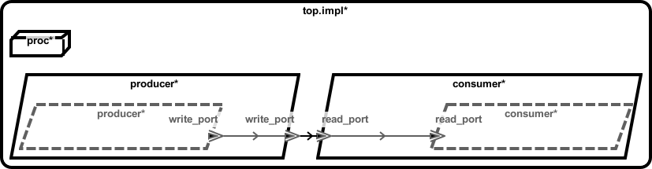
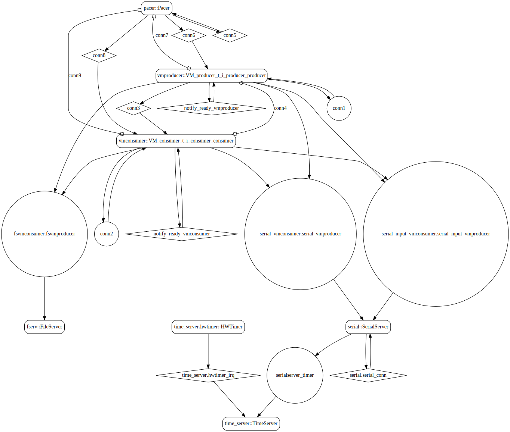
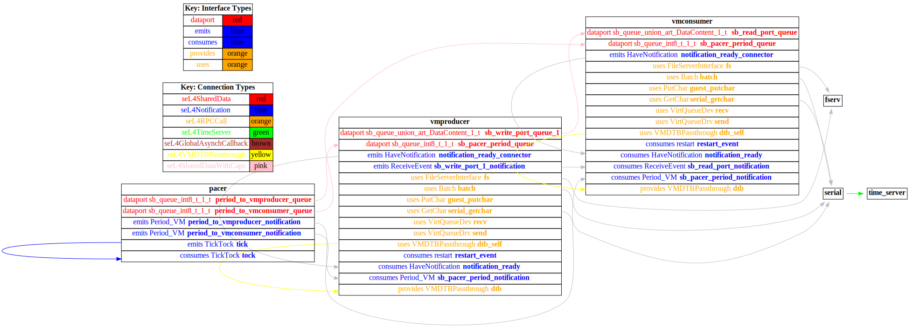

# both_vm

 Table of Contents
<!--table-of-contents_start-->
  * [AADL Architecture](#aadl-architecture)
  * [SeL4](#sel4)
    * [HAMR Configuration: SeL4](#hamr-configuration-sel4)
    * [Behavior Code: SeL4](#behavior-code-sel4)
    * [How to Build/Run: SeL4](#how-to-buildrun-sel4)
    * [Example Output: SeL4](#example-output-sel4)
    * [CAmkES Architecture: SeL4](#camkes-architecture-sel4)
    * [HAMR CAmkES Architecture: SeL4](#hamr-camkes-architecture-sel4)
<!--table-of-contents_end-->


## AADL Architecture
<!--aadl-architecture_start-->

|System Properties|
|--|
|Domain Scheduling|
|Wire Protocol|

|producer Properties|
|--|
|Periodic: 1000 ms|
|Virtual Machine|


|consumer Properties|
|--|
|Periodic: 1000 ms|
|Virtual Machine|


<!--aadl-architecture_end-->


## SeL4
<!--SeL4_start--><!--SeL4_end-->

### HAMR Configuration: SeL4
<!--hamr-configuration-sel4_start-->
refer to [aadl/bin/run-hamr-SeL4.sh](aadl/bin/run-hamr-SeL4.sh)
<!--hamr-configuration-sel4_end-->


### Behavior Code: SeL4
<!--behavior-code-sel4_start-->
  * [producer (includes VM glue code)](hamr/camkes/components/VM/apps/vmproducer/vmproducer.c)

  * [consumer (includes VM glue code)](hamr/camkes/components/VM/apps/vmconsumer/vmconsumer.c)
<!--behavior-code-sel4_end-->


### How to Build/Run: SeL4
<!--how-to-buildrun-sel4_start-->
```
./aadl/bin/run-hamr-SeL4.sh
./hamr/camkes/bin/setup-camkes-arm-vm.sh
./hamr/camkes/bin/run-camkes.sh -o "-DUSE_PRECONFIGURED_ROOTFS=ON" -s
```
<!--how-to-buildrun-sel4_end-->

Eventually you will see ``buildroot login``.  Type ``root`` and at the ``#``
prompt type ``vmproducer``.  Type ``@1`` to switch to the other VM, type ``root``, and at the 
``#`` prompt type ``vmconsumer``.

If you see the following when starting up the producer,

```
handle_event_bar_fault@cross_vm_connection.c:128 Connection is not configured with an emit function
```

then you're in the wrong VM.  Type ``^c`` to shutdown the producer, press ``return`` to get to a fresh ``#`` prompt, type ``@1`` to switch to the other VM, type ``root`` and then ``vmproducer``.  Type ``@0`` to return to the other vm and type ``vmconsumer``.

Type ``^a x`` to shutdown the QEMU simulation.

### Example Output: SeL4
<!--example-output-sel4_start-->
Timeout = 90 seconds
```
Booting all finished, dropped to user space
<<seL4(CPU 0) [decodeUntypedInvocation/212 T0xff807fc18400 "rootserver" @4006f0]: Untyped Retype: Insufficient memory (1 * 2097152 bytes needed, 0 bytes available).>>
_utspace_split_alloc@split.c:272 Failed to find any untyped capable of creating an object at address 0x8040000
Loading Linux: 'linux' dtb: ''
install_linux_devices@main.c:657 module name: map_frame_hack
install_linux_devices@main.c:657 module name: init_ram
_utspace_split_alloc@split.c:272 Failed to find any untyped capable of creating an object at address 0x8040000
Loading Linux: 'linux' dtb: ''
install_linux_devices@main.c:657 module name: map_frame_hack
install_linux_devices@main.c:657 module name: init_ram
install_linux_devices@main.c:657 module name: virtio_con
install_linux_devices@main.c:657 module name: cross_vm_connections
install_linux_devices@main.c:657 module name: virtio_con
install_linux_devices@main.c:657 module name: cross_vm_connections
libsel4muslcsys: Error attempting syscall 215
libsel4muslcsys: Error attempting syscall 215
libsel4muslcsys: Error attempting syscall 215
libsel4muslcsys: Error attempting syscall 215
clean_up@fdtgen.c:370 Non-existing node None specified to be kept
consume_connection_event@cross_vm_connection.c:247 Failed to inject connection irq
_utspace_split_alloc@split.c:272 Failed to find any untyped capable of creating an object at address 0x8020000
clean_up@fdtgen.c:370 Non-existing node None specified to be kept
consume_connection_event@cross_vm_connection.c:247 Failed to inject connection irq
_utspace_split_alloc@split.c:272 Failed to find any untyped capable of creating an object at address 0x8020000
consume_connection_event@cross_vm_connection.c:247 Failed to inject connection irq
consume_connection_event@cross_vm_connection.c:247 Failed to inject connection irq
consume_connection_event@cross_vm_connection.c:247 Failed to inject connection irq
consume_connection_event@cross_vm_connection.c:247 Failed to inject connection irq
consume_connection_event@cross_vm_connection.c:247 Failed to inject connection irq
[    4.055995] Unable to detect cache hierarchy for CPU 0
[    4.072863] e1000: Intel(R) PRO/1000 Network Driver - version 7.3.21-k8-NAPI
[    4.086762] e1000: Copyright (c) 1999-2006 Intel Corporation.
[    4.099970] e1000e: Intel(R) PRO/1000 Network Driver - 3.2.6-k
[    4.111980] e1000e: Copyright(c) 1999 - 2015 Intel Corporation.
[    4.132248] mousedev: PS/2 mouse device common for all mice
[    4.156856] ledtrig-cpu: registered to indicate activity on CPUs
[    4.170924] dmi-sysfs: dmi entry is absent.
[    4.183150] ipip: IPv4 and MPLS over IPv4 tunneling driver
[    4.202177] NET: Registered protocol family 10
[    4.230958] mip6: Mobile IPv6
[    4.246458] NET: Registered protocol family 17
[    4.257113] mpls_gso: MPLS GSO support
[    4.267023] Registered cp15_barrier emulation handler
[    4.278424] Registered setend emulation handler
consume_connection_event@cross_vm_connection.c:247 Failed to inject connection irq
[    4.129901] Unable to detect cache hierarchy for CPU 0
[    4.143335] e1000: Intel(R) PRO/1000 Network Driver - version 7.3.21-k8-NAPI
[    4.157271] e1000: Copyright (c) 1999-2006 Intel Corporation.
[    4.171020] e1000e: Intel(R) PRO/1000 Network Driver - 3.2.6-k
[    4.184427] e1000e: Copyright(c) 1999 - 2015 Intel Corporation.
[    4.205187] mousedev: PS/2 mouse device common for all mice
[    4.228527] ledtrig-cpu: registered to indicate activity on CPUs
[    4.241829] dmi-sysfs: dmi entry is absent.
[    4.253654] ipip: IPv4 and MPLS over IPv4 tunneling driver
[    4.272660] NET: Registered protocol family 10
[    4.301451] mip6: Mobile IPv6
[    4.315663] NET: Registered protocol family 1[    5.189939] registered taskstats version 1
[    5.199825] zswap: loaded using pool lzo/zbud
[    5.215458] ima: No TPM chip found, activating TPM-bypass!
[    5.227100] ima: Allocated hash algorithm: sha256
[    5.250480] hctosys: unable to open rtc device (rtc0)
[    5.263805] PM: Hibernation image not present or could not be loaded.
[    5.278415] initcall clk_disable_unused blacklisted
[    5.675641] Freeing unused kernel memory: 3776K
7
[    5.239365] mpls_gso: MPLS GSO support
[    5.247612] Registered cp15_barrier emulation handler
[    5.259118] Registered setend emulation handler
[    5.276667] registered taskstats version 1
[    5.288986] zswap: loaded using pool lzo/zbud
[    5.306632] ima: No TPM chip found, activating TPM-bypass!
[    5.318767] ima: Allocated hash algorithm: sha256
[    5.342600] hctosys: unable to open rtc device (rtc0)
[    5.354593] PM: Hibernation image not present or could not be loaded.
[    5.369046] initcall clk_disable_unused blacklisted
[    6.624482] Freeing unused kernel memory: 3776K
Starting syslogd: OK
Starting syslogd: Starting klogd: OK
Running sysctl: OK
Starting klogd: OK
Running sysctl: OK
OK
Initializing random number generator... [   11.366112] random: dd: uninitialized urandom read (512 bytes read)
done.
Starting network: Initializing random number generator... [   11.426697] random: dd: uninitialized urandom read (512 bytes read)
done.
Starting network: OK
[   12.686206] connection: loading out-of-tree module taints kernel.
[   12.729034] Event Bar (dev-0) initalised
[   12.741799] 2 Dataports (dev-0) initalised
[   12.764129] Event Bar (dev-1) initalised
OK
[   12.742593] connection: loading out-of-tree module taints kernel.
[   13.474038] 2 Dataports (dev-1) initalised

Welcome to Buildroot
buildroot login: [   13.490372] Event Bar (dev-0) initalised
[   13.506573] 2 Dataports (dev-0) initalised
[   13.520682] Event Bar (dev-1) initalised
[   13.531256] 2 Dataports (dev-1) initalised

Welcome to Buildroot
buildroot login: root
# vmproducer 
VM App vmproducer started
Setting up outgoing event data port /dev/uio0 4096
Successfully setup /dev/uio0
Setting up incoming event data port /dev/uio1 with size 4096
Successfully setup incoming event data port /dev/uio1
Hello from vmproducer's run method

Switching input to 1
root
# vmconsumer 
VM App vmconsumer started
Setting up incoming data port /dev/uio0 with size 4096
Successfully setup incoming data port /dev/uio0
Setting up incoming event data port /dev/uio1 with size 4096
Successfully setup incoming event data port /dev/uio1
Hello from vmconsumer's run method
vmconsumer: Received 8 bits on read_port: [ 06 ]

vmconsumer: Received 8 bits on read_port: [ 07 ]

vmconsumer: Received 8 bits on read_port: [ 08 ]

vmconsumer: Received 8 bits on read_port: [ 09 ]

vmconsumer: Received 8 bits on read_port: [ 0A ]

vmconsumer: Received 8 bits on read_port: [ 0B ]

vmconsumer: Received 8 bits on read_port: [ 0C ]

vmconsumer: Received 8 bits on read_port: [ 0D ]

vmconsumer: Received 8 bits on read_port: [ 0E ]

vmconsumer: Received 8 bits on read_port: [ 0F ]

vmconsumer: Received 8 bits on read_port: [ 10 ]

QEMU: Terminated
```
<!--example-output-sel4_end-->


### CAmkES Architecture: SeL4
<!--camkes-architecture-sel4_start-->

<!--camkes-architecture-sel4_end-->


### HAMR CAmkES Architecture: SeL4
<!--hamr-camkes-architecture-sel4_start-->

<!--hamr-camkes-architecture-sel4_end-->

