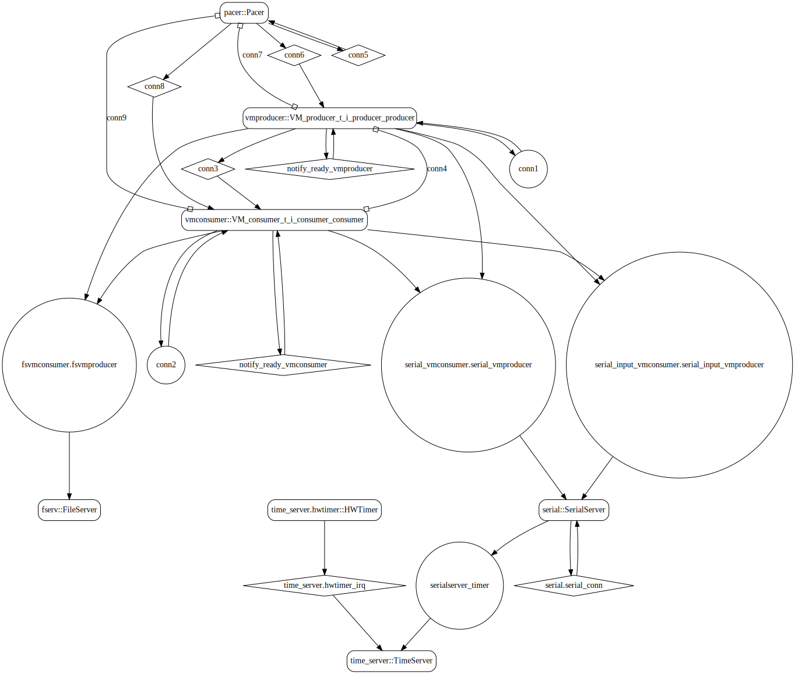

# sender_vm

 Table of Contents
<!--table-of-contents_start-->
* [AADL Architecture](#aadl-architecture)
* [SeL4](#sel4)
  * [HAMR Configuration: SeL4](#hamr-configuration-sel4)
  * [Behavior Code: SeL4](#behavior-code-sel4)
  * [How to Build/Run: SeL4](#how-to-buildrun-sel4)
  * [Example Output: SeL4](#example-output-sel4)
  * [CAmkES Architecture: SeL4](#camkes-architecture-sel4)
  * [HAMR CAmkES Architecture: SeL4](#hamr-camkes-architecture-sel4)
<!--table-of-contents_end-->

This example illustrates how to model and implement event data port communications between
components, where the sending component is implemented as C binary executing within
a Linux virtual machine hosted within a CAmkES components and the receiving component is
a native CAmkES component.

Virtualization of application components does not alter the behavior of
port communications.
In this context, an event data port communication is a shared memory construct
where the sending component has write-only permissions, to the designated block
of memory, and the receiving component has read-only permissions. The data in the
shared memory is queued, and each write operation is accompanied with an event signal
that is forwarded to the receiving component, indicating that a new communication has
been sent. If a write operation is invoked when the queue is full, then the oldest data entry
is overwritten. The data transferred via the port communication 
has a designated data type (e.g., integer, real, boolean, array, struct).
Both write and read operations are non-blocking.

This example also illustrates the use of periodic component scheduling. For a
seL4 target, the implementation employs a static cyclic scheduler. Each
component is assigned a domain (or temporal partition) and typically a domain
is assigned a single component (domain zero is reserved for seL4 infrastructure
and must be invoked regularly to maintain operational flow). The schedule consists
of a series of ordered (non-overlapping) time slots of a specific length and domain.
Time slot lengths are expressed as a number of ticks (by default a tick is
2 milliseconds). The user defines the component schedule in the *domain_schedule.c*
file. 

For seL4 targets, the static cyclic scheduler maintains temporal isolation
between the components, assuming the domain schedule has been correctly engineered.
It is the responsibility of the system designer to define a schedule
in which the components execute to completion within their assigned slots.
A component execution that exceeds the length of a time slot will resume from
where it left off when its next assigned time slot is invoked. 
For applications with virtualized components, it is often necessary to implement
a relatively large time slot for domain zero at the start of a major frame interaction 
to accommodate the initialization of the virtual machine during system startup.

Further details regarding modeling guidelines, virtual machine integration, 
and HAMR integration can be found in the [CASE-Tool-Assessment-Guide](https://github.com/loonwerks/CASE/tree/master/TA5/tool-assessment-4/doc/CASE-Tool-Assessment-Guide.pdf).


## AADL Architecture
<!--aadl-architecture_start-->

|System: [top_impl_Instance](aadl/test_event_data_port_periodic_domains.aadl#L85) Properties|
|--|
|Domain Scheduling|
|Wire Protocol|

|[producer](aadl/test_event_data_port_periodic_domains.aadl#L13) Properties|
|--|
|Virtual Machine|
|Periodic: 1000 ms|
|Domain: 2|


|[consumer](aadl/test_event_data_port_periodic_domains.aadl#L42) Properties|
|--|
|Native|
|Periodic: 1000 ms|
|Domain: 3|


**Schedule:** [domain_schedule.c](aadl/domain_schedule.c)
<!--aadl-architecture_end-->


## SeL4
<!--SeL4_start--><!--SeL4_end-->

### HAMR Configuration: SeL4
<!--hamr-configuration-sel4_start-->
To run HAMR Codegen, select [this](aadl/test_event_data_port_periodic_domains.aadl#L85) system implementation in FMIDE's outline view and then click the
HAMR button in the toolbar.  Use the following values in the dialog box that opens up (_&lt;example-dir&gt;_ is the directory that contains this readme file)

Option Name|Value |
|--|--|
Platform|SeL4|
Output Directory|_&lt;example-dir&gt;_/hamr/slang|
Base Package Name|base|
|Exclude Slang Component Implementations|True/Checked|
|Bit Width|32|
|Max Sequence Size|1|
|Max String Size|256|
|C Output Directory|_&lt;example-dir&gt;_/hamr/c|
|seL4/CAmkES Output Directory|_&lt;example-dir&gt;_/hamr/camkes

You can have HAMR's FMIDE plugin generate verbose output and run the transpiler by setting the ``Verbose output`` and ``Run Transpiler``
options that are located in __Preferences >> OSATE >> Sireum HAMR >> Code Generation__.


<details>

<summary>Click for instructions on how to run HAMR Codegen via the command line</summary>

The script [aadl/bin/run-hamr-SeL4.sh](aadl/bin/run-hamr-SeL4.sh) uses an experimental OSATE/FMIDE plugin we've developed that
allows you to run HAMR's OSATE/FMIDE plugin via the command line.  It has primarily been used/tested
when installed in OSATE (not FMIDE) and under Linux so may not work as expected in FMIDE or
under a different operating system. The script contains instructions on how to install the plugin.

```
./aadl/bin/run-hamr-SeL4.sh
```

</details>
<!--hamr-configuration-sel4_end-->


### Behavior Code: SeL4
<!--behavior-code-sel4_start-->
  * [producer (includes VM glue code)](hamr/camkes/components/VM/apps/vmproducer/vmproducer.c)

  * [consumer](hamr/c/ext-c/consumer_t_i_consumer_consumer/consumer_t_i_consumer_consumer.c)
<!--behavior-code-sel4_end-->


### How to Build/Run: SeL4
<!--how-to-buildrun-sel4_start-->
If you didn't configure HAMR's FMIDE plugin to run the transpiler automatically then run
```
./hamr/slang/bin/transpile-sel4.sh
```
then

```
./hamr/camkes/bin/setup-camkes-arm-vm.sh
./hamr/camkes/bin/run-camkes.sh -o "-DUSE_PRECONFIGURED_ROOTFS=ON" -s
```
<!--how-to-buildrun-sel4_end-->

Eventually you'll see ``buildroot login``.  Type ``root`` and at the ``#`` prompt type ``vmproducer``.

### Example Output: SeL4
<!--example-output-sel4_start-->
Timeout = 90 seconds
```
Booting all finished, dropped to user space
<<seL4(CPU 0) [decodeUntypedInvocation/212 T0xff807fc17400 "rootserver" @4006f0]: Untyped Retype: Insufficient memory (1 * 2097152 bytes needed, 0 bytes available).>>
Entering pre-init of consumer_t_i_consumer_consumer
Art: Registered component: top_impl_Instance_consumer_consumer (periodic: 1000)
Art: - Registered port: top_impl_Instance_consum_utspace_split_alloc@split.c:272 Failed to find any untyped capable of creating an object at address 0x8040000
Loading Linux: 'linux' dtb: ''
install_linux_devices@main.c:657 module name: map_frame_hack
install_linux_devices@main.c:657 module name: init_ram
er_consumer_read_port (event in)
Leaving pre-init of consumer_t_i_consumer_consumer
install_linux_devices@main.c:657 module name: virtio_con
install_linux_devices@main.c:657 module name: cross_vm_connections
libsel4muslcsys: Error attempting syscall 215
libsel4muslcsys: Error attempting syscall 215
clean_up@fdtgen.c:370 Non-existing node None specified to be kept
consume_connection_event@cross_vm_connection.c:247 Failed to inject connection irq
_utspace_split_alloc@split.c:272 Failed to find any untyped capable of creating an object at address 0x8020000
consume_connection_event@cross_vm_connection.c:247 Failed to inject connection irq
consume_connection_event@cross_vm_connection.c:247 Failed to inject connection irq
[    2.496710] Unable to detect cache hierarchy for CPU 0
[    2.515598] e1000: Intel(R) PRO/1000 Network Driver - version 7.3.21-k8-NAPI
[    2.529788] e1000: Copyright (c) 1999-2006 Intel Corporation.
[    2.544836] e1000e: Intel(R) PRO/1000 Network Driver - 3.2.6-k
[    2.557384] e1000e: Copyright(c) 1999 - 2015 Intel Corporation.
[    2.578078] mousedev: PS/2 mouse device common for all mice
[    2.599532] ledtrig-cpu: registered to indicate activity on CPUs
[    2.613796] dmi-sysfs: dmi entry is absent.
[    2.626577] ipip: IPv4 and MPLS over IPv4 tunneling driver
[    2.645783] NET: Registered protocol family 10
[    2.673922] mip6: Mobile IPv6
[    2.688241] NET: Registered protocol family 17
[    2.699928] mpls_gso: MPLS GSO support
[    2.708551] Registered cp15_barrier emulation handler
[    2.720802] Registered setend emulation handler
[    2.738280] registered taskstats version 1
[    2.750360] zswap: loaded using pool lzo/zbud
[    2.766868] ima: No TPM chip found, activating TPM-bypass!
[    2.778575] ima: Allocated hash algorithm: sha256
[    2.799718] hctosys: unable to open rtc device (rtc0)
[    2.810660] PM: Hibernation image not present or could not be loaded.
[    2.823371] initcall clk_disable_unused blacklisted
[    3.828037] Freeing unused kernel memory: 3776K
Starting syslogd: OK
Starting klogd: OK
Running sysctl: OK
Initializing random number generator... [    7.220700] random: dd: uninitialized urandom read (512 bytes read)
done.
Starting network: OK
[    8.575456] connection: loading out-of-tree module taints kernel.
[    8.618421] Event Bar (dev-0) initalised
[    8.637961] 2 Dataports (dev-0) initalised
[    8.653191] Event Bar (dev-1) initalised
[    8.663578] 2 Dataports (dev-1) initalised

Welcome to Buildroot
buildroot login: root
# vmproducer 
VM App vmproducer started
Setting up outgoing event data port /dev/uio0 4096
Successfully setup /dev/uio0
Setting up incoming event data port /dev/uio1 with size 4096
Successfully setup incoming event data port /dev/uio1
Hello from vmproducer's run method
top_impl_Instance_consumer_consumer: Received 8 bits on read_port: [ 00 ]
top_impl_Instance_consumer_consumer: Received 8 bits on read_port: [ 01 ]
top_impl_Instance_consumer_consumer: Received 8 bits on read_port: [ 02 ]
top_impl_Instance_consumer_consumer: Received 8 bits on read_port: [ 03 ]
top_impl_Instance_consumer_consumer: Received 8 bits on read_port: [ 04 ]
top_impl_Instance_consumer_consumer: Received 8 bits on read_port: [ 05 ]
top_impl_Instance_consumer_consumer: Received 8 bits on read_port: [ 06 ]
top_impl_Instance_consumer_consumer: Received 8 bits on read_port: [ 07 ]
top_impl_Instance_consumer_consumer: Received 8 bits on read_port: [ 08 ]
top_impl_Instance_consumer_consumer: Received 8 bits on read_port: [ 09 ]
top_impl_Instance_consumer_consumer: Received 8 bits on read_port: [ 0A ]
top_impl_Instance_consumer_consumer: Received 8 bits on read_port: [ 0B ]
top_impl_Instance_consumer_consumer: Received 8 bits on read_port: [ 0C ]
top_impl_Instance_consumer_consumer: Received 8 bits on read_port: [ 0D ]
QEMU: Terminated
```
<!--example-output-sel4_end-->


### CAmkES Architecture: SeL4
<!--camkes-architecture-sel4_start-->

<!--camkes-architecture-sel4_end-->


### HAMR CAmkES Architecture: SeL4
<!--hamr-camkes-architecture-sel4_start-->

<!--hamr-camkes-architecture-sel4_end-->

