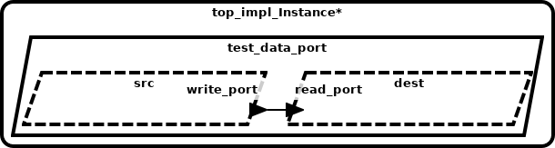
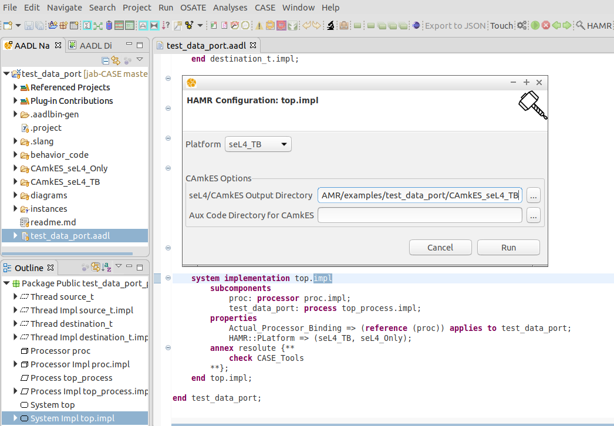

**Table of Contents**

- [AADL Data Ports](#aadl-data-ports)
  * [HAMR Code Generation for seL4 [CASE Phase 1 - Trusted Build Version]](#hamr-code-generation-for-sel4-case-phase-1---trusted-build-version)
  * [HAMR Code Generation for seL4 [CASE Phase 2]](#hamr-code-generation-for-sel4-case-phase-2)
  * [Outline of Argument for Correctness of Translation, Preservation of Information Flow, and Cyber-Resiliency](#outline-of-argument-for-correctness-of-translation-preservation-of-information-flow-and-cyber-resiliency)
- [Running HAMR](#running-hamr)

# AADL Data Ports

This example illustrates how AADL data ports are represented using seL4 
artifacts.   AADL data ports (and associated connections between ports) 
are used to model one-way non-queued data transfer between components.  Intuitively, 
a component with an AADL out data port can write values into the port; 
a component with an AADL in data port can read values from the port.  As 
specified by AADL semantics, arrival of data on an in data port DOES NOT 
trigger a dispatch of the consuming thread nor generate any other 
notification.  Therefore, AADL threads that have in data ports are 
time-triggered (declared with PERIODIC AADL dispatch mode) or event-triggered 
(declared with a SPORADIC AADL dispatch mode and dispatched upon arrival 
of information on an AADL event or event data port).  A typical computation 
pattern is that when a thread is dispatched via a time-trigger or event-trigger, 
it will then make calls from the user code to read the current values of 
data ports.  AADL properties can be attached to ports/connections to indicate 
latency bounds on propagation of values from out data ports to connected in 
ports (scheduling of threads/communication necessary to achieve these bounds 
is outside the scope of CASE). 

Components can have any number of out data ports and in data ports.  This example 
represents a simple producer-consumer pattern, with a single out data port on the 
producer and a single in data port on the consumer.   Specifically, the model 
contains two AADL threads `src` and `dest` that are instances of 
[source_t.impl](test_data_port.aadl#L16-L17)
and 
[destination_t.impl](test_data_port.aadl#L28-L29)
respectively. The AADL port connection 
[conn1](test_data_port.aadl#L45)
connects `src`'s outgoing 
[write_port](test_data_port.aadl#L8)
data port to `dest`'s incoming 
[read_port](test_data_port.aadl#L21)
data port.

## HAMR Code Generation for seL4 [CASE Phase 1 - Trusted Build Version]

*HAMR generated code is contained in the [CAmkES_seL4_TB](CAmkES_seL4_TB) directory*

HAMR transforms each AADL thread into separate CAmkES 
components.  The top-level CAmkES topology for the translated example 
can be found in 
[test_data_port.camkes](CAmkES_seL4_TB/test_data_port.camkes). For example, the AADL `src` thread is translated 
to 
[source_t_impl.camkes](CAmkES_seL4_TB/components/source_t_impl/source_t_impl.camkes), 
and the AADL `dest` thread is translated to 
[destination_t_impl.camkes](CAmkES_seL4_TB/components/destination_t_impl/destination_t_impl.camkes)
.  An intermediary CAmkES component called a monitor, 
[sb_dest_read_port_Monitor.camkes](CAmkES_seL4_TB/components/sb_Monitors/sb_dest_read_port_Monitor/sb_dest_read_port_Monitor.camkes), 
is introduced to handle the non-queued communcation 
over `conn1`. Both producer and consumer components are connected to the 
monitor via *sel4RPCCall* connections (
[conn1](CAmkES_seL4_TB/test_data_port.camkes#L12) 
and 
[conn2](CAmkES_seL4_TB/test_data_port.camkes#L13) 
in the CAmkES assembly).

The *seL4Notification* connection 
[conn3](CAmkES_seL4_TB/test_data_port.camkes#L14)
could be used to alert the receiving 
thread when new data arrives (as is done for AADL event data connections), 
however AADL threads are not dispatched due to the arrival of data on 
incoming data ports so currently the notification is not handled on the 
receiver's side.   HAMR also generates “glue code” on both the 
producer side 
[sb_source_t_impl.c](CAmkES_seL4_TB/components/source_t_impl/src/sb_source_t_impl.c)
and consumer side 
[sb_destination_t_impl.c](CAmkES_seL4_TB/components/destination_t_impl/src/sb_destination_t_impl.c)
to isolate the application code of both components from some of the 
details of interacting with lower-level CAmkES/seL4 APIs.

## HAMR Code Generation for seL4 [CASE Phase 2]

*HAMR generated code is contained in the [CAmkES_seL4_Only](CAmkES_seL4_Only) directory*

HAMR transforms each AADL thread into separate CAmkES 
components.  The top-level CAmkES topology for the translated example 
can be found in 
[test_data_port.camkes](CAmkES_seL4_Only/test_data_port.camkes). For example, the AADL `src` thread is translated 
to 
[source_t_impl.camkes](CAmkES_seL4_Only/components/source_t_impl/source_t_impl.camkes), 
and the AADL `dest` thread is translated to 
[destination_t_impl.camkes](CAmkES_seL4_Only/components/destination_t_impl/destination_t_impl.camkes).  

The new translation for data port connections removes the monitor component 
and has the producer and consumer communicate through a shared memory region (
e.g. [conn1](CAmkES_seL4_Only/test_data_port.camkes#L10)). seL4 
[memory protections](CAmkES_seL4_Only/test_data_port.camkes#L14-L15) 
are used to ensure that the producer can only write
and the consumer can only read from the shared memory.  The reads and writes 
are handled by a sampling port interface
(e.g. [sp_int8_t.c](CAmkES_seL4_Only/sampling_ports/sp_int8_t.c))
that that prevents the consumer from retrieving corrupt data.

## Outline of Argument for Correctness of Translation, Preservation of Information Flow, and Cyber-Resiliency

(Documentation is forth-coming)

# Running HAMR

1. Install [FM-IDE](https://github.com/loonwerks/formal-methods-workbench/releases)

2. Import this project into FM-IDE (by pointing to the directory containing [.project](.project))

3. Switch to the AADL perspective (from the menu bar select *Window >> Perspective >> Open Perspective >> AADL*)

4. Open [test_data_port.aadl](test_data_port.aadl) and in the Outline view select the system implementation *top.impl*

5. Run *Resolint* (from the menu bar select *Analyses >> Resolint*).  It should report no errors were found with the model.

6. With *top.impl* still selected in the outline view, click the *HAMR* icon in the toolbar

7. For *Platform*, select *seL4_TB* to generate CAmkES code using *Trusted Build* style port/connection translations, or *seL4_Only* to generate CAmkES code using *System Build* style port/connection translations.

8. Select an output directory where the generated CAmkES code will be written to.  The *Aux Code Directory for CAmkES* should be left blank.

9. Click *Run*

