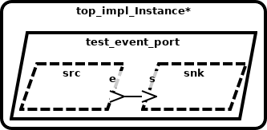
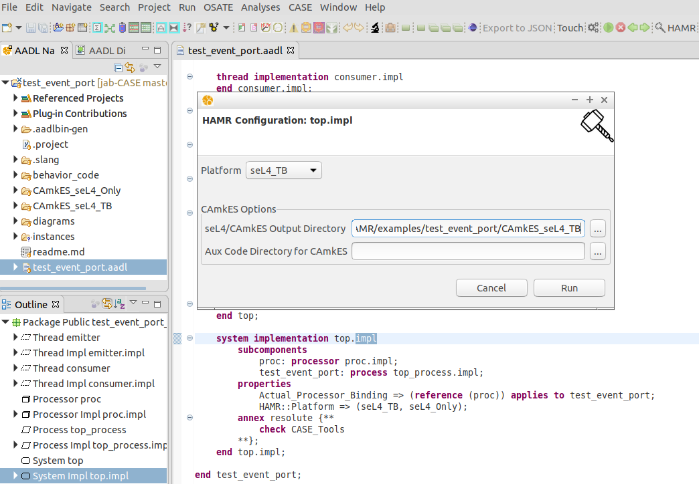

**Table of Contents**

- [AADL Event Port](#aadl-event-ports)
  * [HAMR Code Generation for seL4 [CASE Phase 1 - Trusted Build Version]](#hamr-code-generation-for-sel4-case-phase-1---trusted-build-version)
  * [HAMR Code Generation for seL4 [CASE Phase 2]](#hamr-code-generation-for-sel4-case-phase-2)
  * [Outline of Argument for Correctness of Translation, Preservation of Information Flow, and Cyber-Resiliency](#outline-of-argument-for-correctness-of-translation-preservation-of-information-flow-and-cyber-resiliency)
- [Running HAMR](#running-hamr)

# AADL Event Ports

This example illustrates how AADL event ports are represented using seL4 
artifacts. AADL event ports (and associated connections between ports) are
used to model one-way queued signaling between components. Intuitively, a 
component with an AADL out event port can send a signal/notification out 
of the port; a component with an AADL in event port can retrieve the signals 
from the queue associated with the port (each incoming event port has a 
distinct queue/buffer).  AADL event port communication behaves exactly 
as event data port communication, except the events sent between 
components have no user data payloads in the case of event ports.  As 
specified by AADL semantics, arrival of an event on an in event port 
can be set to trigger a dispatch of the consuming thread. Therefore, AADL 
threads that have in event ports are typically event-triggered (declared 
with a SPORADIC AADL dispatch mode and dispatched upon arrival of information 
on an AADL event or event data port). With a SPORADIC dispatch mode, a 
minimum separation time between event arrivals is also specified.  Messages 
arriving before the minimum interval expires are dropped (providing some 
protection from denial of service situations where incoming messages may 
flood a component).  A typical computation pattern is that when a thread is 
dispatched via event arrival, it may make calls from the user code to read 
the current values of data ports (optional) and then take some appropriate
action. The user code action of sending an event is always non-blocking; if
a receiving component’s event queue is full, a message is dropped according
to a policy specified as a property in the model in the input port (e.g., drop 
newest event, drop oldest event, etc.)  AADL properties can be attached to
ports/connections to indicate latency bounds on propagation of events from 
out event ports to connected in ports (scheduling of threads/communication 
necessary to achieve these bounds is outside the scope of CASE).  A variety 
of AADL properties can be used to state priorities regarding which input 
event ports within a component trigger the dispatching of the thread.

Components can have any number of out event ports and in event ports.  This example 
represents a simple producer-consumer pattern, with a single out event port on the 
producer and a single in event port on the consumer.   Specifically, the model 
contains two AADL threads `src` and `snk` that are instances of 
[emitter.impl](test_event_port.aadl#L15-L16)
and 
[consumer.impl](test_event_port.aadl#L29-L30)
respectively. The AADL port connection 
[conn1](test_event_port.aadl#L46)
connects `src`'s outgoing 
[e](test_event_port.aadl#L7)
event port to `snk`'s incoming 
[s](test_event_port.aadl#L20)
event port.

## HAMR Code Generation for seL4 [CASE Phase 1 - Trusted Build Version]

*HAMR generated code is contained in the [CAmkES_seL4_TB](CAmkES_seL4_TB) directory*

HAMR transforms each AADL thread into separate CAmkES 
components.  The top-level CAmkES topology for the translated example 
can be found in 
[test_event_port.camkes](CAmkES_seL4_TB/test_event_port.camkes). For example, the AADL `src` thread is translated 
to 
[emitter_impl.camkes](CAmkES_seL4_TB/components/emitter_impl/emitter_impl.camkes), 
and the AADL `dest` thread is translated to 
[consumer_impl.camkes](CAmkES_seL4_TB/components/consumer_impl/consumer_impl.camkes)
.  The queue size of `s` is 1 (the default value when not specified in the AADL model) so
an *seL4Notification* connection
[conn1](CAmkES_seL4_TB/test_event_port.camkes#L10) is used to allow `src` to signal/notify
`dest` that an event has been sent, which will result in `dest` being dispatched.  If the
queue size is greater than one then a monitor component will be used (similar to the
monitors used for 
[event data ports](../test_event_data_port#hamr-code-generation-for-sel4-case-phase-1---trusted-build-version)).

HAMR also generates “glue code” on both the 
producer side 
[sb_emitter_impl.c](CAmkES_seL4_TB/components/emitter_impl/src/sb_emitter_impl.c)
and consumer side 
[sb_consumer_impl.c](CAmkES_seL4_TB/components/consumer_impl/src/sb_consumer_impl.c)
to isolate the application code of both components from some of the 
details of interacting with lower-level CAmkES/seL4 APIs.

## HAMR Code Generation for seL4 [CASE Phase 2]

*HAMR generated code is contained in the [CAmkES_seL4_Only](CAmkES_seL4_Only) directory*

HAMR transforms each AADL thread into separate CAmkES 
components.  The top-level CAmkES topology for the translated example 
can be found in 
[test_event_port.camkes](CAmkES_seL4_Only/test_event_port.camkes). For example, the AADL `src` thread is translated 
to 
[emitter_impl.camkes](CAmkES_seL4_Only/components/emitter_impl/emitter_impl.camkes), 
and the AADL `dest` thread is translated to 
[consumer_impl.camkes](CAmkES_seL4_Only/components/consumer_impl/consumer_impl.camkes)
. 

The new translation for event port connections replaces the monitor component 
(when queue sizes are greater than 1) with a shared counter that
the receiving component can use to determine the number of events that
were transmitted (e.g. 
[conn2](CAmkES_seL4_Only/test_event_port.camkes#L11)).  seL4 
[memory protections](CAmkES_seL4_Only/test_event_port.camkes#L15-L16)
are used to ensure that the producer can only send events
and the consumer can only retrieve events. An *seL4Notification* connection
[conn1](CAmkES_seL4_Only/test_event_port.camkes#L10) allows `src` to signal/notify
`dest` that it has transmitted events, which will result in `dest` being dispatched.

HAMR also generates “glue code” on both the 
producer side 
[sb_emitter_impl.c](CAmkES_seL4_Only/components/emitter_impl/src/sb_emitter_impl.c)
and consumer side 
[sb_consumer_impl.c](CAmkES_seL4_Only/components/consumer_impl/src/sb_consumer_impl.c)
to isolate the application code of both components from some of the 
details of interacting with lower-level CAmkES/seL4 APIs.

## Outline of Argument for Correctness of Translation, Preservation of Information Flow, and Cyber-Resiliency

(Documentation is forth-coming)

# Running HAMR

1. Install [FM-IDE](https://github.com/loonwerks/formal-methods-workbench/releases)

2. Import this project into FM-IDE (by pointing to the directory containing [.project](.project))

3. Switch to the AADL perspective (from the menu bar select *Window >> Perspective >> Open Perspective >> AADL*)

4. Open [test_event_port.aadl](test_event_port.aadl) and in the Outline view select the system implementation *top.impl*

5. Run *Resolint* (from the menu bar select *Analyses >> Resolint*).  It should report no errors were found with the model.

6. With *top.impl* still selected in the outline view, click the *HAMR* icon in the toolbar

7. For *Platform*, select *seL4_TB* to generate CAmkES code using *Trusted Build* style port/connection translations, or *seL4_Only* to generate CAmkES code using *System Build* style port/connection translations.

8. Select an output directory where the generated CAmkES code will be written to.  The *Aux Code Directory for CAmkES* should be left blank.

9. Click *Run*

