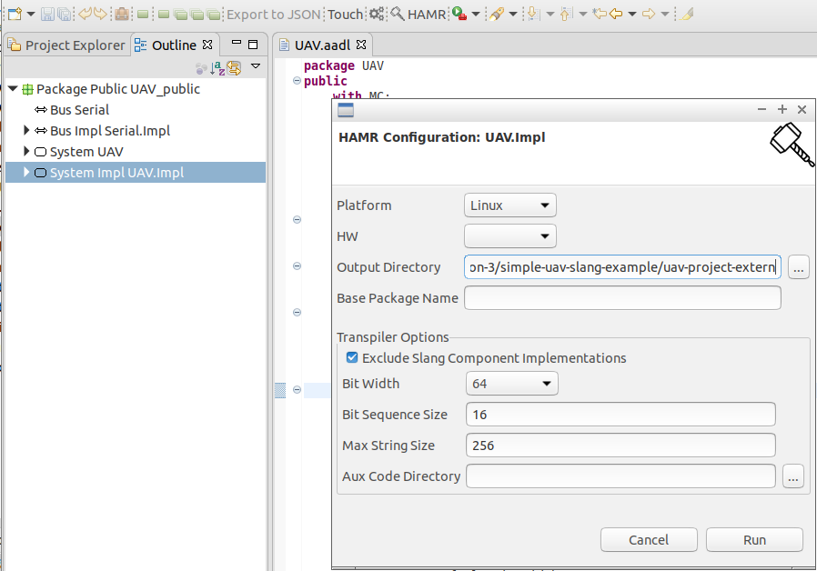
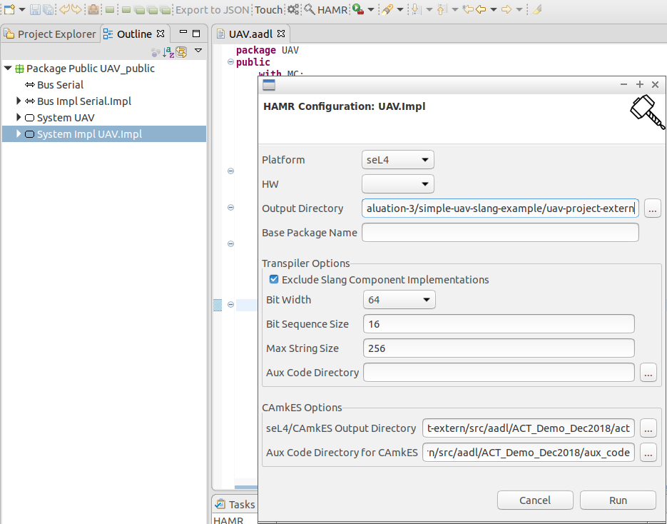

# Simple UAV Slang Example

This folder stores the simple UAV example from CASE tool evaluation #2 (Dec'18), but modified to use auto-generated AADL middleware.

## Demos

### Running on seL4

```
git clone git@github.com:loonwerks/CASE.git
CASE/TA5/tool-evaluation-3/simple-uav-slang-example/uav-project-extern/camkes-demo.sh 
```

This will build the static Slang library and then build and run the CAmkES system. 
The path to the CAmkES installation directory can be supplied if it is not 
located at `/host/camkes-project`.  For example,

```
CASE/TA5/tool-evaluation-3/simple-uav-slang-example/uav-project-extern/camkes-demo.sh /path/to/camkes
```


### Running on Linux

```bash
git clone git@github.com:loonwerks/CASE.git
CASE/TA5/tool-evaluation-3/simple-uav-slang-example/uav-project-extern/linux-demo.sh
```

## Generating HAMR Code

Install HAMR following [these](https://github.com/sireum/hamr-plugin-update-site) directions

### Generating Code for Linux

1. In FM-IDE, open the project contained in [ACT_Demo_Dec2018](src/aadl/ACT_Demo_Dec2018) and select the ``UAV.Impl`` system implementation in the outline view
2. Click the HAMR icon in the toolbar
3. Select ``Linux`` as the **Platform**
4. Set **Output Directory** to point to the ``uav-project-extern`` directory (i.e. the directory this readme.md file is in)
5. Check the **Exclude Slang Component Implementation** box
6. Click **Run**



### Generating Code for seL4

1. In FM-IDE, open the project contained in [ACT_Demo_Dec2018](src/aadl/ACT_Demo_Dec2018) and select the ``UAV.Impl`` system implementation in the outline view
2. Click the HAMR icon in the toolbar
3. Select ``seL4`` as the **Platform**
4. Set **Output Directory** to point to the ``uav-project-extern`` directory (i.e. the directory this readme.md file is in)
5. Check the **Exclude Slang Component Implementation** box
6. Set **seL4/CAmkES Output Directory** to point to the [act](src/aadl/ACT_Demo_Dec2018/act) directory
7. Set **Aux Code Directory for CAmkES** to point to the [aux_code](src/aadl/ACT_Demo_Dec2018/aux_code) directory
8. Click **Run**

