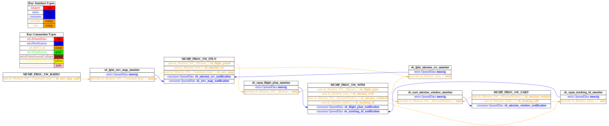
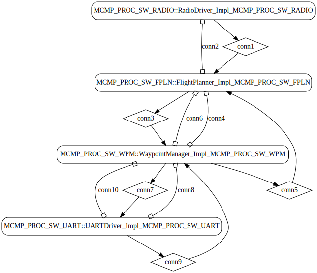

# simple_uav

 Table of Contents
  * [Diagrams](#diagrams)
    * [AADL Arch](#aadl-arch)
    * [SeL4_TB](#sel4_tb)
      * [SeL4_TB CAmkES Arch](#sel4_tb-camkes-arch)
      * [SeL4_TB CAmkES HAMR Arch](#sel4_tb-camkes-hamr-arch)
    * [SeL4_Only](#sel4_only)
      * [SeL4_Only CAmkES Arch](#sel4_only-camkes-arch)
      * [SeL4_Only CAmkES HAMR Arch](#sel4_only-camkes-hamr-arch)
  * [Example Output](#example-output)
    * [SeL4_TB Expected Output: Timeout = 15 seconds](#sel4_tb-expected-output-timeout--15-seconds)
    * [SeL4_Only Expected Output: Timeout = 15 seconds](#sel4_only-expected-output-timeout--15-seconds)

## Diagrams
### AADL Arch


### SeL4_TB
#### SeL4_TB CAmkES Arch


#### SeL4_TB CAmkES HAMR Arch


### SeL4_Only
#### SeL4_Only CAmkES Arch


#### SeL4_Only CAmkES HAMR Arch


## Example Output
*NOTE:* actual output may differ due to issues related to thread interleaving
### SeL4_TB Expected Output: Timeout = 15 seconds

  |HAMR Codegen Configuration| |
  |--|--|
  | refer to [bin/run-hamr-SeL4_TB.sh](bin/run-hamr-SeL4_TB.sh)


  **How To Run**
  ```
  ./bin/run-hamr-SeL4_TB.sh
  ./CAmkES_seL4_TB/bin/run-camkes.sh -s
  ```

  ```
  Booting all finished, dropped to user space
  RDIO: initialise entry point called
  RDIO:> Sending command.
  FPLN:< Command.
    Map     = [
               0: {0, 1, 2}
               1: {1, 2, 3}
               2: {2, 3, 4}
               3: {3, 4, 5}
              ]
    Pattern = 2
    HMAC    = 1
  FPLN:> new mission notification.
  WM:< Received flight plan
    Mission:
      0: {0, 1, 2}
      1: {1, 2, 3}
      2: {2, 3, 4}
      3: {3, 4, 5}
      4: {4, 5, 6}
      5: {5, 6, 7}
      6: {6, 7, 8}
      7: {7, 8, 9}
      8: {8, 9, 10}
      9: {9, 10, 11}
  WM:> Sent mission window
  UAFPLN:< Received mission receipt confirmation: 1.
  RT:< Received mission window
    MissionWindow:
      0: {0, 1, 2}
      1: {1, 2, 3}
      2: {2, 3, 4}
      3: {3, 4, 5}
  UART:> Sending 1 as the next id.
  WM:< Received 1 as the next id.
  WM:> Sent mission window
  UART:< Received mission window
    MissionWindow:
      0: {1, 2, 3}
      1: {2, 3, 4}
      2: {3, 4, 5}
      3: {4, 5, 6}
  UART:> Sending 2 as the next id.
  WM:< Received 2 as the next id.
  WM:> Sent mission window
  UART:< Received mission window
    MissionWindow:
      0: {2, 3, 4}
      1: {3, 4, 5}
      2: {4, 5, 6}
      3: {5, 6, 7}
  UART:> Sending 3 as the next id.
  WM:< Received 3 as the next id.
  WM:> Sent mission window
  UART:< Received mission window
    MissionWindow:
      0: {3, 4, 5}
      1: {4, 5, 6}
      2: {5, 6, 7}
      3: {6, 7, 8}
  UART:> Sending 4 as the next id.
  WM:< Received 4 as the next id.
  WM:> Sent mission window
  UART:< Received mission window
    MissionWindow:
      0: {4, 5, 6}
      1: {5, 6, 7}
      2: {6, 7, 8}
      3: {7, 8, 9}
  UART:> Sending 5 as the next id.
  WM:< Received 5 as the next id.
  WM:> Sent mission window
  UART:< Received mission window
    MissionWindow:
      0: {5, 6, 7}
      1: {6, 7, 8}
      2: {7, 8, 9}
      3: {8, 9, 10}
  UART:> Sending 6 as the next id.
  WM:< Received 6 as the next id.
  WM:> Sent mission window
  UART:< Received mission window
    MissionWindow:
      0: {6, 7, 8}
      1: {7, 8, 9}
      2: {8, 9, 10}
      3: {9, 10, 11}
  UART:> Sending 7 as the next id.
  WM:< Received 7 as the next id.
  WM:> Sent mission window
  UART:< Received mission window
    MissionWindow:
      0: {7, 8, 9}
      1: {8, 9, 10}
      2: {9, 10, 11}
      3: {0, 1, 2}
  UART:> Sending 8 as the next id.
  WM:< Received 8 as the next id.
  WM:> Sent mission window
  UART:< Received mission window
    MissionWindow:
      0: {8, 9, 10}
      1: {9, 10, 11}
      2: {0, 1, 2}
      3: {1, 2, 3}
  UART:> Sending 9 as the next id.
  WM:< Received 9 as the next id.
  WM:> Sent mission window
  UART:< Received mission window
    MissionWindow:
      0: {9, 10, 11}
      1: {0, 1, 2}
      2: {1, 2, 3}
      3: {2, 3, 4}
  UART:> Sending 10 as the next id.
  WM:< Received 10 as the next id.
  WM:> Sent mission window
  UART:< Received mission window
    MissionWindow:
      0: {0, 1, 2}
      1: {1, 2, 3}
      2: {2, 3, 4}
      3: {3, 4, 5}
  UART:> Sending 11 as the next id.
  WM:< Received 11 as the next id.
  WM:> Sent mission window
  UART:< Received mission window
    MissionWindow:
      0: {1, 2, 3}
      1: {2, 3, 4}
      2: {3, 4, 5}
      3: {4, 5, 6}
  UART:> Sending 12 as the next id.
  WM:< Received 12 as the next id.
  WM:> Sent mission window
  UART:< Received mission window
    MissionWindow:
      0: {2, 3, 4}
      1: {3, 4, 5}
      2: {4, 5, 6}
      3: {5, 6, 7}
  UART:> Sending 13 as the next id.
  WM:< Received 13 as the next id.
  WM:> Sent mission window
  UART:< Received mission window
    MissionWindow:
      0: {3, 4, 5}
      1: {4, 5, 6}
      2: {5, 6, 7}
      3: {6, 7, 8}
  UART:> Sending 14 as the next id.
  WM:< Received 14 as the next id.
  WM:> Sent mission window
  UART:< Received mission window
    MissionWindow:
      0: {4, 5, 6}
      1: {5, 6, 7}
      2: {6, 7, 8}
      3: {7, 8, 9}
  UART:> Sending 15 as the next id.
  WM:< Received 15 as the next id.
  WM:> Sent mission window
  UART:< Received mission window
    MissionWindow:
      0: {5, 6, 7}
      1: {6, 7, 8}
      2: {7, 8, 9}
      3: {8, 9, 10}
  UART:> Sending 16 as the next id.
  WM:< Received 16 as the next id.
  WM:> Sent mission window
  UART:< Received mission window
    MissionWindow:
      0: {6, 7, 8}
      1: {7, 8, 9}
      2: {8, 9, 10}
      3: {9, 10, 11}

  ```

### SeL4_Only Expected Output: Timeout = 15 seconds

  |HAMR Codegen Configuration| |
  |--|--|
  | refer to [bin/run-hamr-SeL4_Only.sh](bin/run-hamr-SeL4_Only.sh)


  **How To Run**
  ```
  ./bin/run-hamr-SeL4_Only.sh
  ./CAmkES_seL4_Only/bin/run-camkes.sh -s
  ```

  ```
  Booting all finished, dropped to user space
  RDIO: initialise entry point called
  RDIO:> Sending command.
  FPLN:< Command.
    Map     = [
               0: {0, 1, 2}
               1: {1, 2, 3}
               2: {2, 3, 4}
               3: {3, 4, 5}
              ]
    Pattern = 2
    HMAC    = 1
  FPLN:> new mission notification.
  WM:< Received flight plan
    Mission:
      0: {0, 1, 2}
      1: {1, 2, 3}
      2: {2, 3, 4}
      3: {3, 4, 5}
      4: {4, 5, 6}
      5: {5, 6, 7}
      6: {6, 7, 8}
      7: {7, 8, 9}
      8: {8, 9, 10}
      9: {9, 10, 11}
  WM:> Sent mission window
  UART:< Received mission window
    MissionWindow:
      0: {0, 1, 2}
      1: {1, 2, 3}
      2: {2, 3, 4}
      3: {3, 4, 5}
  FPLN:< Received mission receipt confirmation: 1.
  UART:> Sending 1 as the next id.
  WM:< Received 1 as the next id.
  WM:> Sent mission window
  UART:< Received mission window
    MissionWindow:
      0: {1, 2, 3}
      1: {2, 3, 4}
      2: {3, 4, 5}
      3: {4, 5, 6}
  UART:> Sending 2 as the next id.
  WM:< Received 2 as the next id.
  WM:> Sent mission window
  UART:< Received mission window
    MissionWindow:
      0: {2, 3, 4}
      1: {3, 4, 5}
      2: {4, 5, 6}
      3: {5, 6, 7}
  UART:> Sending 3 as the next id.
  WM:< Received 3 as the next id.
  WM:> Sent mission window
  UART:< Received mission window
    MissionWindow:
      0: {3, 4, 5}
      1: {4, 5, 6}
      2: {5, 6, 7}
      3: {6, 7, 8}
  UART:> Sending 4 as the next id.
  WM:< Received 4 as the next id.
  WM:> Sent mission window
  UART:< Received mission window
    MissionWindow:
      0: {4, 5, 6}
      1: {5, 6, 7}
      2: {6, 7, 8}
      3: {7, 8, 9}
  UART:> Sending 5 as the next id.
  WM:< Received 5 as the next id.
  WM:> Sent mission window
  UART:< Received mission window
    MissionWindow:
      0: {5, 6, 7}
      1: {6, 7, 8}
      2: {7, 8, 9}
      3: {8, 9, 10}
  UART:> Sending 6 as the next id.
  WM:< Received 6 as the next id.
  WM:> Sent mission window
  UART:< Received mission window
    MissionWindow:
      0: {6, 7, 8}
      1: {7, 8, 9}
      2: {8, 9, 10}
      3: {9, 10, 11}
  UART:> Sending 7 as the next id.
  WM:< Received 7 as the next id.
  WM:> Sent mission window
  UART:< Received mission window
    MissionWindow:
      0: {7, 8, 9}
      1: {8, 9, 10}
      2: {9, 10, 11}
      3: {0, 1, 2}
  UART:> Sending 8 as the next id.
  WM:< Received 8 as the next id.
  WM:> Sent mission window
  UART:< Received mission window
    MissionWindow:
      0: {8, 9, 10}
      1: {9, 10, 11}
      2: {0, 1, 2}
      3: {1, 2, 3}
  UART:> Sending 9 as the next id.
  WM:< Received 9 as the next id.
  WM:> Sent mission window
  UART:< Received mission window
    MissionWindow:
      0: {9, 10, 11}
      1: {0, 1, 2}
      2: {1, 2, 3}
      3: {2, 3, 4}
  UART:> Sending 10 as the next id.
  WM:< Received 10 as the next id.
  WM:> Sent mission window
  UART:< Received mission window
    MissionWindow:
      0: {0, 1, 2}
      1: {1, 2, 3}
      2: {2, 3, 4}
      3: {3, 4, 5}
  UART:> Sending 11 as the next id.
  WM:< Received 11 as the next id.
  WM:> Sent mission window
  UART:< Received mission window
    MissionWindow:
      0: {1, 2, 3}
      1: {2, 3, 4}
      2: {3, 4, 5}
      3: {4, 5, 6}
  UART:> Sending 12 as the next id.
  WM:< Received 12 as the next id.
  WM:> Sent mission window
  UART:< Received mission window
    MissionWindow:
      0: {2, 3, 4}
      1: {3, 4, 5}
      2: {4, 5, 6}
      3: {5, 6, 7}
  UART:> Sending 13 as the next id.
  WM:< Received 13 as the next id.
  WM:> Sent mission window
  UART:< Received mission window
    MissionWindow:
      0: {3, 4, 5}
      1: {4, 5, 6}
      2: {5, 6, 7}
      3: {6, 7, 8}
  UART:> Sending 14 as the next id.
  WM:< Received 14 as the next id.
  WM:> Sent mission window
  UART:< Received mission window
    MissionWindow:
      0: {4, 5, 6}
      1: {5, 6, 7}
      2: {6, 7, 8}
      3: {7, 8, 9}
  UART:> Sending 15 as the next id.
  WM:< Received 15 as the next id.
  WM:> Sent mission window
  UART:< Received mission window
    MissionWindow:
      0: {5, 6, 7}
      1: {6, 7, 8}
      2: {7, 8, 9}
      3: {8, 9, 10}
  UART:> Sending 16 as the next id.
  WM:< Received 16 as the next id.
  WM:> Sent mission window
  UART:< Received mission window
    MissionWindow:
      0: {6, 7, 8}
      1: {7, 8, 9}
      2: {8, 9, 10}
      3: {9, 10, 11}
  UART:> Sending 17 as the next id.
  WM:< Received 17 as the next id.
  WM:> Sent mission window
  UART:< Received mission window
    MissionWindow:
      0: {7, 8, 9}
      1: {8, 9, 10}
      2: {9, 10, 11}
      3: {0, 1, 2}
  UART:> Sending 18 as the next id.
  WM:< Received 18 as the next id.
  WM:> Sent mission window
  UART:< Received mission window
    MissionWindow:
      0: {8, 9, 10}
      1: {9, 10, 11}
      2: {0, 1, 2}
      3: {1, 2, 3}

  ```