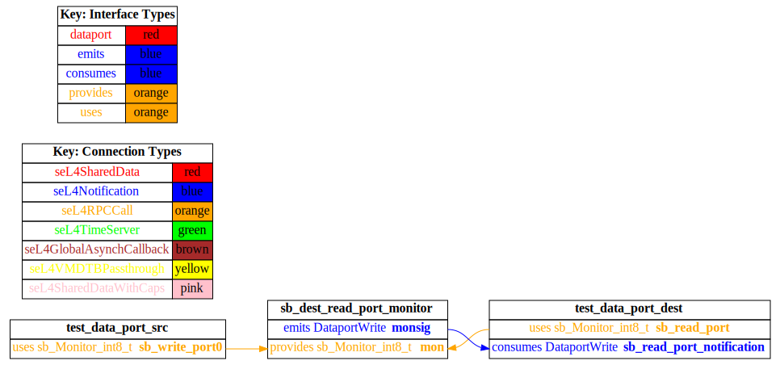
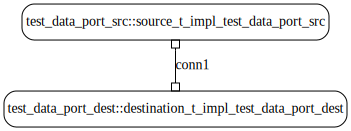

# test_data_port

## Diagrams

### AADL Arch
  

### CAmkES HAMR SeL4_TB Arch
  

### CAmkES SeL4_TB Arch
  

### CAmkES HAMR SeL4_Only Arch
  

### CAmkES SeL4_Only Arch
  

## Expected Output : Timeout = 15 seconds

  ### CAmkES SeL4_TB Expected Output
    Booting all finished, dropped to user space
    [src] test_data_port_source_component_init called
    [dest] test_data_port_destination_component_init called

  ### CAmkES SeL4_Only Expected Output
    Booting all finished, dropped to user space
    [src] test_data_port_source_component_init called
    [dest] test_data_port_destination_component_init called

