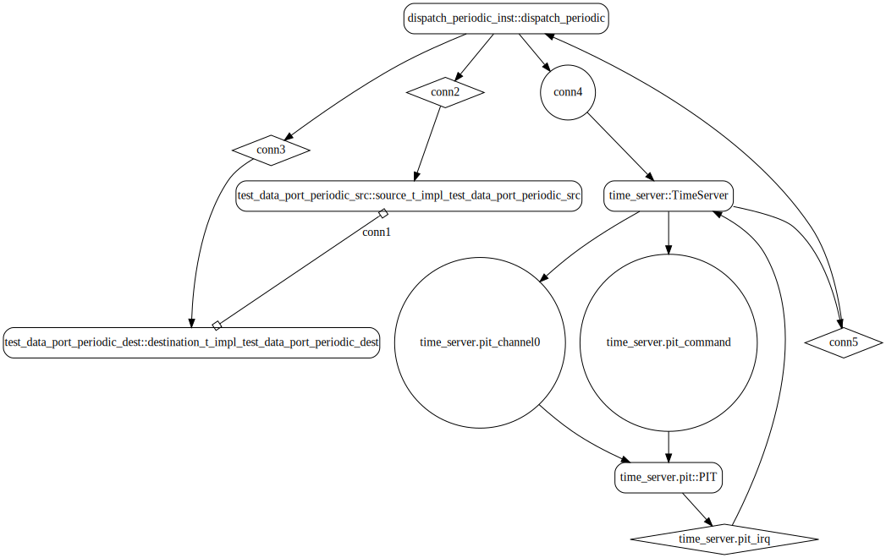

# test_data_port_periodic

## Diagrams

### AADL Arch
  

### CAmkES HAMR SeL4_TB Arch
  

### CAmkES SeL4_TB Arch
  

### CAmkES HAMR SeL4_Only Arch
  

### CAmkES SeL4_Only Arch
  

## Expected Output : Timeout = 15 seconds

  ### CAmkES SeL4_TB Expected Output
    Booting all finished, dropped to user space
    [src] test_data_port_periodic_source_component_init called
    [dest] test_data_port_periodic_destination_component_init called
    ---------------------------------------
    [src] Sent 0
    [dest] value {0}
    ---------------------------------------
    [src] Sent 1
    ---------------------------------------
    [src] Sent 2
    [dest] value {2}
    ---------------------------------------
    [src] Sent 3
    ---------------------------------------
    [src] Sent 4
    [dest] value {4}
    ---------------------------------------
    [src] Sent 5
    ---------------------------------------
    [src] Sent 6
    [dest] value {6}
    ---------------------------------------
    [src] Sent 7
    ---------------------------------------
    [src] Sent 8
    [dest] value {8}

  ### CAmkES SeL4_Only Expected Output
    Booting all finished, dropped to user space
    [src] test_data_port_periodic_source_component_init called
    [dest] test_data_port_periodic_destination_component_init called
    ---------------------------------------
    [src] Sent 0
    [dest] value {0}
    ---------------------------------------
    [src] Sent 1
    ---------------------------------------
    [src] Sent 2
    [dest] value {2}
    ---------------------------------------
    [src] Sent 3
    ---------------------------------------
    [src] Sent 4
    [dest] value {4}
    ---------------------------------------
    [src] Sent 5
    ---------------------------------------
    [src] Sent 6
    [dest] value {6}
    ---------------------------------------
    [src] Sent 7
    ---------------------------------------
    [src] Sent 8
    [dest] value {8}

