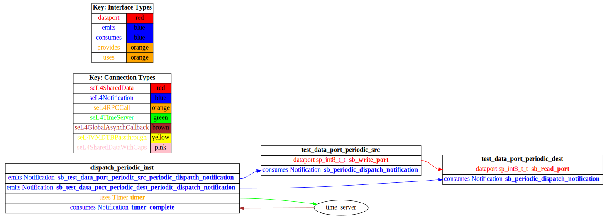

# test_data_port_periodic

 Table of Contents
  * [Diagrams](#diagrams)
    * [AADL Arch](#aadl-arch)
    * [SeL4_TB](#sel4tb)
      * [SeL4_TB CAmkES Arch](#sel4tb-camkes-arch)
      * [SeL4_TB CAmkES HAMR Arch](#sel4tb-camkes-hamr-arch)
    * [SeL4_Only](#sel4only)
      * [SeL4_Only CAmkES Arch](#sel4only-camkes-arch)
      * [SeL4_Only CAmkES HAMR Arch](#sel4only-camkes-hamr-arch)
  * [Example Output](#example-output)
    * [SeL4_TB Expected Output: Timeout = 15 seconds](#sel4tb-expected-output-timeout--15-seconds)
    * [SeL4_Only Expected Output: Timeout = 15 seconds](#sel4only-expected-output-timeout--15-seconds)

## Diagrams
### AADL Arch


### SeL4_TB
#### SeL4_TB CAmkES Arch


#### SeL4_TB CAmkES HAMR Arch


### SeL4_Only
#### SeL4_Only CAmkES Arch


#### SeL4_Only CAmkES HAMR Arch


## Example Output
*NOTE:* actual output may differ due to issues related to thread interleaving
### SeL4_TB Expected Output: Timeout = 15 seconds

  |HAMR Codegen Configuration| |
  |--|--|
  | package-name | test_data_port_periodic |
  | exclude-component-impl | true |
  | bit-width | 32 |
  | max-string-size | 256 |
  | max-array-size | 1 |


  **How To Run**
  ```
  test_data_port_periodic/CAmkES_seL4_TB/bin/run-camkes.sh -s
  ```

  ```
  Booting all finished, dropped to user space
  [src] test_data_port_periodic_source_component_init called
  [dest] test_data_port_periodic_destination_component_init called
  ---------------------------------------
  [src] Sent 0
  [dest] value {0}
  ---------------------------------------
  [src] Sent 1
  ---------------------------------------
  [src] Sent 2
  [dest] value {2}
  ---------------------------------------
  [src] Sent 3
  ---------------------------------------
  [src] Sent 4
  [dest] value {4}
  ---------------------------------------
  [src] Sent 5
  ---------------------------------------
  [src] Sent 6
  [dest] value {6}
  ---------------------------------------
  [src] Sent 7
  ---------------------------------------
  [src] Sent 8
  [dest] value {8}

  ```

### SeL4_Only Expected Output: Timeout = 15 seconds

  |HAMR Codegen Configuration| |
  |--|--|
  | package-name | test_data_port_periodic |
  | exclude-component-impl | true |
  | bit-width | 32 |
  | max-string-size | 256 |
  | max-array-size | 1 |


  **How To Run**
  ```
  test_data_port_periodic/CAmkES_seL4_Only/bin/run-camkes.sh -s
  ```

  ```
  Booting all finished, dropped to user space
  [src] test_data_port_periodic_source_component_init called
  [dest] test_data_port_periodic_destination_component_init called
  ---------------------------------------
  [src] Sent 0
  [dest] value {0}
  ---------------------------------------
  [src] Sent 1
  ---------------------------------------
  [src] Sent 2
  [dest] value {2}
  ---------------------------------------
  [src] Sent 3
  ---------------------------------------
  [src] Sent 4
  [dest] value {4}
  ---------------------------------------
  [src] Sent 5
  ---------------------------------------
  [src] Sent 6
  [dest] value {6}
  ---------------------------------------
  [src] Sent 7
  ---------------------------------------
  [src] Sent 8
  [dest] value {8}

  ```