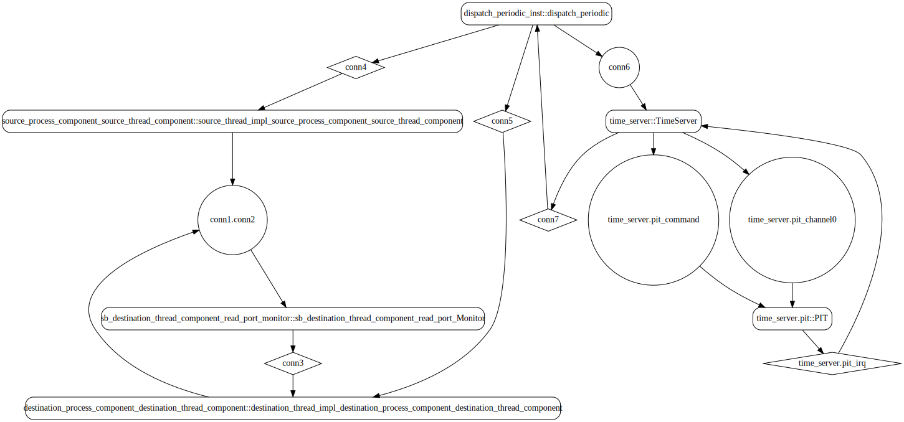
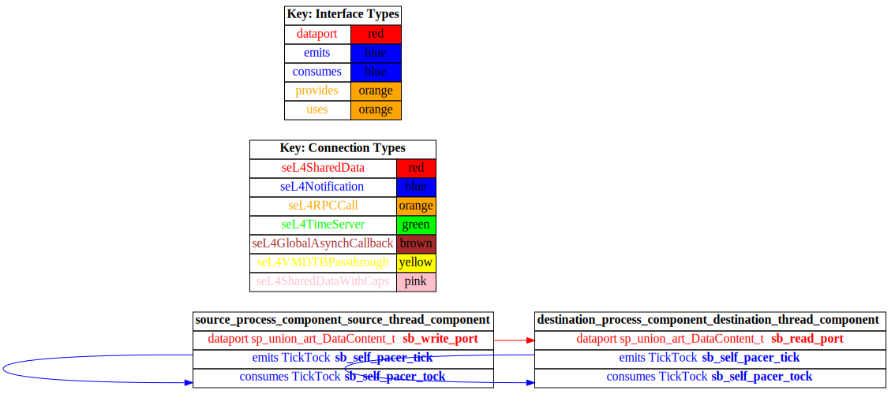

# test_data_port_periodic_domains

 Table of Contents
  * [Diagrams](#diagrams)
    * [AADL Arch](#aadl-arch)
    * [SeL4_TB](#sel4_tb)
      * [SeL4_TB CAmkES Arch](#sel4_tb-camkes-arch)
      * [SeL4_TB CAmkES HAMR Arch](#sel4_tb-camkes-hamr-arch)
    * [SeL4_Only](#sel4_only)
      * [SeL4_Only CAmkES Arch](#sel4_only-camkes-arch)
      * [SeL4_Only CAmkES HAMR Arch](#sel4_only-camkes-hamr-arch)
    * [SeL4](#sel4)
      * [SeL4 CAmkES Arch](#sel4-camkes-arch)
      * [SeL4 CAmkES HAMR Arch](#sel4-camkes-hamr-arch)
  * [Example Output](#example-output)
    * [SeL4_TB Expected Output: Timeout = 15 seconds](#sel4_tb-expected-output-timeout--15-seconds)
    * [SeL4_Only Expected Output: Timeout = 15 seconds](#sel4_only-expected-output-timeout--15-seconds)
    * [SeL4 Expected Output: Timeout = 15 seconds](#sel4-expected-output-timeout--15-seconds)

## Diagrams
### AADL Arch


### SeL4_TB
#### SeL4_TB CAmkES Arch


#### SeL4_TB CAmkES HAMR Arch


### SeL4_Only
#### SeL4_Only CAmkES Arch


#### SeL4_Only CAmkES HAMR Arch


### SeL4
#### SeL4 CAmkES Arch


#### SeL4 CAmkES HAMR Arch


## Example Output
*NOTE:* actual output may differ due to issues related to thread interleaving
### SeL4_TB Expected Output: Timeout = 15 seconds

  |HAMR Codegen Configuration| |
  |--|--|
  | package-name | test_data_port_periodic_domains |
  | exclude-component-impl | true |
  | bit-width | 32 |
  | max-string-size | 256 |
  | max-array-size | 1 |


  **How To Run**
  ```
  test_data_port_periodic_domains/CAmkES_seL4_TB/bin/run-camkes.sh -s
  ```

  ```
  Booting all finished, dropped to user space
  [source_process_component_source_thread_component] test_data_port_periodic_source_component_init called
  [destination_process_component_destination_thread_component] test_data_port_periodic_domains_destination_component_init called
  ---------------------------------------
  [source_process_component_source_thread_component] Sent 0
  [destination_process_component_destination_thread_component] value {0}
  ---------------------------------------
  [source_process_component_source_thread_component] Sent 1
  [destination_process_component_destination_thread_component] value {1}
  ---------------------------------------
  [source_process_component_source_thread_component] Sent 2
  [destination_process_component_destination_thread_component] value {2}
  ---------------------------------------
  [source_process_component_source_thread_component] Sent 3
  [destination_process_component_destination_thread_component] value {3}
  ---------------------------------------
  [source_process_component_source_thread_component] Sent 4
  [destination_process_component_destination_thread_component] value {4}
  ---------------------------------------
  [source_process_component_source_thread_component] Sent 5
  [destination_process_component_destination_thread_component] value {5}
  ---------------------------------------
  [source_process_component_source_thread_component] Sent 6
  [destination_process_component_destination_thread_component] value {6}
  ---------------------------------------
  [source_process_component_source_thread_component] Sent 7
  [destination_process_component_destination_thread_component] value {7}
  ---------------------------------------
  [source_process_component_source_thread_component] Sent 8
  [destination_process_component_destination_thread_component] value {8}
  ---------------------------------------
  [source_process_component_source_thread_component] Sent 9
  [destination_process_component_destination_thread_component] value {9}

  ```

### SeL4_Only Expected Output: Timeout = 15 seconds

  |HAMR Codegen Configuration| |
  |--|--|
  | package-name | test_data_port_periodic_domains |
  | exclude-component-impl | true |
  | bit-width | 32 |
  | max-string-size | 256 |
  | max-array-size | 1 |


  **How To Run**
  ```
  test_data_port_periodic_domains/CAmkES_seL4_Only/bin/run-camkes.sh -s
  ```

  ```
  Booting all finished, dropped to user space
  [destination_process_component_destination_thread_component] test_data_port_periodic_domains_destination_component_init called
  [source_process_component_source_thread_component] test_data_port_periodic_source_component_init called
  ---------------------------------------
  [source_process_component_source_thread_component] Sent 0
  [destination_process_component_destination_thread_component] value {0}
  ---------------------------------------
  [source_process_component_source_thread_component] Sent 1
  [destination_process_component_destination_thread_component] value {1}
  ---------------------------------------
  [source_process_component_source_thread_component] Sent 2
  [destination_process_component_destination_thread_component] value {2}
  ---------------------------------------
  [source_process_component_source_thread_component] Sent 3
  [destination_process_component_destination_thread_component] value {3}
  ---------------------------------------
  [source_process_component_source_thread_component] Sent 4
  [destination_process_component_destination_thread_component] value {4}
  ---------------------------------------
  [source_process_component_source_thread_component] Sent 5
  [destination_process_component_destination_thread_component] value {5}
  ---------------------------------------
  [source_process_component_source_thread_component] Sent 6
  [destination_process_component_destination_thread_component] value {6}
  ---------------------------------------
  [source_process_component_source_thread_component] Sent 7
  [destination_process_component_destination_thread_component] value {7}
  ---------------------------------------
  [source_process_component_source_thread_component] Sent 8
  [destination_process_component_destination_thread_component] value {8}

  ```

### SeL4 Expected Output: Timeout = 15 seconds

  |HAMR Codegen Configuration| |
  |--|--|
  | package-name | test_data_port_periodic_domains |
  | exclude-component-impl | true |
  | bit-width | 32 |
  | max-string-size | 256 |
  | max-array-size | 1 |


  **How To Run**
  ```
  test_data_port_periodic_domains/CAmkES_seL4/bin/transpile-sel4.sh
  test_data_port_periodic_domains/CAmkES_seL4/src/c/CAmkES_seL4/bin/run-camkes.sh -s
  ```

  ```
  Booting all finished, dropped to user space
  Entering pre-init of destination_thread_impl_destination_process_component_destination_thread_component
  Entering pre-init of source_thread_impl_source_process_component_source_thread_component
  Art: Registered component: top_impl_Instance_source_process_component_sArt: Registered component: top_impl_Instance_destination_process_component_destination_thread_component (periodic: 1000)
  Art: - Registered port: top_impl_Instance_destination_process_component_destination_thread_component_read_port (data in)
  top_impl_Instance_destination_process_component_destination_threource_thread_component (periodic: 1000)
  Art: - Registered port: top_impl_Instance_source_process_component_source_thread_component_write_port (data out)
  top_impl_Instance_source_process_component_source_thread_component: Example logInfo
  top_impl_Instance_source_process_component_source_thread_component: Example logDebug
  top_impl_Instance_source_process_component_sourad_component: Example logInfo
  top_impl_Instance_destination_process_component_destination_thread_component: Example logDebug
  top_impl_Instance_destination_process_component_destination_thread_component: Example logError
  Leaving pre-init of destination_thread_impl_destination_process_component_destination_thread_component
  ce_thread_component: Example logError
  Leaving pre-init of source_thread_impl_source_process_component_source_thread_component

  ```