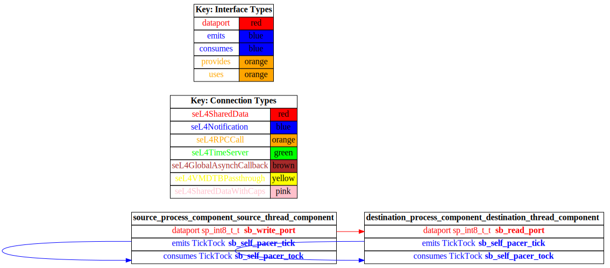
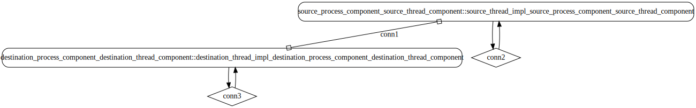

# test_data_port_periodic_domains

## Diagrams

### AADL Arch
  

### CAmkES HAMR SeL4_TB Arch
  

### CAmkES SeL4_TB Arch
  

### CAmkES HAMR SeL4_Only Arch
  

### CAmkES SeL4_Only Arch
  

### CAmkES HAMR SeL4 Arch
  

### CAmkES SeL4 Arch
  

## Expected Output : Timeout = 15 seconds

  ### CAmkES SeL4_TB Expected Output
    Booting all finished, dropped to user space
    [source_thread_component] test_data_port_periodic_source_component_init called
    [destination_thread_component] test_data_port_periodic_domains_destination_component_init called
    ---------------------------------------
    [source_thread_component] Sent 0
    [destination_thread_component] value {0}
    ---------------------------------------
    [source_thread_component] Sent 1
    [destination_thread_component] value {1}
    ---------------------------------------
    [source_thread_component] Sent 2
    [destination_thread_component] value {2}
    ---------------------------------------
    [source_thread_component] Sent 3
    [destination_thread_component] value {3}
    ---------------------------------------
    [source_thread_component] Sent 4
    [destination_thread_component] value {4}
    ---------------------------------------
    [source_thread_component] Sent 5
    [destination_thread_component] value {5}
    ---------------------------------------
    [source_thread_component] Sent 6
    [destination_thread_component] value {6}
    ---------------------------------------
    [source_thread_component] Sent 7
    [destination_thread_component] value {7}
    ---------------------------------------
    [source_thread_component] Sent 8
    [destination_thread_component] value {8}

  ### CAmkES SeL4_Only Expected Output
    Booting all finished, dropped to user space
    [source_thread_component] test_data_port_periodic_source_component_init called
    [destination_thread_component] test_data_port_periodic_domains_destination_component_init called
    ---------------------------------------
    [source_thread_component] Sent 0
    [destination_thread_component] value {0}
    ---------------------------------------
    [source_thread_component] Sent 1
    [destination_thread_component] value {1}
    ---------------------------------------
    [source_thread_component] Sent 2
    [destination_thread_component] value {2}
    ---------------------------------------
    [source_thread_component] Sent 3
    [destination_thread_component] value {3}
    ---------------------------------------
    [source_thread_component] Sent 4
    [destination_thread_component] value {4}
    ---------------------------------------
    [source_thread_component] Sent 5
    [destination_thread_component] value {5}
    ---------------------------------------
    [source_thread_component] Sent 6
    [destination_thread_component] value {6}
    ---------------------------------------
    [source_thread_component] Sent 7
    [destination_thread_component] value {7}
    ---------------------------------------
    [source_thread_component] Sent 8

  ### CAmkES SeL4 Expected Output
    Booting all finished, dropped to user space
    Entering pre-init of destination_thread_impl
    Art: Registered component: top_impl_InEntering pre-init of source_thread_impl
    Art: Registered componstance_destination_process_component_destination_thread_component (periodic: 1000)
    Art: - Registered port: top_impl_Instance_destination_process_component_destination_thread_component_read_port (data in)
    top_impl_Instance_destination_process_component_destination_threadent: top_impl_Instance_source_process_component_source_thread_component (periodic: 1000)
    Art: - Registered port: top_impl_Instance_source_process_component_source_thread_component_write_port (data out)
    top_impl_Instance_source_process_component_source_thread_component: Example_component: Example logInfo
    top_impl_Instance_destination_process_component_destination_thread_component: Example logDebug
    top_impl_Instance_destination_process_component_destination_thread_component: Example logError
    Leaving pre-init of destination_thread_impl
     logInfo
    top_impl_Instance_source_process_component_source_thread_component: Example logDebug
    top_impl_Instance_source_process_component_source_thread_component: Example logError
    Leaving pre-init of source_thread_impl

