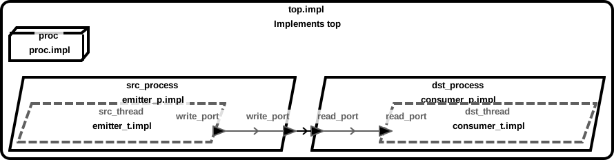
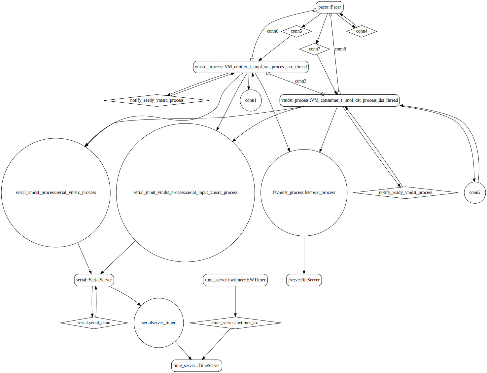
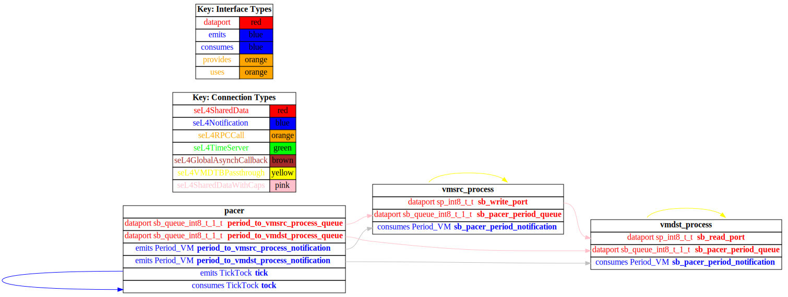
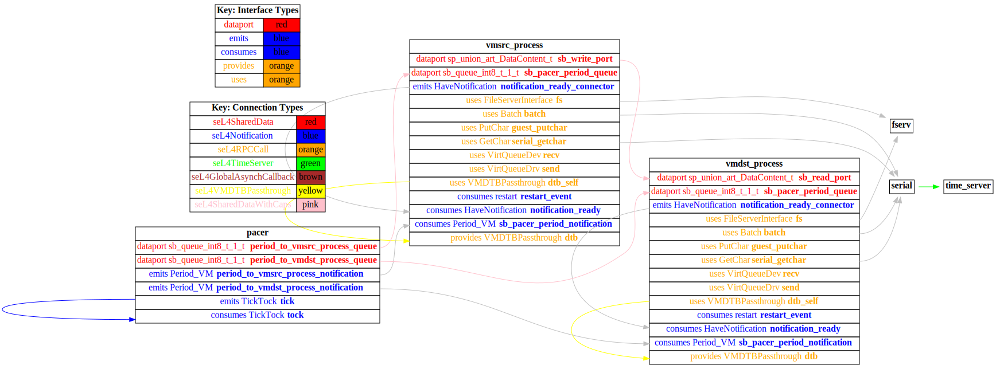

# both_vm

 Table of Contents
  * [Diagrams](#diagrams)
    * [AADL Arch](#aadl-arch)
    * [SeL4_Only](#sel4only)
      * [SeL4_Only CAmkES Arch](#sel4only-camkes-arch)
      * [SeL4_Only CAmkES HAMR Arch](#sel4only-camkes-hamr-arch)
    * [SeL4](#sel4)
      * [SeL4 CAmkES Arch](#sel4-camkes-arch)
      * [SeL4 CAmkES HAMR Arch](#sel4-camkes-hamr-arch)
  * [Example Output](#example-output)
    * [SeL4_Only Expected Output: Timeout = 15 seconds](#sel4only-expected-output-timeout--15-seconds)
    * [SeL4 Expected Output: Timeout = 15 seconds](#sel4-expected-output-timeout--15-seconds)

## Diagrams
### AADL Arch


### SeL4_Only
#### SeL4_Only CAmkES Arch


#### SeL4_Only CAmkES HAMR Arch


### SeL4
#### SeL4 CAmkES Arch


#### SeL4 CAmkES HAMR Arch


## Example Output
*NOTE:* actual output may differ due to issues related to thread interleaving
### SeL4_Only Expected Output: Timeout = 15 seconds

  |HAMR Codegen Configuration| |
  |--|--|
  | package-name | both_vm |
  | exclude-component-impl | true |
  | bit-width | 32 |
  | max-string-size | 256 |
  | max-array-size | 1 |


  **How To Run**
  ```
  test_data_port_periodic_domains_VM/both_vm/CAmkES_seL4_Only/bin/setup-camkes-arm-vm.sh
  test_data_port_periodic_domains_VM/both_vm/CAmkES_seL4_Only/bin/run-camkes.sh -s
  ```

  ```
  Booting all finished, dropped to user space
  <<seL4(CPU 0) [decodeUntypedInvocation/212 T0xff807fc18400 "rootserver" @4006d8]: Untyped Retype: Insufficient memory (1 * 2097152 bytes needed, 0 bytes available).>>
  _utspace_split_alloc@split.c:272 Failed to find any untyped capable of creating an object at address 0x8040000
  Loading Linux: 'linux' dtb: ''
  _utspace_split_alloc@split.c:272 Failed to find any untyped capable of creating an object at address 0x8040000
  Loading Linux: 'linux' dtb: ''
  install_linux_devices@main.c:628 module name: map_frame_hack
  install_linux_devices@main.c:628 module name: virtio_con
  install_linux_devices@main.c:628 module name: cross_vm_connections
  install_linux_devices@main.c:628 module name: map_frame_hack
  install_linux_devices@main.c:628 module name: virtio_con
  install_linux_devices@main.c:628 module name: cross_vm_connections

  ```

### SeL4 Expected Output: Timeout = 15 seconds

  |HAMR Codegen Configuration| |
  |--|--|
  | package-name | both_vm |
  | exclude-component-impl | true |
  | bit-width | 32 |
  | max-string-size | 256 |
  | max-array-size | 1 |


  **How To Run**
  ```
  test_data_port_periodic_domains_VM/both_vm/CAmkES_seL4/src/c/CAmkES_seL4/bin/setup-camkes-arm-vm.sh
  test_data_port_periodic_domains_VM/both_vm/CAmkES_seL4/bin/transpile-sel4.sh
  test_data_port_periodic_domains_VM/both_vm/CAmkES_seL4/src/c/CAmkES_seL4/bin/run-camkes.sh -s
  ```

  ```
  Booting all finished, dropped to user space
  <<seL4(CPU 0) [decodeUntypedInvocation/212 T0xff807fc18400 "rootserver" @4006d8]: Untyped Retype: Insufficient memory (1 * 2097152 bytes needed, 0 bytes available).>>
  _utspace_split_alloc@split.c:272 Failed to find any untyped capable of creating an object at address 0x8040000
  Loading Linux: 'linux' dtb: ''
  _utspace_split_alloc@split.c:272 Failed to find any untyped capable of creating an object at address 0x8040000
  Loading Linux: 'linux' dtb: ''
  install_linux_devices@main.c:628 module name: map_frame_hack
  install_linux_devices@main.c:628 module name: virtio_con
  install_linux_devices@main.c:628 module name: cross_vm_connections
  install_linux_devices@main.c:628 module name: map_frame_hack
  install_linux_devices@main.c:628 module name: virtio_con
  install_linux_devices@main.c:628 module name: cross_vm_connections

  ```