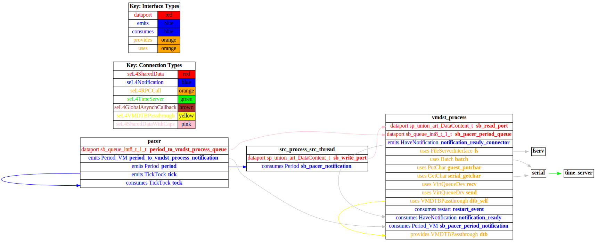

# receiver_vm

 Table of Contents
  * [Diagrams](#diagrams)
    * [AADL Arch](#aadl-arch)
    * [SeL4_Only](#sel4_only)
      * [SeL4_Only CAmkES Arch](#sel4_only-camkes-arch)
      * [SeL4_Only CAmkES HAMR Arch](#sel4_only-camkes-hamr-arch)
    * [SeL4](#sel4)
      * [SeL4 CAmkES Arch](#sel4-camkes-arch)
      * [SeL4 CAmkES HAMR Arch](#sel4-camkes-hamr-arch)
  * [Example Output](#example-output)
    * [SeL4_Only Expected Output: Timeout = 90 seconds](#sel4_only-expected-output-timeout--90-seconds)
    * [SeL4 Expected Output: Timeout = 90 seconds](#sel4-expected-output-timeout--90-seconds)

## Diagrams
### AADL Arch


### SeL4_Only
#### SeL4_Only CAmkES Arch


#### SeL4_Only CAmkES HAMR Arch


### SeL4
#### SeL4 CAmkES Arch


#### SeL4 CAmkES HAMR Arch


## Example Output
*NOTE:* actual output may differ due to issues related to thread interleaving
### SeL4_Only Expected Output: Timeout = 90 seconds

  |HAMR Codegen Configuration| |
  |--|--|
  | refer to [bin/run-hamr-SeL4_Only.sh](bin/run-hamr-SeL4_Only.sh) |


  **How To Run**
  ```
  ./bin/run-hamr-SeL4_Only.sh
  ./CAmkES_seL4_Only/bin/setup-camkes-arm-vm.sh
  ./CAmkES_seL4_Only/bin/run-camkes.sh -o "-DUSE_PRECONFIGURED_ROOTFS=ON" -s
  ```

  ```
  Booting all finished, dropped to user space
  <<seL4(CPU 0) [decodeUntypedInvocation/212 T0xff807fc17400 "rootserver" @4006f0]: Untyped Retype: Insufficient memory (1 * 2097152 bytes needed, 0 bytes available).>>
  <<seL4(CPU 0) [maskVMRights/187 T0xff807fc17400 "rootserver" @4006f0]: Attempted to make unsupported write only mapping>>
  [src_process_src_thread] test_event_data_port_emitter_component_init called
  _utspace_split_alloc@split.c:272 Failed to find any untyped capable of creating an object at address 0x8040000
  Loading Linux: 'linux' dtb: ''
  install_linux_devices@main.c:657 module name: map_frame_hack
  install_linux_devices@main.c:657 module name: init_ram
  ---------------------------------------
  [src_process_src_thread] Sent 0
  ---------------------------------------
  [src_process_src_thread] Sent 1
  ---------------------------------------
  [src_process_src_thread] Sent 2
  install_linux_devices@main.c:657 module name: virtio_con
  install_linux_devices@main.c:657 module name: cross_vm_connections
  ---------------------------------------
  [src_process_src_thread] Sent 3
  ---------------------------------------
  [src_process_src_thread] Sent 4
  ---------------------------------------
  [src_process_src_thread] Sent 5
  ---------------------------------------
  [src_process_src_thread] Sent 6
  ---------------------------------------
  [src_process_src_thread] Sent 7
  ---------------------------------------
  [src_process_src_thread] Sent 8
  ---------------------------------------
  [src_process_src_thread] Sent 9
  ---------------------------------------
  [src_process_src_thread] Sent 10
  ---------------------------------------
  [src_process_src_thread] Sent 11
  ---------------------------------------
  [src_process_src_thread] Sent 12
  ---------------------------------------
  [src_process_src_thread] Sent 13
  ---------------------------------------
  [src_process_src_thread] Sent 14
  ---------------------------------------
  [src_process_src_thread] Sent 15
  ---------------------------------------
  [src_process_src_thread] Sent 16
  ---------------------------------------
  [src_process_src_thread] Sent 17
  ---------------------------------------
  [src_process_src_thread] Sent 18
  ---------------------------------------
  [src_process_src_thread] Sent 19
  ---------------------------------------
  [src_process_src_thread] Sent 20
  ---------------------------------------
  [src_process_src_thread] Sent 21
  ---------------------------------------
  [src_process_src_thread] Sent 22
  ---------------------------------------
  [src_process_src_thread] Sent 23
  libsel4muslcsys: Error attempting syscall 215
  ---------------------------------------
  [src_process_src_thread] Sent 24
  ---------------------------------------
  [src_process_src_thread] Sent 25
  ---------------------------------------
  [src_process_src_thread] Sent 26
  ---------------------------------------
  [src_process_src_thread] Sent 27
  ---------------------------------------
  [src_process_src_thread] Sent 28
  ---------------------------------------
  [src_process_src_thread] Sent 29
  ---------------------------------------
  [src_process_src_thread] Sent 30
  ---------------------------------------
  [src_process_src_thread] Sent 31
  ---------------------------------------
  [src_process_src_thread] Sent 32
  ---------------------------------------
  [src_process_src_thread] Sent 33
  libsel4muslcsys: Error attempting syscall 215
  ---------------------------------------
  [src_process_src_thread] Sent 34
  clean_up@fdtgen.c:370 Non-existing node None specified to be kept
  consume_connection_event@cross_vm_connection.c:247 Failed to inject connection irq
  _utspace_split_alloc@split.c:272 Failed to find any untyped capable of creating an object at address 0x8020000
  ---------------------------------------
  [src_process_src_thread] Sent 35
  consume_connection_event@cross_vm_connection.c:247 Failed to inject connection irq
  [    2.100092] Unable to detect cache hierarchy for CPU 0
  [    2.116237] e1000: Intel(R) PRO/1000 Network Driver - version 7.3.21-k8-NAPI
  ---------------------------------------
  [src_process_src_thread] Sent 36
  [    2.860237] e1000: Copyright (c) 1999-2006 Intel Corporation.
  [    2.872246] e1000e: Intel(R) PRO/1000 Network Driver - 3.2.6-k
  [    2.883507] e1000e: Copyright(c) 1999 - 2015 Intel Corporation.
  [    2.898009] mousedev: PS/2 mouse device common for all mice
  [    2.915865] ledtrig-cpu: registered to indicate activity on CPUs
  [    2.927399] dmi-sysfs: dmi entry is absent.
  [    2.936464] ipip: IPv4 and MPLS over IPv4 tunneling driver
  [    2.952535] NET: Registered protocol family 10
  [    2.974304] mip6: Mobile IPv6
  [    2.986447] NET: Registered protocol family 17
  [    2.996229] mpls_gso: MPLS GSO support
  [    3.003922] Registered cp15_barrier emulation handler
  [    3.014025] Registered setend emulation handler
  [    3.027103] registered taskstats version 1
  [    3.035983] zswap: loaded using pool lzo/zbud
  [    3.050348] ima: No TPM chip found, activating TPM-bypass!
  [    3.059991] ima: Allocated hash algorithm: sha256
  [    3.076824] hctosys: unable to open rtc device (rtc0)
  [    3.088072] PM: Hibernation image not present or could not be loaded.
  [    3.099652] initcall clk_disable_unused blacklisted
  [    3.459360] Freeing unused kernel memory: 3776K
  ---------------------------------------
  [src_process_src_thread] Sent 37
  Starting syslogd: OK
  Starting klogd: ---------------------------------------
  [src_process_src_thread] Sent 38
  OK
  Running sysctl: OK
  Initializing random number generator... ---------------------------------------
  [src_process_src_thread] Sent 39
  [    7.393726] random: dd: uninitialized urandom read (512 bytes read)
  done.
  Starting network: OK
  [    7.940889] connection: loading out-of-tree module taints kernel.
  [    7.974621] Event Bar (dev-0) initalised
  [    7.987987] 2 Dataports (dev-0) initalised
  [    7.996294] Event Bar (dev-1) initalised
  [    8.011970] 2 Dataports (dev-1) initalised
  VM App vmdst_process started
  [vmdst_process] test_event_data_port_consumer_component_init called---------------------------------------
  [src_process_src_thread] Sent 40


  Welcome to Buildroot
  buildroot login: ---------------------------------------
  [src_process_src_thread] Sent 41
  [vmdst_process] value {41}
  ---------------------------------------
  [src_process_src_thread] Sent 42
  [vmdst_process] value {42}
  ---------------------------------------
  [src_process_src_thread] Sent 43
  [vmdst_process] value {43}
  ---------------------------------------
  [src_process_src_thread] Sent 44
  [vmdst_process] value {44}
  ---------------------------------------
  [src_process_src_thread] Sent 45
  [vmdst_process] value {45}
  ---------------------------------------
  [src_process_src_thread] Sent 46
  [vmdst_process] value {46}
  ---------------------------------------
  [src_process_src_thread] Sent 47
  [vmdst_process] value {47}
  ---------------------------------------
  [src_process_src_thread] Sent 48
  [vmdst_process] value {48}
  ---------------------------------------
  [src_process_src_thread] Sent 49
  [vmdst_process] value {49}

  ```

### SeL4 Expected Output: Timeout = 90 seconds

  |HAMR Codegen Configuration| |
  |--|--|
  | refer to [bin/run-hamr-SeL4.sh](bin/run-hamr-SeL4.sh) |


  **How To Run**
  ```
  ./bin/run-hamr-SeL4.sh
  ./CAmkES_seL4/src/c/CAmkES_seL4/bin/setup-camkes-arm-vm.sh
  ./CAmkES_seL4/src/c/CAmkES_seL4/bin/run-camkes.sh -o "-DUSE_PRECONFIGURED_ROOTFS=ON" -s
  ```

  ```
  Booting all finished, dropped to user space
  <<seL4(CPU 0) [decodeUntypedInvocation/212 T0xff807fc17400 "rootserver" @4006f0]: Untyped Retype: Insufficient memory (1 * 2097152 bytes needed, 0 bytes available).>>
  <<seL4(CPU 0) [maskVMRights/187 T0xff807fc17400 "rootserver" @4006f0]: Attempted to make unsupported write only mapping>>
  Entering pre-init of emitter_t_impl_src_process_src_thread
  Art: Registered component: top_impl_Instance_src_process_src_thread (periodic: 1000)
  Art: - Registered port: top_impl_Instance_src_process_src_thread_write_port (data out)
  top_impl_Instance_src_process_src_thread: Example logInfo
  top_impl_Instance_src_process_src_thread: Example logDebug
  top_impl_Instance_src_process_src_thread: Example logError
  Leaving pre-init of emitter_t_impl_src_process_src_thread
  _utspace_split_alloc@split.c:272 Failed to find any untyped capable of creating an object at address 0x8040000
  Loading Linux: 'linux' dtb: ''
  install_linux_devices@main.c:657 module name: map_frame_hack
  install_linux_devices@main.c:657 module name: init_ram
  install_linux_devices@main.c:657 module name: virtio_con
  install_linux_devices@main.c:657 module name: cross_vm_connections

  ```