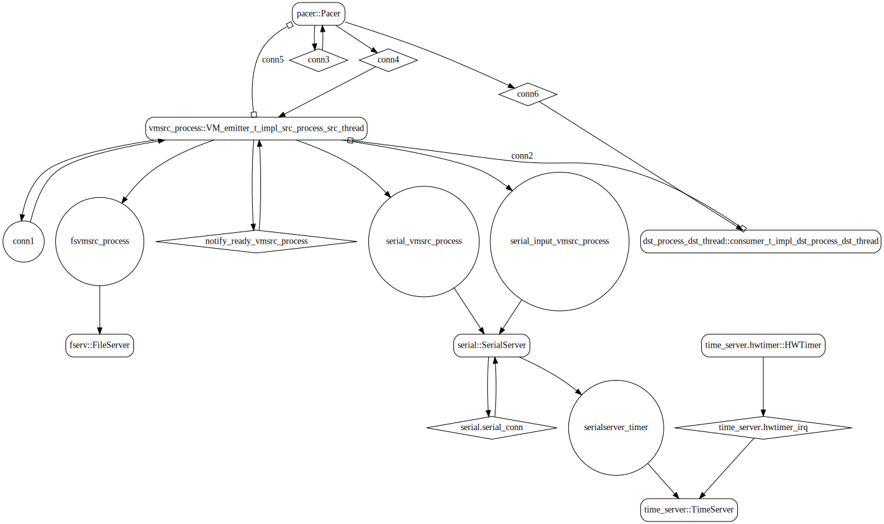
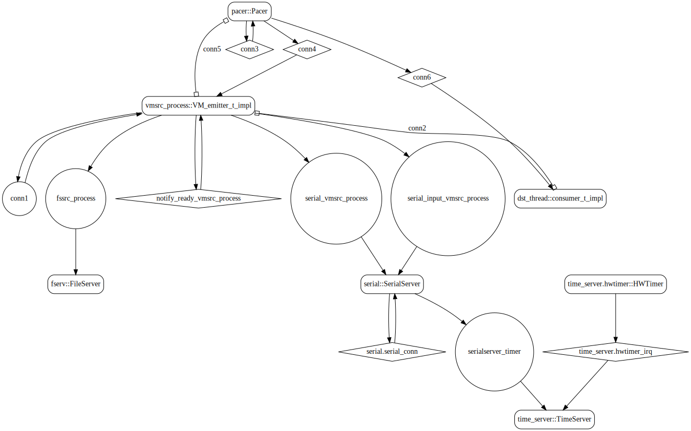
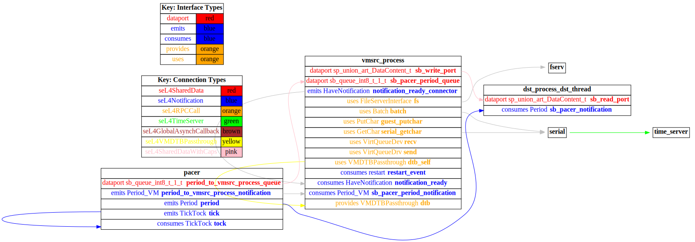

# sender_vm

 Table of Contents
  * [Diagrams](#diagrams)
    * [AADL Arch](#aadl-arch)
    * [SeL4_Only](#sel4_only)
      * [SeL4_Only CAmkES Arch](#sel4_only-camkes-arch)
      * [SeL4_Only CAmkES HAMR Arch](#sel4_only-camkes-hamr-arch)
    * [SeL4](#sel4)
      * [SeL4 CAmkES Arch](#sel4-camkes-arch)
      * [SeL4 CAmkES HAMR Arch](#sel4-camkes-hamr-arch)
  * [Example Output](#example-output)
    * [SeL4_Only Expected Output: Timeout = 90 seconds](#sel4_only-expected-output-timeout--90-seconds)
    * [SeL4 Expected Output: Timeout = 90 seconds](#sel4-expected-output-timeout--90-seconds)

## Diagrams
### AADL Arch


### SeL4_Only
#### SeL4_Only CAmkES Arch


#### SeL4_Only CAmkES HAMR Arch


### SeL4
#### SeL4 CAmkES Arch


#### SeL4 CAmkES HAMR Arch


## Example Output
*NOTE:* actual output may differ due to issues related to thread interleaving
### SeL4_Only Expected Output: Timeout = 90 seconds

  |HAMR Codegen Configuration| |
  |--|--|
  | refer to [bin/run-hamr-SeL4_Only.sh](bin/run-hamr-SeL4_Only.sh) |


  **How To Run**
  ```
  ./bin/run-hamr-SeL4_Only.sh
  ./CAmkES_seL4_Only/bin/setup-camkes-arm-vm.sh
  ./CAmkES_seL4_Only/bin/run-camkes.sh -o "-DUSE_PRECONFIGURED_ROOTFS=ON" -s
  ```

  ```
  Booting all finished, dropped to user space
  <<seL4(CPU 0) [decodeUntypedInvocation/212 T0xff807fc17400 "rootserver" @4006f0]: Untyped Retype: Insufficient memory (1 * 2097152 bytes needed, 0 bytes available).>>
  _utspace_split_alloc@split.c:272 Failed to find any untyped capable of creating an object at address 0x8040000
  Loading Linux: 'linux' dtb: ''
  install_linux_devices@main.c:657 module name: map_frame_hack
  install_linux_devices@main.c:657 module name: init_ram
  [dst_process_dst_thread] test_event_data_port_consumer_component_init called
  [dst_process_dst_thread] value {0}
  [dst_process_dst_thread] value {0}
  install_linux_devices@main.c:657 module name: virtio_con
  install_linux_devices@main.c:657 module name: cross_vm_connections
  [dst_process_dst_thread] value {0}
  [dst_process_dst_thread] value {0}
  [dst_process_dst_thread] value {0}
  [dst_process_dst_thread] value {0}
  [dst_process_dst_thread] value {0}
  [dst_process_dst_thread] value {0}
  [dst_process_dst_thread] value {0}
  [dst_process_dst_thread] value {0}
  [dst_process_dst_thread] value {0}
  [dst_process_dst_thread] value {0}
  [dst_process_dst_thread] value {0}
  [dst_process_dst_thread] value {0}
  [dst_process_dst_thread] value {0}
  [dst_process_dst_thread] value {0}
  [dst_process_dst_thread] value {0}
  [dst_process_dst_thread] value {0}
  [dst_process_dst_thread] value {0}
  [dst_process_dst_thread] value {0}
  [dst_process_dst_thread] value {0}
  [dst_process_dst_thread] value {0}
  [dst_process_dst_thread] value {0}
  libsel4muslcsys: Error attempting syscall 215
  [dst_process_dst_thread] value {0}
  [dst_process_dst_thread] value {0}
  [dst_process_dst_thread] value {0}
  [dst_process_dst_thread] value {0}
  [dst_process_dst_thread] value {0}
  [dst_process_dst_thread] value {0}
  [dst_process_dst_thread] value {0}
  [dst_process_dst_thread] value {0}
  [dst_process_dst_thread] value {0}
  [dst_process_dst_thread] value {0}
  libsel4muslcsys: Error attempting syscall 215
  [dst_process_dst_thread] value {0}
  clean_up@fdtgen.c:370 Non-existing node None specified to be kept
  consume_connection_event@cross_vm_connection.c:247 Failed to inject connection irq
  _utspace_split_alloc@split.c:272 Failed to find any untyped capable of creating an object at address 0x8020000
  [dst_process_dst_thread] value {0}
  consume_connection_event@cross_vm_connection.c:247 Failed to inject connection irq
  [dst_process_dst_thread] value {0}
  consume_connection_event@cross_vm_connection.c:247 Failed to inject connection irq
  [    3.234627] Unable to detect cache hierarchy for CPU 0
  [    3.255410] e1000: Intel(R) PRO/1000 Network Driver - version 7.3.21-k8-NAPI
  [    3.269644] e1000: Copyright (c) 1999-2006 Intel Corporation.
  [    3.283214] e1000e: Intel(R) PRO/1000 Network Driver - 3.2.6-k
  [    3.294777] e1000e: Copyright(c) 1999 - 2015 Intel Corporation.
  [    3.310816] mousedev: PS/2 mouse device common for all mice
  [    3.330250] ledtrig-cpu: registered to indicate activity on CPUs
  [    3.342161] dmi-sysfs: dmi entry is absent.
  [    3.351250] ipip: IPv4 and MPLS over IPv4 tunneling driver
  [    3.366972] NET: Registered protocol family 10
  [    3.389706] mip6: Mobile IPv6
  [    3.401533] NET: Registered protocol family 17
  [    3.410537] mpls_gso: MPLS GSO support
  [    3.418131] Registered cp15_barrier emulation handler
  [    3.426934] Registered setend emulation handler
  [    3.440217] registered taskstats version 1
  [    3.450282] zswap: loaded using pool lzo/zbud
  [    3.465009] ima: No TPM chip found, activating TPM-bypass!
  [    3.474983] ima: Allocated hash algorithm: sha256
  [    3.496561] hctosys: unable to open rtc device (rtc0)
  [    3.506662] PM: Hibernation image not present or could not be loaded.
  [    3.518556] initcall clk_disable_unused blacklisted
  [dst_process_dst_thread] value {0}
  [    4.512011] Freeing unused kernel memory: 3776K
  [dst_process_dst_thread] value {0}
  Starting syslogd: OK
  Starting klogd: OK
  [dst_process_dst_thread] value {0}
  Running sysctl: [dst_process_dst_thread] value {0}
  OK
  Initializing random number generator... [    8.076088] random: dd: uninitialized urandom read (512 bytes read)
  done.
  Starting network: [dst_process_dst_thread] value {0}
  OK
  [    9.280034] connection: loading out-of-tree module taints kernel.
  [    9.322950] Event Bar (dev-0) initalised
  [    9.341175] 2 Dataports (dev-0) initalised
  [    9.358466] Event Bar (dev-1) initalised
  [    9.368048] 2 Dataports (dev-1) initalised
  VM App vmsrc_process started
  [vmsrc_process] test_event_data_port_emitter_component_init called

  Welcome to Buildroot
  buildroot login: ---------------------------------------
  [vmsrc_process] Sent 0
  [dst_process_dst_thread] value {0}
  ---------------------------------------
  [vmsrc_process] Sent 1
  [dst_process_dst_thread] value {1}
  ---------------------------------------
  [vmsrc_process] Sent 2
  [dst_process_dst_thread] value {2}
  ---------------------------------------
  [vmsrc_process] Sent 3
  [dst_process_dst_thread] value {3}
  ---------------------------------------
  [vmsrc_process] Sent 4
  [dst_process_dst_thread] value {4}
  ---------------------------------------
  [vmsrc_process] Sent 5
  [dst_process_dst_thread] value {5}
  ---------------------------------------
  [vmsrc_process] Sent 6
  [dst_process_dst_thread] value {6}
  ---------------------------------------
  [vmsrc_process] Sent 7
  [dst_process_dst_thread] value {7}
  ---------------------------------------
  [vmsrc_process] Sent 8

  ```

### SeL4 Expected Output: Timeout = 90 seconds

  |HAMR Codegen Configuration| |
  |--|--|
  | refer to [bin/run-hamr-SeL4.sh](bin/run-hamr-SeL4.sh) |


  **How To Run**
  ```
  ./bin/run-hamr-SeL4.sh
  ./CAmkES_seL4/src/c/CAmkES_seL4/bin/setup-camkes-arm-vm.sh
  ./CAmkES_seL4/src/c/CAmkES_seL4/bin/run-camkes.sh -o "-DUSE_PRECONFIGURED_ROOTFS=ON" -s
  ```

  ```
  Booting all finished, dropped to user space
  <<seL4(CPU 0) [decodeUntypedInvocation/212 T0xff807fc17400 "rootserver" @4006f0]: Untyped Retype: Insufficient memory (1 * 2097152 bytes needed, 0 bytes available).>>
  Entering pre-init of consumer_t_impl_dst_process_dst_thread
  _utspace_split_alloc@split.c:272 Failed to find any untyped capable of creating an object at address 0x8040000
  Loading Linux: 'linux' dtb: ''
  install_linux_devices@main.c:657 module name: map_frame_hack
  install_linux_devices@main.c:657 module name: init_ram
  Art: Registered component: top_impl_Instance_dst_process_dst_thread (periodic: 1000)
  Art: - Registered port: top_impl_Instance_dst_process_dst_thread_read_port (data in)
  top_impl_Instance_dst_process_dst_thread: Example logInfo
  top_impl_Instance_dst_process_dst_thread: Example logDebug
  top_impl_Instance_dst_process_dst_thread: Example logError
  Leaving pre-init of consumer_t_impl_dst_process_dst_thread
  Unexpected TYPE: : 0
  install_linux_devices@main.c:657 module name: virtio_con
  install_linux_devices@main.c:657 module name: cross_vm_connections

  ```