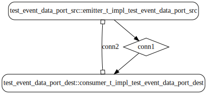

# test_event_data_port

 Table of Contents
  * [Diagrams](#diagrams)
    * [AADL Arch](#aadl-arch)
    * [SeL4_TB](#sel4_tb)
      * [SeL4_TB CAmkES Arch](#sel4_tb-camkes-arch)
      * [SeL4_TB CAmkES HAMR Arch](#sel4_tb-camkes-hamr-arch)
    * [SeL4_Only](#sel4_only)
      * [SeL4_Only CAmkES Arch](#sel4_only-camkes-arch)
      * [SeL4_Only CAmkES HAMR Arch](#sel4_only-camkes-hamr-arch)
  * [Example Output](#example-output)
    * [SeL4_TB Expected Output: Timeout = 15 seconds](#sel4_tb-expected-output:-timeout-=-15-seconds)
    * [SeL4_Only Expected Output: Timeout = 15 seconds](#sel4_only-expected-output:-timeout-=-15-seconds)

## Diagrams
### AADL Arch


### SeL4_TB
#### SeL4_TB CAmkES Arch


#### SeL4_TB CAmkES HAMR Arch


### SeL4_Only
#### SeL4_Only CAmkES Arch


#### SeL4_Only CAmkES HAMR Arch


## Example Output
*NOTE:* actual output may differ due to issues related to thread interleaving
### SeL4_TB Expected Output: Timeout = 15 seconds

  |HAMR Codegen Configuration| |
  |--|--|
  |Exclude Component Implementation | true |
  |bitWidth | 32 |
  |maxStringSize | 256 |
  |maxArraySize | 1 |


  **How To Run**
  ```
  test_event_data_port/CAmkES_seL4_TB/bin/run-camkes.sh
  ```

  ```
  Booting all finished, dropped to user space
  [src] test_event_data_port_emitter_component_init called
  [dest] test_event_data_port_consumer_component_init called

  ```

### SeL4_Only Expected Output: Timeout = 15 seconds

  |HAMR Codegen Configuration| |
  |--|--|
  |Exclude Component Implementation | true |
  |bitWidth | 32 |
  |maxStringSize | 256 |
  |maxArraySize | 1 |


  **How To Run**
  ```
  test_event_data_port/CAmkES_seL4_Only/bin/run-camkes.sh
  ```

  ```
  Booting all finished, dropped to user space
  [src] test_event_data_port_emitter_component_init called
  [dest] test_event_data_port_consumer_component_init called

  ```