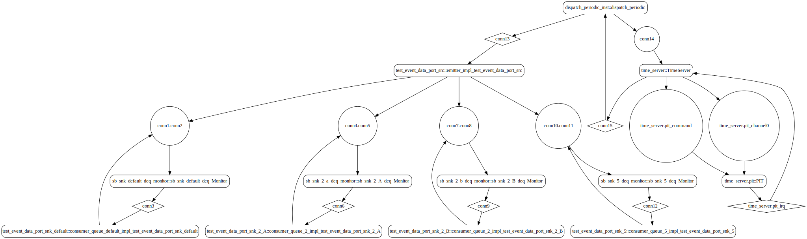

# test_event_data_port_fan_out

 Table of Contents
  * [Diagrams](#diagrams)
    * [AADL Arch](#aadl-arch)
    * [SeL4_TB](#sel4_tb)
      * [SeL4_TB CAmkES Arch](#sel4_tb-camkes-arch)
      * [SeL4_TB CAmkES HAMR Arch](#sel4_tb-camkes-hamr-arch)
    * [SeL4_Only](#sel4_only)
      * [SeL4_Only CAmkES Arch](#sel4_only-camkes-arch)
      * [SeL4_Only CAmkES HAMR Arch](#sel4_only-camkes-hamr-arch)
  * [Example Output](#example-output)
    * [SeL4_TB Expected Output: Timeout = 15 seconds](#sel4_tb-expected-output-timeout--15-seconds)
    * [SeL4_Only Expected Output: Timeout = 15 seconds](#sel4_only-expected-output-timeout--15-seconds)

## Diagrams
### AADL Arch


### SeL4_TB
#### SeL4_TB CAmkES Arch


#### SeL4_TB CAmkES HAMR Arch


### SeL4_Only
#### SeL4_Only CAmkES Arch


#### SeL4_Only CAmkES HAMR Arch


## Example Output
*NOTE:* actual output may differ due to issues related to thread interleaving
### SeL4_TB Expected Output: Timeout = 15 seconds

  |HAMR Codegen Configuration| |
  |--|--|
  | package-name | test_event_data_port_fan_out |
  | exclude-component-impl | true |
  | bit-width | 32 |
  | max-string-size | 256 |
  | max-array-size | 1 |


  **How To Run**
  ```
  test_event_data_port_fan_out/CAmkES_seL4_TB/bin/run-camkes.sh -s
  ```

  ```
  Booting all finished, dropped to user space
  [test_event_data_port_src] test_event_data_port_emitter_component_init called
  [test_event_data_port_snk_default] test_event_data_port_consumer_component_init called
  [test_event_data_port_snk_5] test_event_data_port_consumer_component_init called
  [test_event_data_port_snk_2_B] test_event_data_port_consumer_component_init called
  [test_event_data_port_snk_2_A] test_event_data_port_consumer_component_init called
  ---------------------------------------
  [test_event_data_port_src] Sent 0 events.
  ---------------------------------------
  [test_event_data_port_src] Sent 1 events.
  [test_event_data_port_snk_default] received value {1}
  [test_event_data_port_snk_2_A] received value {1}
  [test_event_data_port_snk_2_A] 1 events received
  [test_event_data_port_snk_2_B] received value {1}
  [test_event_data_port_snk_5] received value {1}
  [test_event_data_port_snk_5] 1 even[test_event_data_port_snk_default] 1 events received
  [test_event_data_port_snk_2_B] 1 events received
  ts received
  ---------------------------------------
  [test_event_data_port_src] Sent 2 events.
  [test_event_data_port_snk_default] received value {1}
  [test_event_data_port_snk_default] 1 events received
  [test_event_data_port_snk_2_A] received value {1}
  [test_event_data_port_snk_2_A] received value {2}
  [test_event_data_port_snk_2_A] 2 events received
  [test_event_data_port_snk_2_B] received value {1}
  [test_event_data_port_snk_2_B] received value {2}
  [test_event_data_port_snk_2_B] 2 events received
  [test_event_data_port_snk_5] received value {1}
  [test_event_data_port_snk_5] received value {2}
  [test_event_data_port_snk_5] 2 events received
  ---------------------------------------
  [test_event_data_port_src] Sent 3 events.
  [test_event_data_port_snk_default] received value {1}
  [test_event_data_port_snk_default] 1 events received
  [test_event_data_port_snk_2_A] received value {1}
  [test_event_data_port_snk_2_A] received value {2}
  [test_event_data_port_snk_2_A] 2 events received
  [test_event_data_port_snk_2_B] received value {1}
  [test_event_data_port_snk_2_B] received value {2}
  [test_event_data_port_snk_2_B] 2 events received
  [test_event_data_port_snk_5] received value {1}
  [test_event_data_port_snk_5] received value {2}
  [test_event_data_port_snk_5] received value {3}
  [test_event_data_port_snk_5] 3 events received
  ---------------------------------------
  [test_event_data_port_src] Sent 4 events.
  [test_event_data_port_snk_default] received value {1}
  [test_event_data_port_snk_default] 1 events received
  [test_event_data_port_snk_2_A] received value {1}
  [test_event_data_port_snk_2_B] received value {1}
  [test_event_data_port_snk_2_B] received value {2}
  [test_event_data_port_snk_2_B] 2 events received
  [test_event_data_port_snk_5] received value {1}
  [test_event_data_port_snk_5] received value {2}
  [test_event_data_port_snk_5] received value {3}
  [test_event_data_port_snk_5] received value {4}
  [test_event_data_port_snk_5] 4 events received
  [test_event_data_port_snk_2_A] received value {2}
  [test_event_data_port_snk_2_A] 2 events received

  ```

### SeL4_Only Expected Output: Timeout = 15 seconds

  |HAMR Codegen Configuration| |
  |--|--|
  | package-name | test_event_data_port_fan_out |
  | exclude-component-impl | true |
  | bit-width | 32 |
  | max-string-size | 256 |
  | max-array-size | 1 |


  **How To Run**
  ```
  test_event_data_port_fan_out/CAmkES_seL4_Only/bin/run-camkes.sh -s
  ```

  ```
  Booting all finished, dropped to user space
  [test_event_data_port_src] test_event_data_port_emitter_component_init called
  [test_event_data_port_snk_default] test_event_data_port_consumer_component_init called
  [test_event_data_port_snk_5] test_event_data_port_consumer_component_init called
  [test_event_data_port_snk_2_B] test_event_data_port_consumer_component_init called
  [test_event_data_port_snk_2_A] test_event_data_port_consumer_component_init called
  ---------------------------------------
  [test_event_data_port_src] Sent 0 events.
  ---------------------------------------
  [test_event_data_port_src] Sent 1 events.
  [test_event_data_port_snk_default] received value {1}
  [test_event_data_port_snk_default] 1 events received
  [test_event_data_port_snk_2_A] received value {1}
  [t[test_event_data_port_snk_2_B] received value {1}
  [test_event_data_port_snk_5] received value {1}
  [test_event_data_port_snk_5] 1 events received
  est_event_data_port_snk_2_A] 1 events received
  [test_event_data_port_snk_2_B] 1 events received
  ---------------------------------------
  [test_event_data_port_src] Sent 2 events.
  [test_event_data_port_snk[test_event_data_port_snk_2_A] received value {1}
  [test_event_data_port_snk_2_A] received value {2}
  [test_event_data_port_snk_2_A] 2 events received
  [test_event_data_port_snk_2_B] received value {1}
  [test_event_data_port_snk_2_B] received value {2}
  [test_event_data_port_snk_2_B] 2 events received
  [test__default] received value {2}
  [test_event_data_port_snk_default] 1 events received
  event_data_port_snk_5] received value {1}
  [test_event_data_port_snk_5] received value {2}
  [test_event_data_port_snk_5] 2 events received
  ---------------------------------------
  [test_event_data_port_src] Sent 3 events.
  [test_event_data_port_snk_default] received value {3}
  [test_event_data_port_snk_default] 1 events received
  [test_event_data_port_snk_2_A] received value {2}
  [test_event_data_port_snk_2_A] received value {3}
  [test_event_data_port_snk_2_A] 2 events received
  [test_event_data_port_snk_2_B] received value {2}
  [test_event_data_port_snk_2_B] received value {3}
  [test_event_data_port_snk_2_B] 2 events received
  [test_event_data_port_snk_5] received value {1}
  [test_event_data_port_snk_5] received value {2}
  [test_event_data_port_snk_5] received value {3}
  [test_event_data_port_snk_5] 3 events received
  ---------------------------------------
  [test_event_data_port_src] Sent 4 events.
  [test_event_data_port_snk_default] received value {4}
  [test_event_data_port_snk_default] 1 events received
  [test_event_data_port_snk_2_A] received value {3}
  [test_event_data_port_[test_event_data_port_snk_2_B] received value {3}
  [test_event_data_port_snk[test_event_data_port_snk_5] received value {1}
  [test_event_data_port_snk_5] received value {snk_2_A] received value {4}
  [test_event_data_port_snk_2_A] 2 events received
  _2_B] received value {4}
  [test_event_data_port_snk_2_B] 2 events received
  2}
  [test_event_data_port_snk_5] received value {3}
  [test_event_data_port_snk_5] received value {4}
  [test_event_data_port_snk_5] 4 events received

  ```