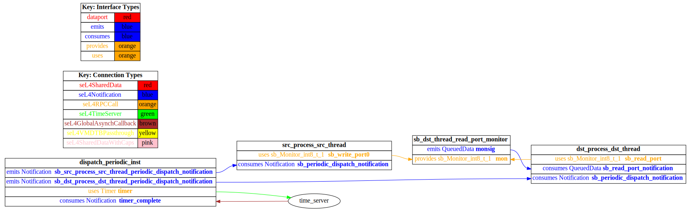
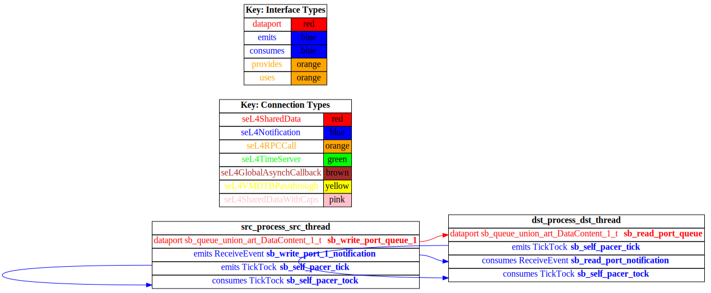

# test_event_data_port_periodic_domains

## Diagrams

### AADL Arch
  

### CAmkES HAMR SeL4_TB Arch
  

### CAmkES SeL4_TB Arch
  

### CAmkES HAMR SeL4_Only Arch
  

### CAmkES SeL4_Only Arch
  

### CAmkES HAMR SeL4 Arch
  

### CAmkES SeL4 Arch
  

## Expected Output : Timeout = 15 seconds

  ### CAmkES SeL4_TB Expected Output
    Booting all finished, dropped to user space
    [src_thread] test_event_data_port_emitter_component_init called
    [dst_thread] test_event_data_port_consumer_component_init called
    ---------------------------------------
    [src_thread] Sent 0
    [dst_thread] value {0}
    ---------------------------------------
    [src_thread] Sent 1
    [dst_thread] value {1}
    ---------------------------------------
    [src_thread] Sent 2
    [dst_thread] value {2}
    ---------------------------------------
    [src_thread] Sent 3
    [dst_thread] value {3}
    ---------------------------------------
    [src_thread] Sent 4
    [dst_thread] value {4}
    ---------------------------------------
    [src_thread] Sent 5
    [dst_thread] value {5}
    ---------------------------------------
    [src_thread] Sent 6
    [dst_thread] value {6}
    ---------------------------------------
    [src_thread] Sent 7
    [dst_thread] value {7}
    ---------------------------------------
    [src_thread] Sent 8
    [dst_thread] value {8}
    ---------------------------------------
    [src_thread] Sent 9
    [dst_thread] value {9}

  ### CAmkES SeL4_Only Expected Output
    Booting all finished, dropped to user space
    [dst_thread] test_event_data_port_consumer_component_init called
    [src_thread] test_event_data_port_emitter_component_init called
    ---------------------------------------
    [src_thread] Sent 0
    [dst_thread] value {0}
    ---------------------------------------
    [src_thread] Sent 1
    [dst_thread] value {1}
    ---------------------------------------
    [src_thread] Sent 2
    [dst_thread] value {2}
    ---------------------------------------
    [src_thread] Sent 3
    [dst_thread] value {3}
    ---------------------------------------
    [src_thread] Sent 4
    [dst_thread] value {4}
    ---------------------------------------
    [src_thread] Sent 5
    [dst_thread] value {5}
    ---------------------------------------
    [src_thread] Sent 6
    [dst_thread] value {6}

  ### CAmkES SeL4 Expected Output
    Booting all finished, dropped to user space
    Entering pre-init of consumer_t_impl
    Art: RegEntering pre-init of emitter_t_impl
    Art: Registered component: top_impl_Instance_src_process_src_thread (periodic: 1000)
    istered component: top_impl_Instance_dst_process_dst_thread (periodic: 1000)
    Art: - Registered port: top_impl_Instance_dst_process_dst_thread_read_port (event in)
    top_impl_Instance_dst_process_dst_thread: Example logInfo
    top_impl_Instance_dst_process_dst_thread: Example logDebug
    top_impl_Instance_dst_process_dst_thread: Example Art: - Registered port: top_impl_Instance_src_process_src_thread_write_port (event out)
    top_impl_Instance_src_process_src_thread: Example logInfo
    top_impl_Instance_src_process_src_thread: Example logDebug
    top_impl_Instance_src_process_src_thread: Example logError
    Leaving pre-init of emitter_t_impl
    logError
    Leaving pre-init of consumer_t_impl

