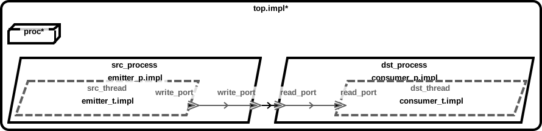
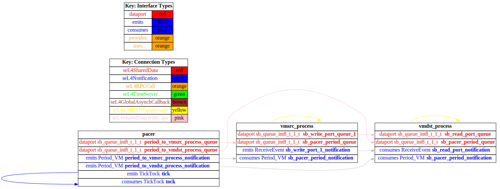
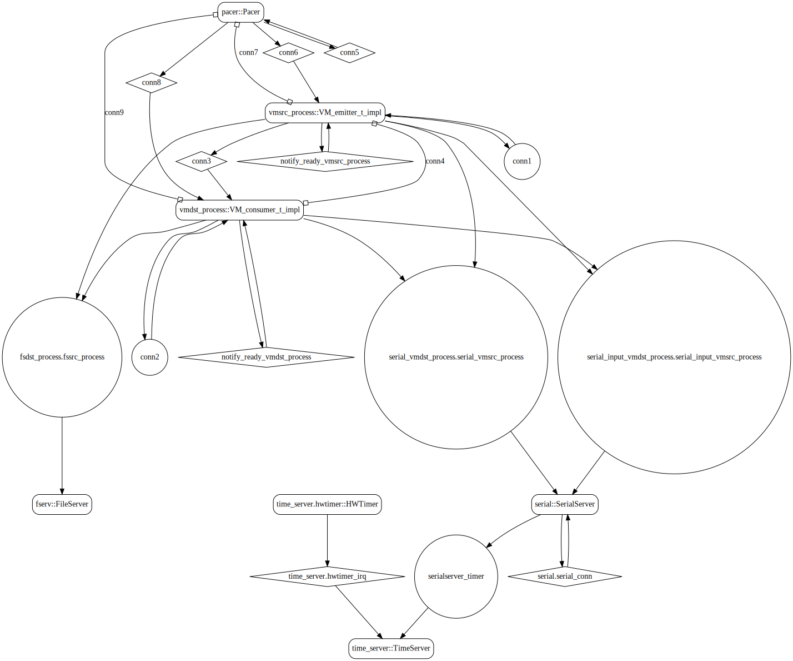
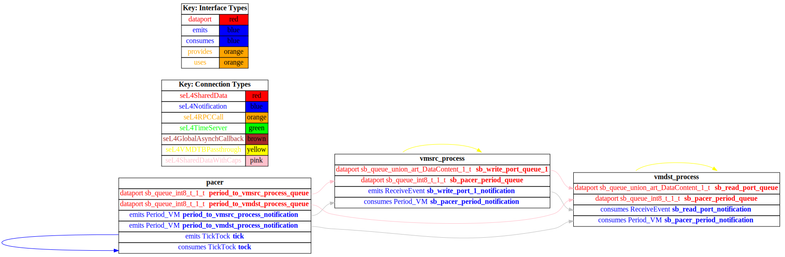

# both_vm

## Diagrams

### AADL Arch
  

### CAmkES HAMR SeL4_Only Arch
  

### CAmkES SeL4_Only Arch
  

### CAmkES HAMR SeL4 Arch
  

### CAmkES SeL4 Arch
  

## Expected Output : Timeout = 15 seconds

  ### CAmkES SeL4_Only Expected Output
    Booting all finished, dropped to user space
    <<seL4(CPU 0) [decodeUntypedInvocation/212 T0xff807fc18400 "rootserver" @4006d8]: Untyped Retype: Insufficient memory (1 * 2097152 bytes needed, 0 bytes available).>>
    <<seL4(CPU 0) [maskVMRights/193 T0xff807fc18400 "rootserver" @4006d8]: Attempted to make unsupported write only mapping>>
    _utspace_split_alloc@split.c:272 Failed to find any untyped capable of creating an object at address 0x8040000
    Loading Linux: 'linux' dtb: ''
    _utspace_split_alloc@split.c:272 Failed to find any untyped capable of creating an object at address 0x8040000
    Loading Linux: 'linux' dtb: ''
    install_linux_devices@main.c:628 module name: map_frame_hack
    install_linux_devices@main.c:628 module name: virtio_con
    install_linux_devices@main.c:628 module name: cross_vm_connections
    install_linux_devices@main.c:628 module name: map_frame_hack
    install_linux_devices@main.c:628 module name: virtio_con
    install_linux_devices@main.c:628 module name: cross_vm_connections

  ### CAmkES SeL4 Expected Output
    Booting all finished, dropped to user space
    <<seL4(CPU 0) [decodeUntypedInvocation/212 T0xff807fc18400 "rootserver" @4006a0]: Untyped Retype: Insufficient memory (1 * 2097152 bytes needed, 0 bytes available).>>
    <<seL4(CPU 0) [maskVMRights/193 T0xff807fc18400 "rootserver" @4006a0]: Attempted to make unsupported write only mapping>>
    _utspace_split_alloc@split.c:272 Failed to find any untyped capable of creating an object at address 0x8040000
    Loading Linux: 'linux' dtb: ''
    _utspace_split_alloc@split.c:272 Failed to find any untyped capable of creating an object at address 0x8040000
    Loading Linux: 'linux' dtb: ''
    install_linux_devices@main.c:628 module name: map_frame_hack
    install_linux_devices@main.c:628 module name: virtio_con
    install_linux_devices@main.c:628 module name: cross_vm_connections
    install_linux_devices@main.c:628 module name: map_frame_hack
    install_linux_devices@main.c:628 module name: virtio_con
    install_linux_devices@main.c:628 module name: cross_vm_connections

