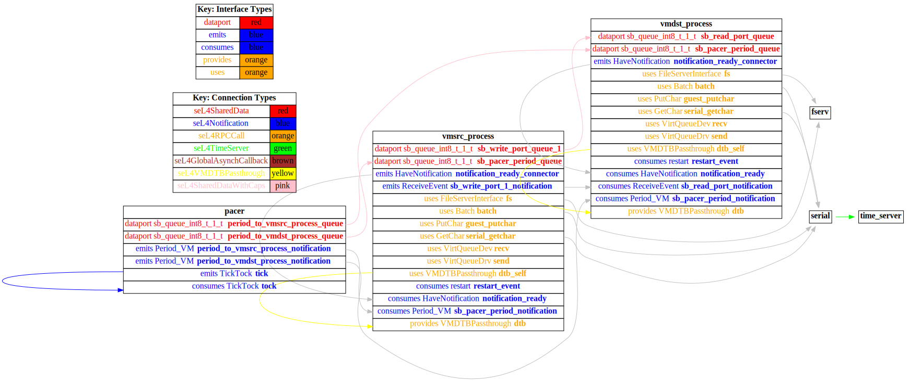

# both_vm

 Table of Contents
  * [Diagrams](#diagrams)
    * [AADL Arch](#aadl-arch)
    * [SeL4_Only](#sel4_only)
      * [SeL4_Only CAmkES Arch](#sel4_only-camkes-arch)
      * [SeL4_Only CAmkES HAMR Arch](#sel4_only-camkes-hamr-arch)
    * [SeL4](#sel4)
      * [SeL4 CAmkES Arch](#sel4-camkes-arch)
      * [SeL4 CAmkES HAMR Arch](#sel4-camkes-hamr-arch)
  * [Example Output](#example-output)
    * [SeL4_Only Expected Output: Timeout = 90 seconds](#sel4_only-expected-output-timeout--90-seconds)
    * [SeL4 Expected Output: Timeout = 90 seconds](#sel4-expected-output-timeout--90-seconds)

## Diagrams
### AADL Arch


### SeL4_Only
#### SeL4_Only CAmkES Arch


#### SeL4_Only CAmkES HAMR Arch


### SeL4
#### SeL4 CAmkES Arch


#### SeL4 CAmkES HAMR Arch


## Example Output
*NOTE:* actual output may differ due to issues related to thread interleaving
### SeL4_Only Expected Output: Timeout = 90 seconds

  |HAMR Codegen Configuration| |
  |--|--|
  | package-name | both_vm |
  | exclude-component-impl | true |
  | bit-width | 32 |
  | max-string-size | 256 |
  | max-array-size | 1 |


  **How To Run**
  ```
  test_event_data_port_periodic_domains_VM/both_vm/CAmkES_seL4_Only/bin/setup-camkes-arm-vm.sh
  test_event_data_port_periodic_domains_VM/both_vm/CAmkES_seL4_Only/bin/run-camkes.sh -s
  ```

  ```
  Booting all finished, dropped to user space
  <<seL4(CPU 0) [decodeUntypedInvocation/212 T0xff807fc18400 "rootserver" @4006d8]: Untyped Retype: Insufficient memory (1 * 2097152 bytes needed, 0 bytes available).>>
  _utspace_split_alloc@split.c:272 Failed to find any untyped capable of creating an object at address 0x8040000
  Loading Linux: 'linux' dtb: ''
  _utspace_split_alloc@split.c:272 Failed to find any untyped capable of creating an object at address 0x8040000
  Loading Linux: 'linux' dtb: ''
  install_linux_devices@main.c:628 module name: map_frame_hack
  install_linux_devices@main.c:628 module name: virtio_con
  install_linux_devices@main.c:628 module name: cross_vm_connections
  install_linux_devices@main.c:628 module name: map_frame_hack
  install_linux_devices@main.c:628 module name: virtio_con
  install_linux_devices@main.c:628 module name: cross_vm_connections
  libsel4muslcsys: Error attempting syscall 215
  libsel4muslcsys: Error attempting syscall 215
  libsel4muslcsys: Error attempting syscall 215
  libsel4muslcsys: Error attempting syscall 215
  clean_up@fdtgen.c:370 Non-existing node None specified to be kept
  consume_connection_event@cross_vm_connection.c:247 Failed to inject connection irq
  _utspace_split_alloc@split.c:272 Failed to find any untyped capable of creating an object at address 0x8020000
  clean_up@fdtgen.c:370 Non-existing node None specified to be kept
  consume_connection_event@cross_vm_connection.c:247 Failed to inject connection irq
  _utspace_split_alloc@split.c:272 Failed to find any untyped capable of creating an object at address 0x8020000
  consume_connection_event@cross_vm_connection.c:247 Failed to inject connection irq
  consume_connection_event@cross_vm_connection.c:247 Failed to inject connection irq
  consume_connection_event@cross_vm_connection.c:247 Failed to inject connection irq
  consume_connection_event@cross_vm_connection.c:247 Failed to inject connection irq
  consume_connection_event@cross_vm_connection.c:247 Failed to inject connection irq
  [    3.768495] Unable to detect cache hierarchy for CPU 0
  [    3.788112] e1000: Intel(R) PRO/1000 Network Driver - version 7.3.21-k8-NAPI
  [    3.802435] e1000: Copyright (c) 1999-2006 Intel Corporation.
  [    3.815913] e1000e: Intel(R) PRO/1000 Network Driver - 3.2.6-k
  [    3.828643] e1000e: Copyright(c) 1999 - 2015 Intel Corporation.
  [    3.848295] mousedev: PS/2 mouse device common for all mice
  [    3.869541] ledtrig-cpu: registered to indicate activity on CPUs
  [    3.884521] dmi-sysfs: dmi entry is absent.
  consume_connection_event@cross_vm_connection.c:247 Failed to inject connection irq
  [    3.763597] Unable to detect cache hierarchy for CPU 0
  [    3.777658] e1000: Intel(R) PRO/1000 Network Driver - version 7.3.21-k8-NAPI
  [    3.792041] e1000: Copyright (c) 1999-2006 Intel Corporation.
  [    3.804870] e1000e: Intel(R) PRO/1000 Network Driver - 3.2.6-k
  [    3.818252] e1000e: Copyright(c) 1999 - 2015 Intel Corporation.
  [    3.840296] mousedev: PS/2 mouse device common for all mice
  [    3.862945] ledtrig-cpu: registered to indicate activity on CPUs
  [    3.876917] dmi-sysfs: dmi entry is absent.
  [    3.887917] ipip: IPv4 and MPLS over IPv4 tunneling driver
  [    4.687643] ipip: IPv4 and MPLS over IPv4 tunneling driver
  [    4.703789] NET: Registered protocol family 10
  [    4.728584] mip6: Mobile IPv6
  [    4.742190] NET: Registered protocol family 17
  [    4.753153] mpls_gso: MPLS GSO support
  [    4.761942] Registered cp15_barrier emulation handler
  [    4.773522] Registered setend emulation handler
  [    4.790248] registered taskstats version 1
  [    4.801263] zswap: loaded using pool lzo/zbud
  [    4.817688] ima: No TPM chip found, activating TPM-bypass!
  [    4.830234] ima: Allocated hash algorithm: sha256
  [    4.852082] hctosys: unable to open rtc device (rtc0)
  [    4.864687] PM: Hibernation image not present or could not be loaded.
  [    4.878469] initcall clk_disable_unused blacklisted
  [    4.692473] NET: Registered protocol family 10
  [    4.719683] mip6: Mobile IPv6
  [    4.733807] NET: Registered protocol family 17
  [    4.745380] mpls_gso: MPLS GSO support
  [    4.753549] Registered cp15_barrier emulation handler
  [    4.764187] Registered setend emulation handler
  [    4.781628] registered taskstats version 1
  [    4.793042] zswap: loaded using pool lzo/zbud
  [    4.809107] ima: No TPM chip found, activating TPM-bypass!
  [    4.820887] ima: Allocated hash algorithm: sha256
  [    4.844589] hctosys: unable to open rtc device (rtc0)
  [    4.857592] PM: Hibernation image not present or could not be loaded.
  [    4.871770] initcall clk_disable_unused blacklisted
  [    6.102295] Freeing unused kernel memory: 3776K
  [    6.097690] Freeing unused kernel memory: 3776K
  Starting syslogd: OK
  Starting klogd: OK
  Running sysctl: Starting syslogd: OK
  Starting klogd: OK
  Running sysctl: OK
  OK
  Initializing random number generator... [   11.214812] random: dd: uninitialized urandom read (512 bytes read)
  done.
  Starting network: Initializing random number generator... [   11.188524] random: dd: uninitialized urandom read (512 bytes read)
  done.
  Starting network: OK
  [   12.537524] connection: loading out-of-tree module taints kernel.
  [   12.578569] Event Bar (dev-0) initalised
  [   12.596035] 2 Dataports (dev-0) initalised
  [   12.606292] Event Bar (dev-1) initalised
  [   12.625817] 2 Dataports (dev-1) initalised
  OK
  [   12.539855] connection: loading out-of-tree module taints kernel.
  [   12.585204] Event Bar (dev-0) initalised
  [   12.595168] 2 Dataports (dev-0) initalised
  [   12.616929] Event Bar (dev-1) initalised
  [   12.626571] 2 Dataports (dev-1) initalised

  Welcome to Buildroot
  buildroot login: 
  Welcome to Buildroot
  buildroot login: root
  # vmsrc_process /dev/uio0 4096 /dev/uio1 4096
  [vmsrc_process] test_event_data_port_emitter_component_init called

  Switching input to 1
  [vmsrc_process] sending 0

  Welcome to Buildroot
  buildroot login: [vmsrc_process] sending 1
  root
  # [vmsrc_process] sending 2
  vmdst_process /dev/uio0 4096 /dev/uio1 4096
  [vmdst_process] test_event_data_port_consumer_component_init called
  [vmsrc_process] sending 3
  [vmdst_process] received {3}
  [vmsrc_process] sending 4
  [vmdst_process] received {4}
  [vmsrc_process] sending 5
  [vmdst_process] received {5}
  [vmsrc_process] sending 6
  [vmdst_process] received {6}
  [vmsrc_process] sending 7
  [vmdst_process] received {7}
  [vmsrc_process] sending 8
  [vmdst_process] received {8}
  [vmsrc_process] sending 9
  [vmdst_process] received {9}
  [vmsrc_process] sending 10
  [vmdst_process] received {10}
  [vmsrc_process] sending 11
  [vmdst_process] received {11}
  [vmsrc_process] sending 12
  [vmdst_process] received {12}
  [vmsrc_process] sending 13
  [vmdst_process] received {13}
  [vmsrc_process] sending 14
  [vmdst_process] received {14}
  [vmsrc_process] sending 15
  [vmdst_process] received {15}
  [vmsrc_process] sending 16
  [vmdst_process] received {16}
  [vmsrc_process] sending 17
  [vmdst_process] received {17}
  [vmsrc_process] sending 18
  ```

### SeL4 Expected Output: Timeout = 90 seconds

  |HAMR Codegen Configuration| |
  |--|--|
  | package-name | both_vm |
  | exclude-component-impl | true |
  | bit-width | 32 |
  | max-string-size | 256 |
  | max-array-size | 1 |


  **How To Run**
  ```
  test_event_data_port_periodic_domains_VM/both_vm/CAmkES_seL4/src/c/CAmkES_seL4/bin/setup-camkes-arm-vm.sh
  test_event_data_port_periodic_domains_VM/both_vm/CAmkES_seL4/bin/transpile-sel4.sh
  test_event_data_port_periodic_domains_VM/both_vm/CAmkES_seL4/src/c/CAmkES_seL4/bin/run-camkes.sh -s
  ```

  ```
  Booting all finished, dropped to user space
  <<seL4(CPU 0) [decodeUntypedInvocation/212 T0xff807fc18400 "rootserver" @4006d8]: Untyped Retype: Insufficient memory (1 * 2097152 bytes needed, 0 bytes available).>>
  _utspace_split_alloc@split.c:272 Failed to find any untyped capable of creating an object at address 0x8040000
  Loading Linux: 'linux' dtb: ''
  _utspace_split_alloc@split.c:272 Failed to find any untyped capable of creating an object at address 0x8040000
  Loading Linux: 'linux' dtb: ''
  install_linux_devices@main.c:628 module name: map_frame_hack
  install_linux_devices@main.c:628 module name: virtio_con
  install_linux_devices@main.c:628 module name: cross_vm_connections
  install_linux_devices@main.c:628 module name: map_frame_hack
  install_linux_devices@main.c:628 module name: virtio_con
  install_linux_devices@main.c:628 module name: cross_vm_connections

  ```