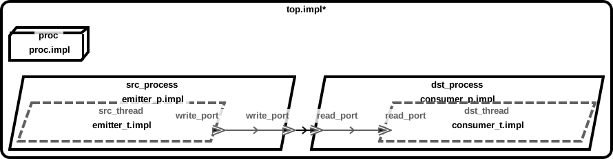
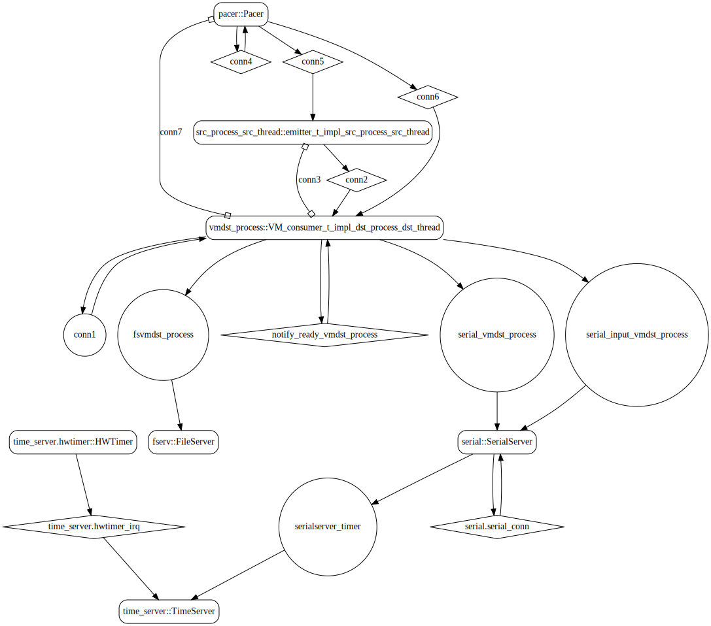
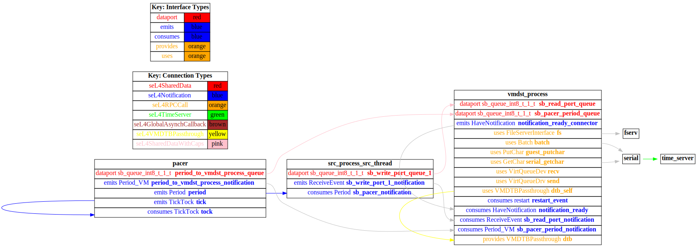
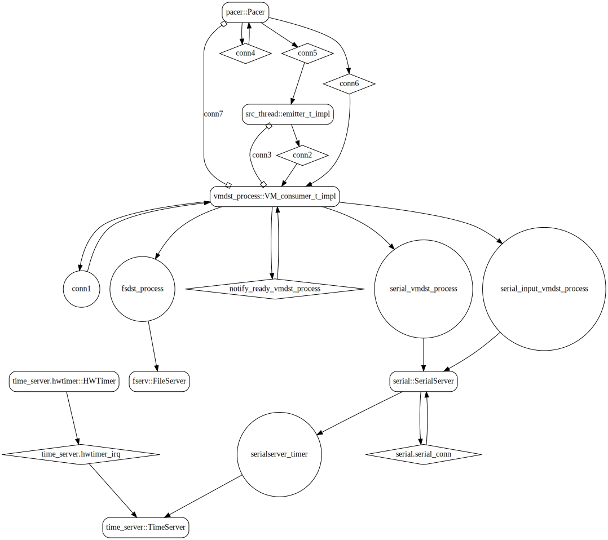
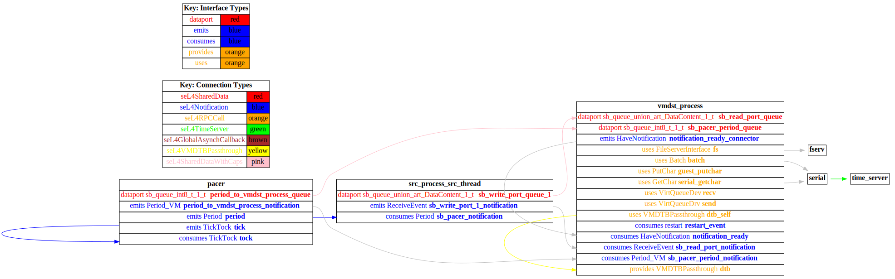

# receiver_vm

 Table of Contents
  * [Diagrams](#diagrams)
    * [AADL Arch](#aadl-arch)
    * [SeL4_Only](#sel4_only)
      * [SeL4_Only CAmkES Arch](#sel4_only-camkes-arch)
      * [SeL4_Only CAmkES HAMR Arch](#sel4_only-camkes-hamr-arch)
    * [SeL4](#sel4)
      * [SeL4 CAmkES Arch](#sel4-camkes-arch)
      * [SeL4 CAmkES HAMR Arch](#sel4-camkes-hamr-arch)
  * [Example Output](#example-output)
    * [SeL4_Only Expected Output: Timeout = 90 seconds](#sel4_only-expected-output-timeout--90-seconds)
    * [SeL4 Expected Output: Timeout = 90 seconds](#sel4-expected-output-timeout--90-seconds)

## Diagrams
### AADL Arch


### SeL4_Only
#### SeL4_Only CAmkES Arch


#### SeL4_Only CAmkES HAMR Arch


### SeL4
#### SeL4 CAmkES Arch


#### SeL4 CAmkES HAMR Arch


## Example Output
*NOTE:* actual output may differ due to issues related to thread interleaving
### SeL4_Only Expected Output: Timeout = 90 seconds

  |HAMR Codegen Configuration| |
  |--|--|
  | refer to [bin/run-hamr-SeL4_Only.sh](bin/run-hamr-SeL4_Only.sh) |


  **How To Run**
  ```
  ./bin/run-hamr-SeL4_Only.sh
  ./CAmkES_seL4_Only/bin/setup-camkes-arm-vm.sh
  ./CAmkES_seL4_Only/bin/run-camkes.sh -s
  ```

  ```
  Booting all finished, dropped to user space
  <<seL4(CPU 0) [decodeUntypedInvocation/212 T0xff807fc17400 "rootserver" @4006f0]: Untyped Retype: Insufficient memory (1 * 2097152 bytes needed, 0 bytes available).>>
  <<seL4(CPU 0) [maskVMRights/187 T0xff807fc17400 "rootserver" @4006f0]: Attempted to make unsupported write only mapping>>
  [src_process_src_thread] test_event_data_port_emitter_component_init called
  _utspace_split_alloc@split.c:272 Failed to find any untyped capable of creating an object at address 0x8040000
  Loading Linux: 'linux' dtb: ''
  install_linux_devices@main.c:657 module name: map_frame_hack
  install_linux_devices@main.c:657 module name: init_ram
  [src_process_src_thread] sending 0
  [src_process_src_thread] sending 1
  [src_process_src_thread] sending 2
  [src_process_src_thread] sending 3
  install_linux_devices@main.c:657 module name: virtio_con
  install_linux_devices@main.c:657 module name: cross_vm_connections
  [src_process_src_thread] sending 4
  [src_process_src_thread] sending 5
  [src_process_src_thread] sending 6
  [src_process_src_thread] sending 7
  [src_process_src_thread] sending 8
  [src_process_src_thread] sending 9
  [src_process_src_thread] sending 10
  [src_process_src_thread] sending 11
  [src_process_src_thread] sending 12
  [src_process_src_thread] sending 13
  [src_process_src_thread] sending 14
  [src_process_src_thread] sending 15
  [src_process_src_thread] sending 16
  [src_process_src_thread] sending 17
  [src_process_src_thread] sending 18
  [src_process_src_thread] sending 19
  [src_process_src_thread] sending 20
  [src_process_src_thread] sending 21
  [src_process_src_thread] sending 22
  [src_process_src_thread] sending 23
  [src_process_src_thread] sending 24
  libsel4muslcsys: Error attempting syscall 215
  [src_process_src_thread] sending 25
  [src_process_src_thread] sending 26
  [src_process_src_thread] sending 27
  [src_process_src_thread] sending 28
  [src_process_src_thread] sending 29
  [src_process_src_thread] sending 30
  [src_process_src_thread] sending 31
  [src_process_src_thread] sending 32
  [src_process_src_thread] sending 33
  [src_process_src_thread] sending 34
  [src_process_src_thread] sending 35
  libsel4muslcsys: Error attempting syscall 215
  [src_process_src_thread] sending 36
  clean_up@fdtgen.c:370 Non-existing node None specified to be kept
  consume_connection_event@cross_vm_connection.c:247 Failed to inject connection irq
  consume_connection_event@cross_vm_connection.c:247 Failed to inject connection irq
  _utspace_split_alloc@split.c:272 Failed to find any untyped capable of creating an object at address 0x8020000
  [src_process_src_thread] sending 37
  consume_connection_event@cross_vm_connection.c:247 Failed to inject connection irq
  consume_connection_event@cross_vm_connection.c:247 Failed to inject connection irq
  [src_process_src_thread] sending 38
  consume_connection_event@cross_vm_connection.c:247 Failed to inject connection irq
  consume_connection_event@cross_vm_connection.c:247 Failed to inject connection irq
  [    2.895847] Unable to detect cache hierarchy for CPU 0
  [    2.914285] e1000: Intel(R) PRO/1000 Network Driver - version 7.3.21-k8-NAPI
  [    2.929326] e1000: Copyright (c) 1999-2006 Intel Corporation.
  [    2.941809] e1000e: Intel(R) PRO/1000 Network Driver - 3.2.6-k
  [    2.952851] e1000e: Copyright(c) 1999 - 2015 Intel Corporation.
  [    2.968974] mousedev: PS/2 mouse device common for all mice
  [    2.992966] ledtrig-cpu: registered to indicate activity on CPUs
  [    3.005879] dmi-sysfs: dmi entry is absent.
  [    3.016773] ipip: IPv4 and MPLS over IPv4 tunneling driver
  [src_process_src_thread] sending 39
  [    3.610114] NET: Registered protocol family 10
  [    3.639863] mip6: Mobile IPv6
  [    3.653197] NET: Registered protocol family 17
  [    3.663578] mpls_gso: MPLS GSO support
  [    3.672021] Registered cp15_barrier emulation handler
  [    3.683034] Registered setend emulation handler
  [    3.697700] registered taskstats version 1
  [    3.709409] zswap: loaded using pool lzo/zbud
  [    3.727679] ima: No TPM chip found, activating TPM-bypass!
  [    3.740048] ima: Allocated hash algorithm: sha256
  [    3.760816] hctosys: unable to open rtc device (rtc0)
  [    3.772189] PM: Hibernation image not present or could not be loaded.
  [    3.784289] initcall clk_disable_unused blacklisted
  [    4.209179] Freeing unused kernel memory: 3776K
  [src_process_src_thread] sending 40
  [src_process_src_thread] sending 41
  Starting syslogd: OK
  Starting klogd: OK
  Running sysctl: [src_process_src_thread] sending 42
  OK
  Initializing random number generator... [    8.293317] random: dd: uninitialized urandom read (512 bytes read)
  done.
  [src_process_src_thread] sending 43
  Starting network: OK
  [    9.547977] connection: loading out-of-tree module taints kernel.
  [    9.593281] Event Bar (dev-0) initalised
  [src_process_src_thread] sending 44
  [   10.220346] 2 Dataports (dev-0) initalised
  [   10.241268] Event Bar (dev-1) initalised
  [   10.254396] 2 Dataports (dev-1) initalised
  [vmdst_process] test_event_data_port_consumer_component_init called

  Welcome to Buildroot
  buildroot login: [src_process_src_thread] sending 45
  [vmdst_process] received {45}
  [src_process_src_thread] sending 46
  [vmdst_process] received {46}
  [src_process_src_thread] sending 47
  [vmdst_process] received {47}
  [src_process_src_thread] sending 48
  [vmdst_process] received {48}
  [src_process_src_thread] sending 49
  [vmdst_process] received {49}
  [src_process_src_thread] sending 50
  [vmdst_process] received {50}
  [src_process_src_thread] sending 51
  [vmdst_process] received {51}
  [src_process_src_thread] sending 52
  [vmdst_process] received {52}
  [src_process_src_thread] sending 53
  [vmdst_process] received {53}
  [src_process_src_thread] sending 54
  [vmdst_process] received {54}
  [src_process_src_thread] sending 55
  [vmdst_process] received {55}
  [src_process_src_thread] sending 56
  [vmdst_process] received {56}
  [src_process_src_thread] sending 57
  [vmdst_process] received {57}
  [src_process_src_thread] sending 58
  [vmdst_process] received {58}
  [src_process_src_thread] sending 59
  [vmdst_process] received {59}
  [src_process_src_thread] sending 60
  [vmdst_process] received {60}

  ```

### SeL4 Expected Output: Timeout = 90 seconds

  |HAMR Codegen Configuration| |
  |--|--|
  | refer to [bin/run-hamr-SeL4.sh](bin/run-hamr-SeL4.sh) |


  **How To Run**
  ```
  ./bin/run-hamr-SeL4.sh
  ./CAmkES_seL4/src/c/CAmkES_seL4/bin/setup-camkes-arm-vm.sh
  ./CAmkES_seL4/src/c/CAmkES_seL4/bin/run-camkes.sh -s
  ```

  ```
  Booting all finished, dropped to user space
  <<seL4(CPU 0) [decodeUntypedInvocation/212 T0xff807fc17400 "rootserver" @4006f0]: Untyped Retype: Insufficient memory (1 * 2097152 bytes needed, 0 bytes available).>>
  <<seL4(CPU 0) [maskVMRights/187 T0xff807fc17400 "rootserver" @4006f0]: Attempted to make unsupported write only mapping>>
  Entering pre-init of emitter_t_impl_src_process_src_thread
  Art: Registered component: top_impl_Instance_src_process_src_thread (periodic: 1000)
  Art: - Registered port: top_impl_Instance_src_process_src_thread_write_port (event out)
  top_impl_Instance_src_process_src_thread: Example logInfo
  top_impl_Instance_src_process_src_thread: Example logDebug
  top_impl_Instance_src_process_src_thread: Example logError
  Leaving pre-init of emitter_t_impl_src_process_src_thread
  _utspace_split_alloc@split.c:272 Failed to find any untyped capable of creating an object at address 0x8040000
  Loading Linux: 'linux' dtb: ''
  install_linux_devices@main.c:657 module name: map_frame_hack
  install_linux_devices@main.c:657 module name: init_ram
  install_linux_devices@main.c:657 module name: virtio_con
  install_linux_devices@main.c:657 module name: cross_vm_connections

  ```