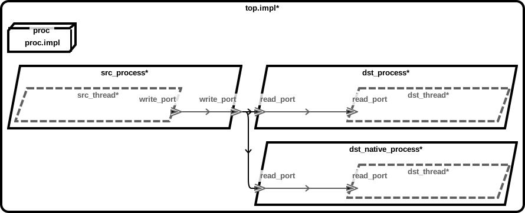
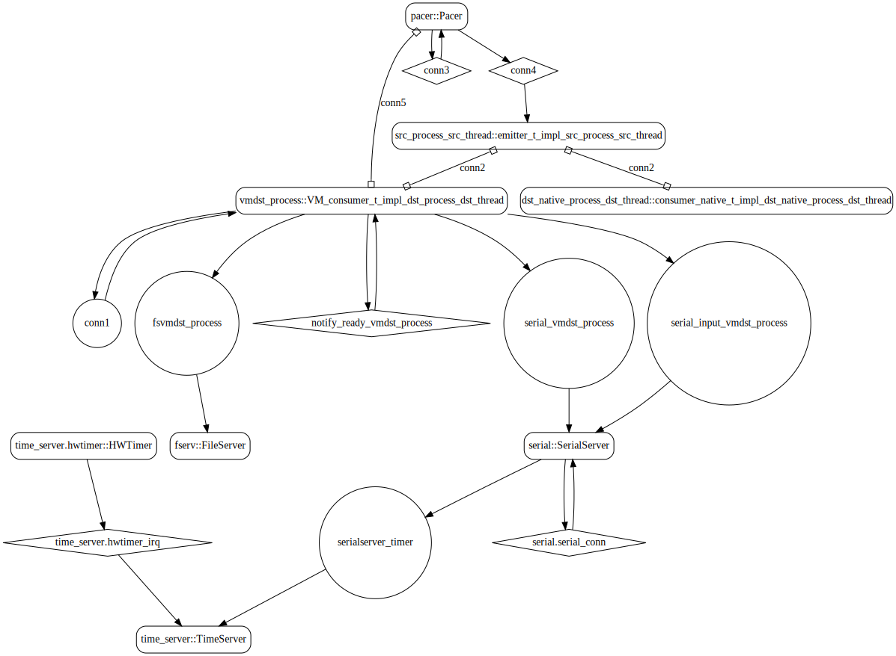
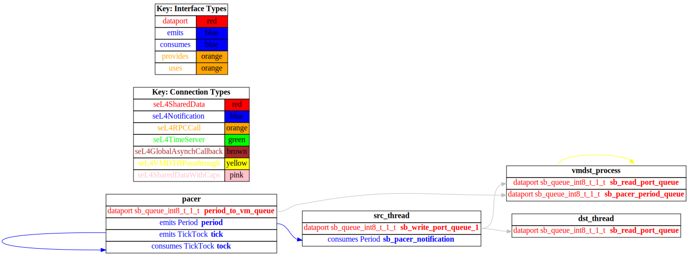

# receiver_vm

 Table of Contents
  * [Diagrams](#diagrams)
    * [AADL Arch](#aadl-arch)
    * [SeL4_Only](#sel4_only)
      * [SeL4_Only CAmkES Arch](#sel4_only-camkes-arch)
      * [SeL4_Only CAmkES HAMR Arch](#sel4_only-camkes-hamr-arch)
  * [Example Output](#example-output)
    * [SeL4_Only Expected Output: Timeout = 90 seconds](#sel4_only-expected-output-timeout--90-seconds)

## Diagrams
### AADL Arch


### SeL4_Only
#### SeL4_Only CAmkES Arch


#### SeL4_Only CAmkES HAMR Arch


## Example Output
*NOTE:* actual output may differ due to issues related to thread interleaving
### SeL4_Only Expected Output: Timeout = 90 seconds

  |HAMR Codegen Configuration| |
  |--|--|
  | refer to [bin/run-hamr-SeL4_Only.sh](bin/run-hamr-SeL4_Only.sh) |


  **How To Run**
  ```
  ./bin/run-hamr-SeL4_Only.sh
  ./CAmkES_seL4_Only/bin/setup-camkes-arm-vm.sh
  ./CAmkES_seL4_Only/bin/run-camkes.sh -o "-DUSE_PRECONFIGURED_ROOTFS=ON" -s
  ```

  ```
  Booting all finished, dropped to user space
  <<seL4(CPU 0) [decodeUntypedInvocation/212 T0xff807fc17400 "rootserver" @4006f0]: Untyped Retype: Insufficient memory (1 * 2097152 bytes needed, 0 bytes available).>>
  [src_process_src_thread] test_event_data_port_emitter_component_init called
  _utspace_split_alloc@split.c:272 Failed to find any untyped capable of creating an object at address 0x8040000
  Loading Linux: 'linux' dtb: ''
  install_linux_devices@main.c:657 module name: map_frame_hack
  install_linux_devices@main.c:657 module name: init_ram
  [dst_native_process_dst_thread] test_event_data_port_consumer_component_init called
  -----------------------
  [src_process_src_thread] sending 0
  [dst_native_process_dst_thread] received {0}
  -----------------------
  [src_process_src_thread] sending 1
  [dst_native_process_dst_thread] received {1}
  -----------------------
  [src_process_src_thread] sending 2
  install_linux_devices@main.c:657 module name: virtio_con
  install_linux_devices@main.c:657 module name: cross_vm_connections
  [dst_native_process_dst_thread] received {2}
  -----------------------
  [src_process_src_thread] sending 3
  [dst_native_process_dst_thread] received {3}
  -----------------------
  [src_process_src_thread] sending 4
  [dst_native_process_dst_thread] received {4}
  -----------------------
  [src_process_src_thread] sending 5
  [dst_native_process_dst_thread] received {5}
  -----------------------
  [src_process_src_thread] sending 6
  [dst_native_process_dst_thread] received {6}
  -----------------------
  [src_process_src_thread] sending 7
  [dst_native_process_dst_thread] received {7}
  -----------------------
  [src_process_src_thread] sending 8
  [dst_native_process_dst_thread] received {8}
  -----------------------
  [src_process_src_thread] sending 9
  [dst_native_process_dst_thread] received {9}
  -----------------------
  [src_process_src_thread] sending 10
  [dst_native_process_dst_thread] received {10}
  -----------------------
  [src_process_src_thread] sending 11
  [dst_native_process_dst_thread] received {11}
  -----------------------
  [src_process_src_thread] sending 12
  [dst_native_process_dst_thread] received {12}
  -----------------------
  [src_process_src_thread] sending 13
  [dst_native_process_dst_thread] received {13}
  -----------------------
  [src_process_src_thread] sending 14
  [dst_native_process_dst_thread] received {14}
  -----------------------
  [src_process_src_thread] sending 15
  [dst_native_process_dst_thread] received {15}
  -----------------------
  [src_process_src_thread] sending 16
  [dst_native_process_dst_thread] received {16}
  -----------------------
  [src_process_src_thread] sending 17
  [dst_native_process_dst_thread] received {17}
  -----------------------
  [src_process_src_thread] sending 18
  [dst_native_process_dst_thread] received {18}
  -----------------------
  [src_process_src_thread] sending 19
  [dst_native_process_dst_thread] received {19}
  -----------------------
  [src_process_src_thread] sending 20
  [dst_native_process_dst_thread] received {20}
  -----------------------
  [src_process_src_thread] sending 21
  [dst_native_process_dst_thread] received {21}
  -----------------------
  [src_process_src_thread] sending 22
  [dst_native_process_dst_thread] received {22}
  -----------------------
  [src_process_src_thread] sending 23
  libsel4muslcsys: Error attempting syscall 215
  [dst_native_process_dst_thread] received {23}
  -----------------------
  [src_process_src_thread] sending 24
  [dst_native_process_dst_thread] received {24}
  -----------------------
  [src_process_src_thread] sending 25
  [dst_native_process_dst_thread] received {25}
  -----------------------
  [src_process_src_thread] sending 26
  [dst_native_process_dst_thread] received {26}
  -----------------------
  [src_process_src_thread] sending 27
  [dst_native_process_dst_thread] received {27}
  -----------------------
  [src_process_src_thread] sending 28
  [dst_native_process_dst_thread] received {28}
  -----------------------
  [src_process_src_thread] sending 29
  [dst_native_process_dst_thread] received {29}
  -----------------------
  [src_process_src_thread] sending 30
  [dst_native_process_dst_thread] received {30}
  -----------------------
  [src_process_src_thread] sending 31
  [dst_native_process_dst_thread] received {31}
  -----------------------
  [src_process_src_thread] sending 32
  [dst_native_process_dst_thread] received {32}
  -----------------------
  [src_process_src_thread] sending 33
  libsel4muslcsys: Error attempting syscall 215
  [dst_native_process_dst_thread] received {33}
  -----------------------
  [src_process_src_thread] sending 34
  clean_up@fdtgen.c:370 Non-existing node None specified to be kept
  consume_connection_event@cross_vm_connection.c:247 Failed to inject connection irq
  consume_connection_event@cross_vm_connection.c:247 Failed to inject connection irq
  _utspace_split_alloc@split.c:272 Failed to find any untyped capable of creating an object at address 0x8020000
  [dst_native_process_dst_thread] received {34}
  -----------------------
  [src_process_src_thread] sending 35
  consume_connection_event@cross_vm_connection.c:247 Failed to inject connection irq
  consume_connection_event@cross_vm_connection.c:247 Failed to inject connection irq
  [dst_native_process_dst_thread] received {35}
  -----------------------
  [src_process_src_thread] sending 36
  consume_connection_event@cross_vm_connection.c:247 Failed to inject connection irq
  consume_connection_event@cross_vm_connection.c:247 Failed to inject connection irq
  [    2.941286] Unable to detect cache hierarchy for CPU 0
  [    2.964628] e1000: Intel(R) PRO/1000 Network Driver - version 7.3.21-k8-NAPI
  [    2.982306] e1000: Copyright (c) 1999-2006 Intel Corporation.
  [    2.996241] e1000e: Intel(R) PRO/1000 Network Driver - 3.2.6-k
  [    3.008207] e1000e: Copyright(c) 1999 - 2015 Intel Corporation.
  [    3.024860] mousedev: PS/2 mouse device common for all mice
  [    3.046285] ledtrig-cpu: registered to indicate activity on CPUs
  [    3.059493] dmi-sysfs: dmi entry is absent.
  [    3.069254] ipip: IPv4 and MPLS over IPv4 tunneling driver
  [    3.087928] NET: Registered protocol family 10
  [    3.116591] mip6: Mobile IPv6
  [    3.132052] NET: Registered protocol family 17
  [    3.143868] mpls_gso: MPLS GSO support
  [    3.153328] Registered cp15_barrier emulation handler
  [    3.163588] Registered setend emulation handler
  [    3.177426] registered taskstats version 1
  [    3.187836] zswap: loaded using pool lzo/zbud
  [    3.202816] ima: No TPM chip found, activating TPM-bypass!
  [    3.214054] ima: Allocated hash algorithm: sha256
  [    3.233000] hctosys: unable to open rtc device (rtc0)
  [    3.243746] PM: Hibernation image not present or could not be loaded.
  [    3.255978] initcall clk_disable_unused blacklisted
  [dst_native_process_dst_thread] received {36}
  -----------------------
  [src_process_src_thread] sending 37
  [    4.421835] Freeing unused kernel memory: 3776K
  [dst_native_process_dst_thread] received {37}
  -----------------------
  [src_process_src_thread] sending 38
  Starting syslogd: OK
  Starting klogd: OK
  [dst_native_process_dst_thread] received {38}
  -----------------------
  [src_process_src_thread] sending 39
  Running sysctl: OK
  Initializing random number generator... [dst_native_process_dst_thread] received {39}
  -----------------------
  [src_process_src_thread] sending 40
  [    8.712983] random: dd: uninitialized urandom read (512 bytes read)
  done.
  Starting network: OK
  [dst_native_process_dst_thread] received {40}
  -----------------------
  [src_process_src_thread] sending 41
  [   10.135769] connection: loading out-of-tree module taints kernel.
  [   10.176883] Event Bar (dev-0) initalised
  [   10.198755] 2 Dataports (dev-0) initalised
  [   10.207947] Event Bar (dev-1) initalised
  [   10.224398] 2 Dataports (dev-1) initalised
  VM App vmdst_process started
  [vmdst_process] test_event_data_port_consumer_component_init called

  Welcome to Buildroot
  buildroot login: [dst_native_process_dst_thread] received {41}
  -----------------------
  [src_process_src_thread] sending 42
  [vmdst_process] received {42}
  [dst_native_process_dst_thread] received {42}
  -----------------------
  [src_process_src_thread] sending 43
  [vmdst_process] received {43}
  [dst_native_process_dst_thread] received {43}
  -----------------------
  [src_process_src_thread] sending 44
  [vmdst_process] received {44}
  [dst_native_process_dst_thread] received {44}
  -----------------------
  [src_process_src_thread] sending 45
  [vmdst_process] received {45}
  [dst_native_process_dst_thread] received {45}
  -----------------------
  [src_process_src_thread] sending 46
  [vmdst_process] received {46}
  [dst_native_process_dst_thread] received {46}
  -----------------------
  [src_process_src_thread] sending 47
  [vmdst_process] received {47}
  [dst_native_process_dst_thread] received {47}
  -----------------------
  [src_process_src_thread] sending 48
  [vmdst_process] received {48}
  [dst_native_process_dst_thread] received {48}
  -----------------------
  [src_process_src_thread] sending 49
  [vmdst_process] received {49}
  [dst_native_process_dst_thread] received {49}
  -----------------------
  [src_process_src_thread] sending 50
  [vmdst_process] received {50}
  [dst_native_process_dst_thread] received {50}

  ```