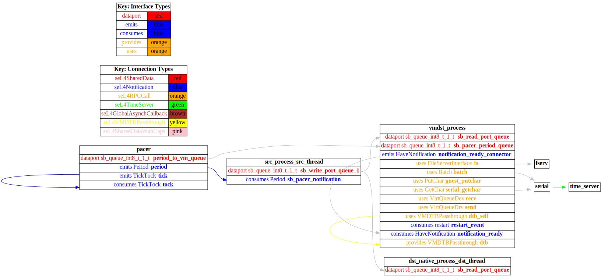

# receiver_vm

 Table of Contents
  * [Diagrams](#diagrams)
    * [AADL Arch](#aadl-arch)
    * [SeL4_Only](#sel4_only)
      * [SeL4_Only CAmkES Arch](#sel4_only-camkes-arch)
      * [SeL4_Only CAmkES HAMR Arch](#sel4_only-camkes-hamr-arch)
  * [Example Output](#example-output)
    * [SeL4_Only Expected Output: Timeout = 15 seconds](#sel4_only-expected-output-timeout--15-seconds)

## Diagrams
### AADL Arch


### SeL4_Only
#### SeL4_Only CAmkES Arch


#### SeL4_Only CAmkES HAMR Arch


## Example Output
*NOTE:* actual output may differ due to issues related to thread interleaving
### SeL4_Only Expected Output: Timeout = 15 seconds

  |HAMR Codegen Configuration| |
  |--|--|
  | package-name | receiver_vm |
  | exclude-component-impl | true |
  | bit-width | 32 |
  | max-string-size | 256 |
  | max-array-size | 1 |


  **How To Run**
  ```
  test_event_data_port_periodic_domains_VMx/receiver_vm/CAmkES_seL4_Only/bin/setup-camkes-arm-vm.sh
  test_event_data_port_periodic_domains_VMx/receiver_vm/CAmkES_seL4_Only/bin/run-camkes.sh -s
  ```

  ```
  Booting all finished, dropped to user space
  <<seL4(CPU 0) [decodeUntypedInvocation/212 T0xff807fc17400 "rootserver" @4006d8]: Untyped Retype: Insufficient memory (1 * 2097152 bytes needed, 0 bytes available).>>
  [dst_thread] test_event_data_port_consumer_component_init called
  _utspace_split_alloc@split.c:272 Failed to find any untyped capable of creating an object at address 0x8040000
  Loading Linux: 'linux' dtb: ''
  [src_thread] test_event_data_port_emitter_component_init called
  -----------------------
  [src_thread] sending 0
  [dst_thread] received {0}
  -----------------------
  [src_thread] sending 1
  [dst_thread] received {1}
  install_linux_devices@main.c:628 module name: map_frame_hack
  install_linux_devices@main.c:628 module name: virtio_con
  install_linux_devices@main.c:628 module name: cross_vm_connections
  -----------------------
  [src_thread] sending 2
  [dst_thread] received {2}
  -----------------------
  [src_thread] sending 3
  [dst_thread] received {3}
  -----------------------
  [src_thread] sending 4
  [dst_thread] received {4}
  -----------------------
  [src_thread] sending 5
  [dst_thread] received {5}
  -----------------------
  [src_thread] sending 6
  [dst_thread] received {6}
  -----------------------
  [src_thread] sending 7
  [dst_thread] received {7}
  -----------------------
  [src_thread] sending 8
  [dst_thread] received {8}
  -----------------------
  [src_thread] sending 9
  [dst_thread] received {9}
  -----------------------
  [src_thread] sending 10
  [dst_thread] received {10}
  -----------------------
  [src_thread] sending 11
  [dst_thread] received {11}
  -----------------------
  [src_thread] sending 12
  [dst_thread] received {12}
  -----------------------
  [src_thread] sending 13
  [dst_thread] received {13}
  -----------------------
  [src_thread] sending 14
  [dst_thread] received {14}
  -----------------------
  [src_thread] sending 15
  [dst_thread] received {15}
  -----------------------
  [src_thread] sending 16
  [dst_thread] received {16}
  -----------------------
  [src_thread] sending 17
  [dst_thread] received {17}
  -----------------------
  [src_thread] sending 18
  [dst_thread] received {18}
  -----------------------
  [src_thread] sending 19
  [dst_thread] received {19}
  -----------------------
  [src_thread] sending 20
  [dst_thread] received {20}
  -----------------------
  [src_thread] sending 21
  [dst_thread] received {21}
  -----------------------
  [src_thread] sending 22
  [dst_thread] received {22}
  libsel4muslcsys: Error attempting syscall 215
  -----------------------
  [src_thread] sending 23
  [dst_thread] received {23}
  -----------------------
  [src_thread] sending 24
  [dst_thread] received {24}
  -----------------------
  [src_thread] sending 25
  [dst_thread] received {25}
  -----------------------
  [src_thread] sending 26
  [dst_thread] received {26}
  -----------------------
  [src_thread] sending 27
  [dst_thread] received {27}
  -----------------------
  [src_thread] sending 28
  [dst_thread] received {28}
  -----------------------
  [src_thread] sending 29
  [dst_thread] received {29}
  -----------------------
  [src_thread] sending 30
  [dst_thread] received {30}
  -----------------------
  [src_thread] sending 31
  [dst_thread] received {31}
  -----------------------
  [src_thread] sending 32
  [dst_thread] received {32}
  libsel4muslcsys: Error attempting syscall 215
  -----------------------
  [src_thread] sending 33
  [dst_thread] received {33}
  clean_up@fdtgen.c:370 Non-existing node None specified to be kept
  consume_connection_event@cross_vm_connection.c:247 Failed to inject connection irq
  consume_connection_event@cross_vm_connection.c:247 Failed to inject connection irq
  _utspace_split_alloc@split.c:272 Failed to find any untyped capable of creating an object at address 0x8020000
  -----------------------
  [src_thread] sending 34
  [dst_thread] received {34}
  consume_connection_event@cross_vm_connection.c:247 Failed to inject connection irq
  consume_connection_event@cross_vm_connection.c:247 Failed to inject connection irq
  -----------------------
  [src_thread] sending 35
  [dst_thread] received {35}
  consume_connection_event@cross_vm_connection.c:247 Failed to inject connection irq
  consume_connection_event@cross_vm_connection.c:247 Failed to inject connection irq
  [    3.449283] Unable to detect cache hierarchy for CPU 0
  [    3.470558] e1000: Intel(R) PRO/1000 Network Driver - version 7.3.21-k8-NAPI
  [    3.484529] e1000: Copyright (c) 1999-2006 Intel Corporation.
  [    3.497206] e1000e: Intel(R) PRO/1000 Network Driver - 3.2.6-k
  [    3.509537] e1000e: Copyright(c) 1999 - 2015 Intel Corporation.
  [    3.527054] mousedev: PS/2 mouse device common for all mice
  [    3.546696] ledtrig-cpu: registered to indicate activity on CPUs
  [    3.559280] dmi-sysfs: dmi entry is absent.
  [    3.569635] ipip: IPv4 and MPLS over IPv4 tunneling driver
  [    3.588412] NET: Registered protocol family 10
  [    3.616954] mip6: Mobile IPv6
  [    3.632602] NET: Registered protocol family 17
  [    3.643258] mpls_gso: MPLS GSO support
  [    3.652549] Registered cp15_barrier emulation handler
  [    3.661771] Registered setend emulation handler
  [    3.678155] registered taskstats version 1
  [    3.689594] zswap: loaded using pool lzo/zbud
  [    3.705581] ima: No TPM chip found, activating TPM-bypass!
  [    3.717261] ima: Allocated hash algorithm: sha256
  [    3.737939] hctosys: unable to open rtc device (rtc0)
  [    3.750038] PM: Hibernation image not present or could not be loaded.
  [    3.761893] initcall clk_disable_unused blacklisted
  -----------------------
  [src_thread] sending 36
  [dst_thread] received {36}
  [    5.116466] Freeing unused kernel memory: 3776K
  -----------------------
  [src_thread] sending 37
  [dst_thread] received {37}
  Starting syslogd: OK
  Starting klogd: OK
  Running sysctl: -----------------------
  [src_thread] sending 38
  [dst_thread] received {38}
  OK
  Initializing random number generator... [    9.021495] random: dd: uninitialized urandom read (512 bytes read)
  done.
  Starting network: -----------------------
  [src_thread] sending 39
  [dst_thread] received {39}
  OK
  [   10.630111] connection: loading out-of-tree module taints kernel.
  [   10.674095] Event Bar (dev-0) initalised
  [   10.691391] 2 Dataports (dev-0) initalised
  [   10.709761] Event Bar (dev-1) initalised
  [   10.719417] 2 Dataports (dev-1) initalised
  [vmdst_process] test_event_data_port_consumer_component_init called

  Welcome to Buildroot
  buildroot login: -----------------------
  [src_thread] sending 40
  [dst_thread] received {40}
  [vmdst_process] received {40}
  -----------------------
  [src_thread] sending 41
  [dst_thread] received {41}
  [vmdst_process] received {41}
  -----------------------
  [src_thread] sending 42
  [dst_thread] received {42}
  [vmdst_process] received {42}
  -----------------------
  [src_thread] sending 43
  [dst_thread] received {43}
  [vmdst_process] received {43}
  -----------------------
  [src_thread] sending 44
  [dst_thread] received {44}
  [vmdst_process] received {44}
  -----------------------
  [src_thread] sending 45
  [dst_thread] received {45}
  [vmdst_process] received {45}
  -----------------------
  [src_thread] sending 46
  [dst_thread] received {46}
  [vmdst_process] received {46}
  -----------------------
  [src_thread] sending 47
  [dst_thread] received {47}
  [vmdst_process] received {47}
  -----------------------
  [src_thread] sending 48
  [dst_thread] received {48}
  [vmdst_process] received {48}
  -----------------------
  [src_thread] sending 49
  [dst_thread] received {49}
  [vmdst_process] received {49}
  -----------------------
  [src_thread] sending 50
  [dst_thread] received {50}
  [vmdst_process] received {50}
  -----------------------
  [src_thread] sending 51
  [dst_thread] received {51}
  [vmdst_process] received {51}
  ```