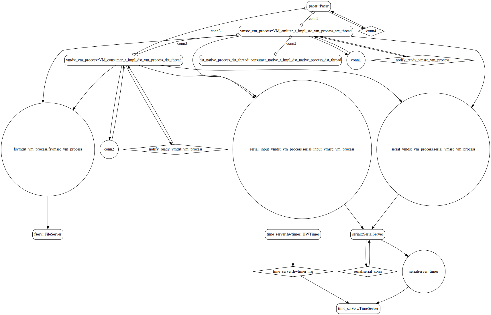

# sender_vm

 Table of Contents
  * [Diagrams](#diagrams)
    * [AADL Arch](#aadl-arch)
    * [SeL4_Only](#sel4_only)
      * [SeL4_Only CAmkES Arch](#sel4_only-camkes-arch)
      * [SeL4_Only CAmkES HAMR Arch](#sel4_only-camkes-hamr-arch)
  * [Example Output](#example-output)
    * [SeL4_Only Expected Output: Timeout = 15 seconds](#sel4_only-expected-output-timeout--15-seconds)

## Diagrams
### AADL Arch


### SeL4_Only
#### SeL4_Only CAmkES Arch


#### SeL4_Only CAmkES HAMR Arch


## Example Output
*NOTE:* actual output may differ due to issues related to thread interleaving
### SeL4_Only Expected Output: Timeout = 15 seconds

  |HAMR Codegen Configuration| |
  |--|--|
  | package-name | sender_vm |
  | exclude-component-impl | true |
  | bit-width | 32 |
  | max-string-size | 256 |
  | max-array-size | 1 |


  **How To Run**
  ```
  test_event_data_port_periodic_domains_VMx/sender_vm/CAmkES_seL4_Only/bin/setup-camkes-arm-vm.sh
  test_event_data_port_periodic_domains_VMx/sender_vm/CAmkES_seL4_Only/bin/run-camkes.sh -s
  ```

  ```
  Booting all finished, dropped to user space
  <<seL4(CPU 0) [decodeUntypedInvocation/212 T0xff807fc18400 "rootserver" @4006d8]: Untyped Retype: Insufficient memory (1 * 2097152 bytes needed, 0 bytes available).>>
  [dst_thread] test_event_data_port_consumer_component_init called
  _utspace_split_alloc@split.c:272 Failed to find any untyped capable of creating an object at address 0x8040000
  Loading Linux: 'linux' dtb: ''
  _utspace_split_alloc@split.c:272 Failed to find any untyped capable of creating an object at address 0x8040000
  Loading Linux: 'linux' dtb: ''
  install_linux_devices@main.c:628 module name: map_frame_hack
  install_linux_devices@main.c:628 module name: virtio_con
  install_linux_devices@main.c:628 module name: cross_vm_connections
  install_linux_devices@main.c:628 module name: map_frame_hack
  install_linux_devices@main.c:628 module name: virtio_con
  install_linux_devices@main.c:628 module name: cross_vm_connections
  libsel4muslcsys: Error attempting syscall 215
  libsel4muslcsys: Error attempting syscall 215
  libsel4muslcsys: Error attempting syscall 215
  libsel4muslcsys: Error attempting syscall 215
  clean_up@fdtgen.c:370 Non-existing node None specified to be kept
  consume_connection_event@cross_vm_connection.c:247 Failed to inject connection irq
  _utspace_split_alloc@split.c:272 Failed to find any untyped capable of creating an object at address 0x8020000
  clean_up@fdtgen.c:370 Non-existing node None specified to be kept
  consume_connection_event@cross_vm_connection.c:247 Failed to inject connection irq
  _utspace_split_alloc@split.c:272 Failed to find any untyped capable of creating an object at address 0x8020000
  consume_connection_event@cross_vm_connection.c:247 Failed to inject connection irq
  consume_connection_event@cross_vm_connection.c:247 Failed to inject connection irq
  consume_connection_event@cross_vm_connection.c:247 Failed to inject connection irq
  [    3.925021] Unable to detect cache hierarchy for CPU 0
  [    3.942969] e1000: Intel(R) PRO/1000 Network Driver - version 7.3.21-k8-NAPI
  [    3.955222] e1000: Copyright (c) 1999-2006 Intel Corporation.
  [    3.966853] e1000e: Intel(R) PRO/1000 Network Driver - 3.2.6-k
  [    3.978074] e1000e: Copyright(c) 1999 - 2015 Intel Corporation.
  [    3.996816] mousedev: PS/2 mouse device common for all mice
  [    4.017809] ledtrig-cpu: registered to indicate activity on CPUs
  [    4.031087] dmi-sysfs: dmi entry is absent.
  [    4.042029] ipip: IPv4 and MPLS over IPv4 tunneling driver
  [    4.061871] NET: Registered protocol family 10
  [    4.090971] mip6: Mobile IPv6
  [    4.107293] NET: Registered protocol family 17
  [    4.119158] mpls_gso: MPLS GSO support
  [    4.128779] Registered cp15_barrier emulation handler
  [    4.139549] Registered setend emulation handler
  [    4.155712] registered taskstats version 1
  [    4.166384] zswap: loaded using pool lzo/zbud
  [    4.183363] ima: No TPM chip found, activating TPM-bypass!
  [    4.194019] ima: Allocated hash algorithm: sha256
  [    4.215287] hctosys: unable to open rtc device (rtc0)
  [    4.226351] PM: Hibernation image not present or could not be loaded.
  [    4.238407] initcall clk_disable_unused blacklisted
  consume_connection_event@cross_vm_connection.c:247 Failed to inject connection irq
  [    3.905764] Unable to detect cache hierarchy for CPU 0
  [    3.922212] e1000: Intel(R) PRO/1000 Network Driver - version 7.3.21-k8-NAPI
  [    3.936511] e1000: Copyright (c) 1999-2006 Intel Corporation.
  [    3.948819] e1000e: Intel(R) PRO/1000 Network Driver - 3.2.6-k
  [    3.961757] e1000e: Copyright(c) 1999 - 2015 Intel Corporation.
  [    3.980703] mousedev: PS/2 mouse device common for all mice
  [    4.002198] ledtrig-cpu: registered to indicate activity on CPUs
  [    4.015857] dmi-sysfs: dmi entry is absent.
  [    4.026326] ipip: IPv4 and MPLS over IPv4 tunneling driver
  [    4.044421] NET: Registered protocol family 10
  [    4.072534] mip6: Mobile IPv6
  [    4.088045] NET: Registered protocol family 17
  [    4.098635] mpls_gso: MPLS GSO support
  [    4.108246] Registered cp15_barrier emulation handler
  [    4.121762] Registered setend emulation handler
  [    4.138302] registered taskstats version 1
  [    4.149438] zswap: loaded using pool lzo/zbud
  [    4.166085] ima: No TPM chip found, activating TPM-bypass!
  [    4.176647] ima: Allocated hash algorithm: sha256
  [    4.198344] hctosys: unable to open rtc device (rtc0)
  [    4.210670] PM: Hibernation image not present or could not be loaded.
  [    4.224266] initcall clk_disable_unused blacklisted
  [    5.747663] Freeing unused kernel memory: 3776K
  [    5.770709] Freeing unused kernel memory: 3776K
  Starting syslogd: OK
  Starting klogd: OK
  Starting syslogd: OK
  Starting klogd: OK
  Running sysctl: OK
  Initializing random number generator... Running sysctl: OK
  Initializing random number generator... [   11.403309] random: dd: uninitialized urandom read (512 bytes read)
  done.
  Starting network: OK[   11.331914] random: dd: uninitialized urandom read (512 bytes read)
  done.
  Starting network: OK
  [   11.966617] connection: loading out-of-tree module taints kernel.
  [   12.008075] Event Bar (dev-0) initalised
  [   12.018448] 2 Dataports (dev-0) initalised

  [   13.325344] connection: loading out-of-tree module taints kernel.
  [   13.369330] Event Bar (dev-0) initalised
  [   13.379052] 2 Dataports (dev-0) initalised
  [   13.400615] Event Bar (dev-1) initalised
  [   13.410890] 2 Dataports (dev-1) initalised

  Welcome to Buildroot
  buildroot login: [   13.243783] Event Bar (dev-1) initalised
  [   13.254816] 2 Dataports (dev-1) initalised

  Welcome to Buildroot
  buildroot login: 
  Switching input to 0
  root
  # vmdst_vm_process /dev/uio0 4096 /dev/uio1 4096
  [vmdst_vm_process] test_event_data_port_consumer_component_init called

  Switching input to 1
  root
  # vmsrc_vm_process /dev/uio0 4096 /dev/uio1 4096
  [vmsrc_process] test_event_data_port_emitter_component_init called
  -----------------------
  [vmsrc_process] sending 0
  [dst_thread] received {0}
  [vmdst_vm_process] received {0}
  -----------------------
  [vmsrc_process] sending 1
  [dst_thread] received {1}
  [vmdst_vm_process] received {1}
  -----------------------
  [vmsrc_process] sending 2
  [dst_thread] received {2}
  [vmdst_vm_process] received {2}
  -----------------------
  [vmsrc_process] sending 3
  [dst_thread] received {3}
  [vmdst_vm_process] received {3}
  -----------------------
  [vmsrc_process] sending 4
  [dst_thread] received {4}
  [vmdst_vm_process] received {4}
  -----------------------
  [vmsrc_process] sending 5
  [dst_thread] received {5}
  [vmdst_vm_process] received {5}
  -----------------------
  [vmsrc_process] sending 6
  ```