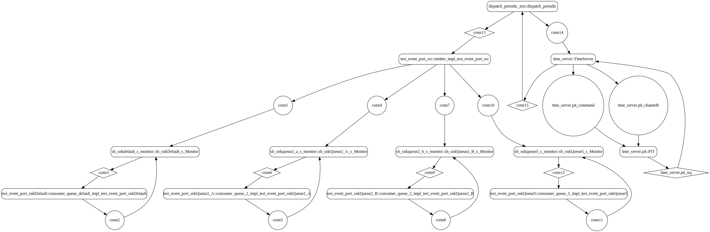
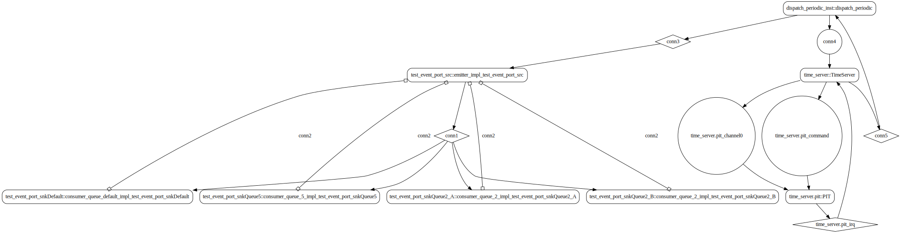

# test_event_port_fan_out

 Table of Contents
  * [Diagrams](#diagrams)
    * [AADL Arch](#aadl-arch)
    * [SeL4_TB](#sel4_tb)
      * [SeL4_TB CAmkES Arch](#sel4_tb-camkes-arch)
      * [SeL4_TB CAmkES HAMR Arch](#sel4_tb-camkes-hamr-arch)
    * [SeL4_Only](#sel4_only)
      * [SeL4_Only CAmkES Arch](#sel4_only-camkes-arch)
      * [SeL4_Only CAmkES HAMR Arch](#sel4_only-camkes-hamr-arch)
  * [Example Output](#example-output)
    * [SeL4_TB Expected Output: Timeout = 18 seconds](#sel4_tb-expected-output-timeout--18-seconds)
    * [SeL4_Only Expected Output: Timeout = 18 seconds](#sel4_only-expected-output-timeout--18-seconds)

## Diagrams
### AADL Arch


### SeL4_TB
#### SeL4_TB CAmkES Arch


#### SeL4_TB CAmkES HAMR Arch


### SeL4_Only
#### SeL4_Only CAmkES Arch


#### SeL4_Only CAmkES HAMR Arch


## Example Output
*NOTE:* actual output may differ due to issues related to thread interleaving
### SeL4_TB Expected Output: Timeout = 18 seconds

  |HAMR Codegen Configuration| |
  |--|--|
  | refer to [bin/run-hamr-SeL4_TB.sh](bin/run-hamr-SeL4_TB.sh) |


  **How To Run**
  ```
  ./bin/run-hamr-SeL4_TB.sh
  ./CAmkES_seL4_TB/bin/run-camkes.sh -s
  ```

  ```
  Booting all finished, dropped to user space
  [test_event_port_src] test_event_port_emitter_component_init called
  [test_event_port_snkQueue5] test_event_port_consumer_component_init called
  [test_event_port_snkQueue2_B] test_event_port_consumer_component_init called
  [test_event_port_snkQueue2_A] test_event_port_consumer_component_init called
  [test_event_port_snkDefault] test_event_port_consumer_component_init called
  ---------------------------------------
  [test_event_port_src] Sent 0 events.
  ---------------------------------------
  [test_event_port_src] Sent 1 events.
  [test_event_port_snkDefault] Received 1 events
  [test_event_port_snkQueue2_A] Received 1 events
  [test_event_port_snkQueue2_B] Received 1 events
  [test_event_port_snkQueue5] Received 1 events
  ---------------------------------------
  [test_event_port_src] Sent 2 events.
  [test_event_port_snkDe[test_event_port_snkQueue2_A] Received 2 events
  [test_event_port_snkQueue2_B] Received 2 events
  [test_event_port_snkQueue5] Received 2 events
  fault] Received 1 events
  ---------------------------------------
  [test_event_port_src] Sent 3 events.
  [test_event_port_snkDefault] Received 1 events
  [[test_event_port_snkQueue2_B] Received 2 events
  [test_event_port_snkQueue5] Received 3 events
  test_event_port_snkQueue2_A] Received 2 events
  ---------------------------------------
  [test_event_port_src] Sent 4 events.
  [test_event_port_snkDefault] Received 1 events
  [test_event_port_snkQueue2_A] Received 2 events
  [test_event_port_snkQueue2_B] Received 2 events
  [test_event_port_snkQueue5] Received 4 events

  ```

### SeL4_Only Expected Output: Timeout = 18 seconds

  |HAMR Codegen Configuration| |
  |--|--|
  | refer to [bin/run-hamr-SeL4_Only.sh](bin/run-hamr-SeL4_Only.sh) |


  **How To Run**
  ```
  ./bin/run-hamr-SeL4_Only.sh
  ./CAmkES_seL4_Only/bin/run-camkes.sh -s
  ```

  ```
  Booting all finished, dropped to user space
  [test_event_port_src] test_event_port_emitter_component_init called
  [test_event_port_snkQueue5] test_event_port_consumer_component_init called
  [test_event_port_snkQueue2_B] test_event_port_consumer_component_init called
  [test_event_port_snkQueue2_A] test_event_port_consumer_component_init called
  [test_event_port_snkDefault] test_event_port_consumer_component_init called
  ---------------------------------------
  [test_event_port_src] Sent 0 events.
  ---------------------------------------
  [test_event_port_src] Sent 1 events.
  [te[test_event_port_snkQueue2_A] Received 1 events
  [test_event_port_snkQueue2_B] Received 1 events
  [test_evst_event_port_snkDefault] Received 1 events
  ent_port_snkQueue5] Received 1 events
  ---------------------------------------
  [test_event_port_src] Sent 2 events.
  [test_event_port_snkDefault] Received 1 events
  [test_event_port_snkQueue2_A] Received 2 events
  [test_[test_event_port_snkQueue5] Received 2 events
  event_port_snkQueue2_B] Received 2 events
  ---------------------------------------
  [test_event_port_src] Sent 3 events.
  [test_event_port_snkDefault] Received 1 events
  [test_event_port_snkQueue2_A] Received 2 events
  [test_event_port_snkQueue2_B] Received 2 events
  [test_event_port_snkQueue5] Received 3 events
  ---------------------------------------
  [test_event_port_src] Sent 4 events.
  [test_event_port_snkDefault] Received 1 events
  [test_event_port_snkQueue2_A] Received 2 events
  [test_event_port_snkQ[test_event_port_snkQueue5] Received 4 events
  ueue2_B] Received 2 events
  ---------------------------------------
  [test_event_port_src] Sent 5 events.
  [test_event_port_snkDefault] Received 1 events
  [test_event_port_snkQueue2_A] Received 2 events
  [test_event_port_snkQueue2_B] Received 2 events
  [test_event_port_snkQueue5] Received 5 events

  ```