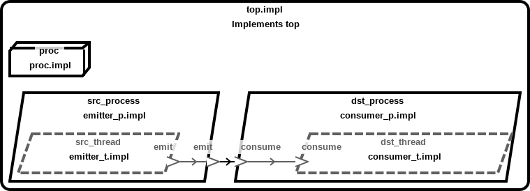
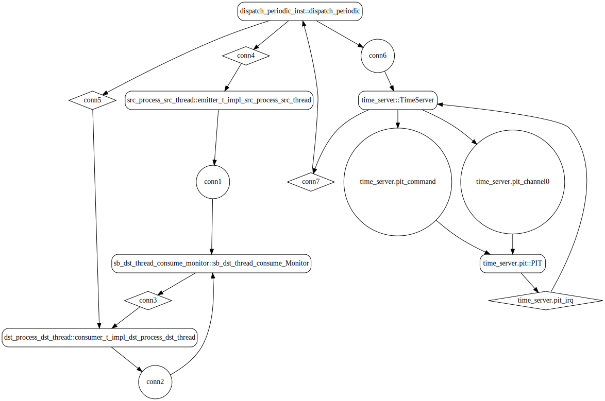
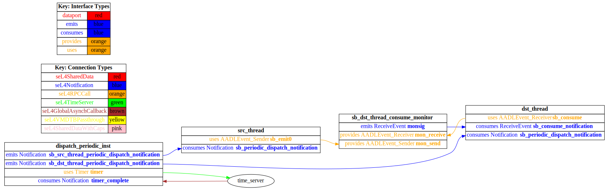
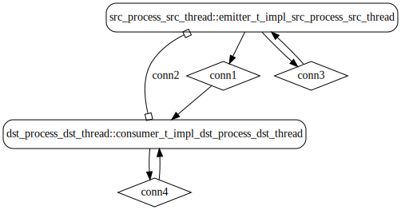
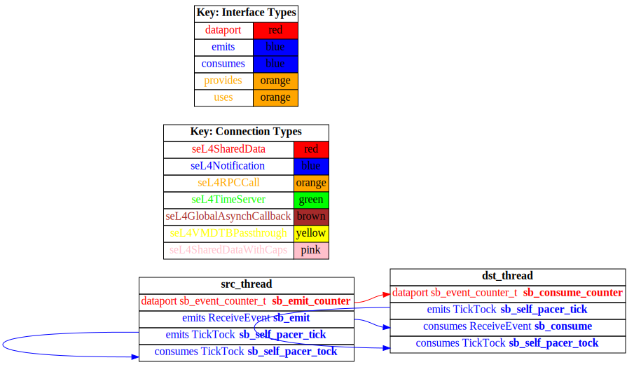

# test_event_port_periodic_domains

 Table of Contents
  * [Diagrams](#diagrams)
    * [AADL Arch](#aadl-arch)
    * [SeL4_TB](#sel4_tb)
      * [SeL4_TB CAmkES Arch](#sel4_tb-camkes-arch)
      * [SeL4_TB CAmkES HAMR Arch](#sel4_tb-camkes-hamr-arch)
    * [SeL4_Only](#sel4_only)
      * [SeL4_Only CAmkES Arch](#sel4_only-camkes-arch)
      * [SeL4_Only CAmkES HAMR Arch](#sel4_only-camkes-hamr-arch)
    * [SeL4](#sel4)
      * [SeL4 CAmkES Arch](#sel4-camkes-arch)
      * [SeL4 CAmkES HAMR Arch](#sel4-camkes-hamr-arch)
  * [Example Output](#example-output)
    * [SeL4_TB Expected Output: Timeout = 15 seconds](#sel4_tb-expected-output-timeout--15-seconds)
    * [SeL4_Only Expected Output: Timeout = 15 seconds](#sel4_only-expected-output-timeout--15-seconds)
    * [SeL4 Expected Output: Timeout = 15 seconds](#sel4-expected-output-timeout--15-seconds)

## Diagrams
### AADL Arch


### SeL4_TB
#### SeL4_TB CAmkES Arch


#### SeL4_TB CAmkES HAMR Arch


### SeL4_Only
#### SeL4_Only CAmkES Arch


#### SeL4_Only CAmkES HAMR Arch


### SeL4
#### SeL4 CAmkES Arch


#### SeL4 CAmkES HAMR Arch


## Example Output
*NOTE:* actual output may differ due to issues related to thread interleaving
### SeL4_TB Expected Output: Timeout = 15 seconds

  |HAMR Codegen Configuration| |
  |--|--|
  | package-name | test_event_port_periodic_domains |
  | exclude-component-impl | true |
  | bit-width | 32 |
  | max-string-size | 256 |
  | max-array-size | 1 |


  **How To Run**
  ```
  test_event_port_periodic_domains/CAmkES_seL4_TB/bin/run-camkes.sh -s
  ```

  ```
  Booting all finished, dropped to user space
  [src_process_src_thread] test_event_port_emitter_component_init called
  [dst_process_dst_thread] test_event_port_consumer_component_init called
  ---------------------------------------
  [src_process_src_thread] Sent event.
  [dst_process_dst_thread] Callback fired.  Received 1 events this dispatch, 1 total
  ---------------------------------------
  [src_process_src_thread] Sent event.
  [dst_process_dst_thread] Callback fired.  Received 1 events this dispatch, 2 total
  ---------------------------------------
  [src_process_src_thread] Sent event.
  [dst_process_dst_thread] Callback fired.  Received 1 events this dispatch, 3 total
  ---------------------------------------
  [src_process_src_thread] Sent event.
  [dst_process_dst_thread] Callback fired.  Received 1 events this dispatch, 4 total
  ---------------------------------------
  [src_process_src_thread] Sent event.
  [dst_process_dst_thread] Callback fired.  Received 1 events this dispatch, 5 total
  ---------------------------------------
  [src_process_src_thread] Sent event.
  [dst_process_dst_thread] Callback fired.  Received 1 events this dispatch, 6 total
  ---------------------------------------
  [src_process_src_thread] Sent event.
  [dst_process_dst_thread] Callback fired.  Received 1 events this dispatch, 7 total
  ---------------------------------------
  [src_process_src_thread] Sent event.
  [dst_process_dst_thread] Callback fired.  Received 1 events this dispatch, 8 total
  ---------------------------------------
  [src_process_src_thread] Sent event.
  [dst_process_dst_thread] Callback fired.  Received 1 events this dispatch, 9 total
  ---------------------------------------
  [src_process_src_thread] Sent event.
  [dst_process_dst_thread] Callback fired.  Received 1 events this dispatch, 10 total

  ```

### SeL4_Only Expected Output: Timeout = 15 seconds

  |HAMR Codegen Configuration| |
  |--|--|
  | package-name | test_event_port_periodic_domains |
  | exclude-component-impl | true |
  | bit-width | 32 |
  | max-string-size | 256 |
  | max-array-size | 1 |


  **How To Run**
  ```
  test_event_port_periodic_domains/CAmkES_seL4_Only/bin/run-camkes.sh -s
  ```

  ```
  Booting all finished, dropped to user space
  [dst_process_dst_thread] test_event_port_consumer_component_init called
  [src_process_src_thread] test_event_port_emitter_component_init called
  [dst_process_dst_thread] Callback fired.  Received 0 events this dispatch, 0 total
  ---------------------------------------
  [src_process_src_thread] Sent event.
  [dst_process_dst_thread] Callback fired.  Received 1 events this dispatch, 1 total
  ---------------------------------------
  [src_process_src_thread] Sent event.
  [dst_process_dst_thread] Callback fired.  Received 1 events this dispatch, 2 total
  ---------------------------------------
  [src_process_src_thread] Sent event.
  [dst_process_dst_thread] Callback fired.  Received 1 events this dispatch, 3 total
  ---------------------------------------
  [src_process_src_thread] Sent event.
  [dst_process_dst_thread] Callback fired.  Received 1 events this dispatch, 4 total
  ---------------------------------------
  [src_process_src_thread] Sent event.
  [dst_process_dst_thread] Callback fired.  Received 1 events this dispatch, 5 total
  ---------------------------------------
  [src_process_src_thread] Sent event.
  [dst_process_dst_thread] Callback fired.  Received 1 events this dispatch, 6 total
  ---------------------------------------
  [src_process_src_thread] Sent event.
  [dst_process_dst_thread] Callback fired.  Received 1 events this dispatch, 7 total
  ---------------------------------------
  [src_process_src_thread] Sent event.
  [dst_process_dst_thread] Callback fired.  Received 1 events this dispatch, 8 total
  ---------------------------------------
  [src_process_src_thread] Sent event.
  [dst_process_dst_thread] Callback fired.  Received 1 events this dispatch, 9 total
  ---------------------------------------
  [src_process_src_thread] Sent event.

  ```

### SeL4 Expected Output: Timeout = 15 seconds

  |HAMR Codegen Configuration| |
  |--|--|
  | package-name | test_event_port_periodic_domains |
  | exclude-component-impl | true |
  | bit-width | 32 |
  | max-string-size | 256 |
  | max-array-size | 1 |


  **How To Run**
  ```
  test_event_port_periodic_domains/CAmkES_seL4/bin/transpile-sel4.sh
  test_event_port_periodic_domains/CAmkES_seL4/src/c/CAmkES_seL4/bin/run-camkes.sh -s
  ```

  ```
  Booting all finished, dropped to user space
  Entering pre-init of consumer_t_impl_dst_process_dst_thread
  Entering pre-init of emitter_t_impl_src_process_src_thread
  Art: Registered coArt: Registered component: top_impl_Instance_dst_process_dst_thread (periodic: 1000)
  Art: - Registered port: top_impl_Instance_dst_process_dst_thread_consume (event in)
  top_impl_Instance_dst_process_dst_thread: Example logInfo
  top_impl_Instance_dst_process_dst_thread: Example logDebug
  mponent: top_impl_Instance_src_process_src_thread (periodic: 1000)
  Art: - Registered port: top_impl_Instance_src_process_src_thread_emit (event out)
  top_impl_Instance_src_process_src_thread: Example logInfo
  top_impl_Instance_src_process_src_thread: Example logDebug
  top_impl_Instance_src_process_src_thread: Extop_impl_Instance_dst_process_dst_thread: Example logError
  Leaving pre-init of consumer_t_impl_dst_process_dst_thread
  ample logError
  Leaving pre-init of emitter_t_impl_src_process_src_thread

  ```