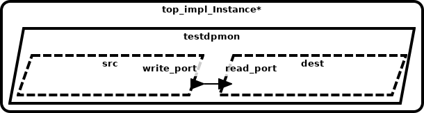

# AADL Data Ports

This example illustrates how AADL data ports are represented using seL4 
artifacts.   AADL data ports (and associated connections between ports) 
are used to model one-way non-queued data transfer between components.  Intuitively, 
a component with an AADL out data port can write values into the port; 
a component with an AADL in data port can read values from the port.  As 
specified by AADL semantics, arrival of data on an in data port DOES NOT 
trigger a dispatch of the consuming thread nor generate any other 
notification.  Therefore, AADL threads that have in data ports are 
time-triggered (declared with PERIODIC AADL dispatch mode) or event-triggered 
(declared with a SPORADIC AADL dispatch mode and dispatched upon arrival 
of information on an AADL event or event data port).  A typical computation 
pattern is that when a thread is dispatched via a time-trigger or event-trigger, 
it will then make calls from the user code to read the current values of 
data ports.  AADL properties can be attached to ports/connections to indicate 
latency bounds on propagation of values from out data ports to connected in 
ports (scheduling of threads/communication necessary to achieve these bounds 
is outside the scope of CASE). 

Components can have any number of out data ports and in data ports.  This example 
represents a simple producer-consumer pattern, with a single out data port on the 
producer and a single in data port on the consumer.   Specifically, the model 
contains two AADL threads `src` and `dest` that are instances of 
[source_t.impl](testdpmon.aadl#L17-L18)
and 
[destination_t.impl](testdpmon.aadl#L30-L31)
respectively. The AADL port connection 
[conn1](testdpmon.aadl#L47)
connects `src`'s outgoing 
[write_port](testdpmon.aadl#L8)
data port to `dest`'s incoming 
[read_port](testdpmon.aadl#L22)
data port.

## HAMR Code Generation for seL4 [CASE Phase 1 - Trusted Build Version]

*HAMR generated code is contained in the [CAmkES](CAmkES) directory*

HAMR transforms each AADL thread into separate CAmkES 
components.  The top-level CAmkES topology for the translated example 
can be found in 
[testdpmon.camkes](CAmkES/testdpmon.camkes). HAMR
transforms each AADL thread into 
separate CAmkES components.  For example, the AADL `src` thread is translated 
to 
[source_t_impl.camkes](CAmkES/components/source_t_impl/source_t_impl.camkes), 
and the AADL `dest` thread is translated to 
[destination_t_impl.camkes](CAmkES/components/destination_t_impl/destination_t_impl.camkes)
.  An intermediary CAmkES component called a monitor, 
[sb_dest_read_port_Monitor.camkes](CAmkES/components/sb_Monitors/sb_dest_read_port_Monitor/sb_dest_read_port_Monitor.camkes), 
is introduced to handle the non-queued communcation 
over `conn1`. Both producer and consumer components are connected to the 
monitor via *sel4RPCCall* connections (
[conn7](CAmkES/testdpmon.camkes#L23) 
and 
[conn8](CAmkES/testdpmon.camkes#L24) 
in the CAmkES assembly).

The *seL4Notification* connection 
[conn9](CAmkES/testdpmon.camkes#L25)
could be used to alert the receiving 
thread when new data arrives (as is done for AADL event data connections), 
however AADL threads are not dispatched due to the arrival of data on 
incoming data ports so currently the notification is not handled on the 
receiver's side.   HAMR also generates “glue code” on both the 
producer side 
[sb_source_t_impl.c](CAmkES/components/source_t_impl/src/sb_source_t_impl.c)
and consumer side 
[sb_destination_t_impl.c](CAmkES/components/destination_t_impl/src/sb_destination_t_impl.c)
to isolate the application code of both components from some of the 
details of interacting with lower-level CAmkES/seL4 APIs.

The source and destination threads are declared to be periodic 
(using the *Dispatch_Protocol* [property](testdpmon.aadl#L10)) 
so an additional component 
[dispatch_periodic.camkes](CAmkES/components/dispatch_periodic/dispatch_periodic.camkes)
is generated to handle the dispatching according to their periods 
(declared using the *Period* [property](testdpmon.aadl#L11)). 
The dispatching is accomplished using *sel4Notification* connections, 
[conn2](CAmkES/testdpmon.camkes#L18) and [conn4](CAmkES/testdpmon.camkes#L20), 
from the dispatcher to the threads.  Connections
[conn1](CAmkES/testdpmon.camkes#L17), 
[conn3](CAmkES/testdpmon.camkes#L19), and 
[conn5](CAmkES/testdpmon.camkes#L21) 
allow the components to get the current system
time by connecting them to a predefined CAmkES time server.  Connection
[conn8](CAmkES/testdpmon.camkes#L19) allows the time server to periodically callback/trigger
the dispatcher so that it can determine if a thread should be dispatched.

## HAMR Code Generation for seL4 [CASE Phase 2]

*HAMR generated code is contained in the [CAmkES_new](CAmkES_new) directory*

(Documentation is forth-coming. Quick notes: The new version of the translation 
removes the monitor component and has the producer and consumer communicate 
through a shared memory region where seL4 memory protections are used to 
ensure that the producer can only write and the consumer can only read.  
The new version is also more closely aligned with the semantics and APIs 
described in the AADL standard.)

## Outline of Argument for Correctness of Translation, Preservation of Information Flow, and Cyber-Resiliency

(Documentation is forth-coming)
