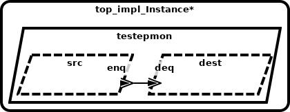

# AADL Event Data Ports

This example illustrates how AADL event data ports are represented using seL4 
artifacts. AADL event data ports (and associated connections between ports) are 
used to model one-way queued message passing between components. Intuitively, a
component with an AADL out event data port can send a message out of the port; 
a component with an AADL in event data port can retrieve messages from the queue 
associated with the port (each incoming event data port has a distinct 
queue/buffer). As specified by AADL semantics, arrival of an event on an in 
event data port can be set to trigger a dispatch of the consuming thread. Therefore, 
AADL threads that have in event data ports are typically event-triggered (declared 
with a SPORADIC AADL dispatch mode and dispatched upon arrival of information on an 
AADL event or event data port).  With a SPORADIC dispatch mode, a minimum separation 
time between event arrivals is also specified.  Messages arriving before the minimum 
interval expires are dropped (providing some protection from denial of service 
situations where incoming messages may flood a component).   A typical computation 
pattern is that when a thread is dispatched via event arrival, it will process the 
payload from the incoming message and also make calls from the user code to read 
the current values of data ports. The user code action of sending a message out 
an event data port is always non-blocking; if a receiving component’s message queue 
is full, a message is dropped according to a policy specified as a property in the 
model on the input port (e.g., drop newest message, drop oldest message, etc.)  AADL 
properties can be attached to ports/connections to indicate latency bounds 
on propagation of messages from out event data ports to connected in ports 
(scheduling of threads/communication necessary to achieve these bounds is outside 
the scope of CASE).  A variety of AADL properties can be used to state priorities 
regarding which input event data ports within a component trigger the dispatching 
of the thread. 

Components can have any number of out event data ports and in event data ports.  This example 
represents a simple producer-consumer pattern, with a single out event data port on the 
producer and a single in event data port on the consumer.   Specifically, the model 
contains two AADL threads `src` and `dest` that are instances of 
[emitter_t.impl](testepmon.aadl#L16-L17)
and 
[consumer_t.impl](testepmon.aadl#L30-L31)
respectively. The AADL port connection 
[conn1](testepmon.aadl#L47)
connects `src`'s outgoing 
[enq](testepmon.aadl#L8)
data port to `dest`'s incoming 
[deq](testepmon.aadl#L21)
data port.

## HAMR Code Generation for seL4 [CASE Phase 1 - Trusted Build Version]

*HAMR generated code is contained in the [CAmkES](CAmkES) directory*

HAMR transforms each AADL thread into separate CAmkES 
components.  The top-level CAmkES topology for the translated example 
can be found in 
[testepmon.camkes](CAmkES/testepmon.camkes). For example, the AADL `src` thread is translated 
to 
[emitter_t_impl.camkes](CAmkES/components/emitter_t_impl/emitter_t_impl.camkes), 
and the AADL `dest` thread is translated to 
[consumer_t_impl.camkes](CAmkES/components/consumer_t_impl/consumer_t_impl.camkes)
.  An intermediary CAmkES component called a monitor, 
[sb_dest_deq_Monitor.camkes](CAmkES/components/sb_Monitors/sb_dest_deq_Monitor/sb_dest_deq_Monitor.camkes), 
is introduced to handle the queued communcation 
over `conn1`. Both producer and consumer components are connected to the 
monitor via *sel4RPCCall* connections (
[conn1](CAmkES/testepmon.camkes#L12) 
and 
[conn2](CAmkES/testepmon.camkes#L13) 
in the CAmkES assembly). The *seL4Notification* connection 
[conn3](CAmkES/testepmon.camkes#L14) allows the monitor to notify the consumer
that an event has arrived, which will cause the component to be dispatched.

HAMR also generates “glue code” on both the 
producer side 
[sb_emitter_t_impl.c](CAmkES/components/emitter_t_impl/src/sb_emitter_t_impl.c)
and consumer side 
[sb_consumer_t_impl.c](CAmkES/components/consumer_t_impl/src/sb_consumer_t_impl.c)
to isolate the application code of both components from some of the 
details of interacting with lower-level CAmkES/seL4 APIs.

## HAMR Code Generation for seL4 [CASE Phase 2]

(Documentation and examples are forth-coming. Quick notes: The new version of
the translation removes the monitor component and has the queue between the 
producer and consumer communicate through a shared memory region where seL4 
memory protections are used to ensure that the producer can only write and 
the consumer can only read.  The new version is also more closely aligned 
with the semantics and APIs described in the AADL standard.)
