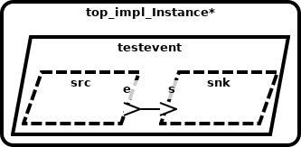

# AADL Event Ports

This example illustrates how AADL event ports are represented using seL4 
artifacts.   AADL event ports (and associated connections between ports) 
are used to model one-way queued event transmission between components.  Intuitively, 
a component with an AADL out event port can pass events into the port; 
a component with an AADL in event port can dequeue one or more events from the port.  As 
specified by AADL semantics, arrival of events on an in event port may
trigger a dispatch of the consuming thread.  Therefore, AADL threads that have in event ports are 
time-triggered (declared with PERIODIC AADL dispatch mode) or event-triggered 
(declared with a SPORADIC AADL dispatch mode and dispatched upon arrival 
of information on an AADL event or event data port).  A typical computation 
pattern is that when a thread is dispatched via a time-trigger or event-trigger, 
it will then make calls from the user code to fetch events from the
event ports.  AADL properties can be attached to ports/connections to indicate 
latency bounds on propagation of values from out data ports to connected in 
ports (scheduling of threads/communication necessary to achieve these bounds 
is outside the scope of CASE). 

Components can have any number of out event ports and in event ports.  This example 
represents a simple producer-consumer pattern, with a single out event port on the 
producer and a single in event port on the consumer.   Specifically, the model 
contains two AADL threads `src` and `snk` that are instances of 
[emitter.impl](testevent.aadl#L15-L16)
and 
[consumer.impl](testevent.aadl#L29-L30)
respectively. The AADL port connection 
[conn1](testevent.aadl#L46)
connects `src`'s outgoing 
[e](testevent.aadl#L7)
event port to `snk`'s incoming 
[s](testevent.aadl#L20)
event port.

## HAMR Code Generation for seL4 [CASE Phase 1 - Trusted Build Version]

*HAMR generated code is contained in the [CAmkES](CAmkES) directory*

HAMR transforms each AADL thread into separate CAmkES 
components.  The top-level CAmkES topology for the translated example 
can be found in 
[testevent.camkes](CAmkES/testevent.camkes). For example, the AADL `src` thread is translated 
to 
[emitter_impl.camkes](CAmkES/components/emitter_impl/emitter_impl.camkes), 
and the AADL `dest` thread is translated to 
[consumer_impl.camkes](CAmkES/components/consumer_impl/consumer_impl.camkes)
.  The *seL4Notification* connection
[conn1](CAmkES/testevent.camkes#L10) allows the `src` component to signal/notify
`dest` that an event has been sent, which will result in `dest` being dispatched.

HAMR also generates “glue code” on both the 
producer side 
[sb_emitter_impl.c](CAmkES/components/emitter_impl/src/sb_emitter_impl.c)
and consumer side 
[sb_consumer_impl.c](CAmkES/components/consumer_impl/src/sb_consumer_impl.c)
to isolate the application code of both components from some of the 
details of interacting with lower-level CAmkES/seL4 APIs.
